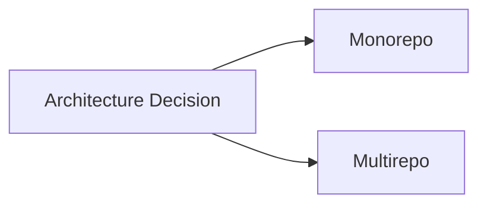
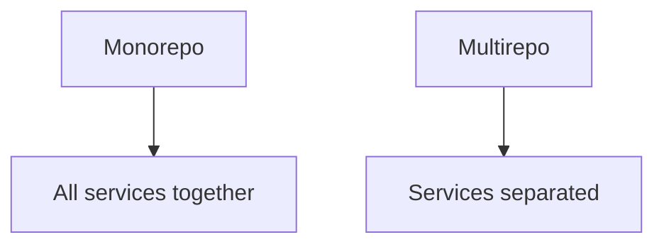

# 🏗️ Monorepo vs Multirepo (Repository Architecture)

<p align="center">
  
  
  
  
</p>

<p align="center">
  <b>Understand how large systems organize code: one repository vs many repositories.</b>
</p>

---

## 📌 What Is This Topic?

This is about:

```text id="mr-def"
How you structure your codebase at scale
````

You have two main approaches:

* 🧩 Monorepo (single repository)
* 📦 Multirepo (multiple repositories)

---

## 🧠 Why This Matters

Choosing the wrong structure can lead to:

* slow development ❌
* dependency chaos ❌
* scaling issues ❌

Choosing correctly leads to:

* better collaboration ✅
* easier maintenance ✅
* scalable systems ✅

---

## 🗺️ Big Picture



---

# 🧩 Monorepo (Single Repository)

---

## 📌 Definition

A monorepo is:

> One repository containing multiple projects/services.

---

## 🧬 Example Structure

```text id="mono-structure"
project/
 ├── frontend/
 ├── backend/
 ├── mobile/
 └── shared/
```

---

## 🧠 Real Examples

```text id="mono-ex"
Google
Facebook (Meta)
```

---

## ⚡ Advantages

---

### 1. Shared Code

```text id="mono-adv1"
Easy to reuse code
```

---

### 2. Single Source of Truth

```text id="mono-adv2"
All code in one place
```

---

### 3. Atomic Changes

```text id="mono-adv3"
Update multiple services in one commit
```

---

### 4. Easier Refactoring

```text id="mono-adv4"
Change everything consistently
```

---

## ⚠️ Challenges

---

### ❌ Large Repo Size

```text id="mono-con1"
Slower clone/build
```

---

### ❌ Complex CI/CD

```text id="mono-con2"
Need smart pipelines
```

---

### ❌ Access Control

```text id="mono-con3"
Harder to restrict permissions
```

---

## 🧠 When to Use Monorepo

```text id="mono-use"
- tightly coupled services
- shared libraries
- large engineering teams
```

---

# 📦 Multirepo (Multiple Repositories)

---

## 📌 Definition

A multirepo is:

> Each project/service has its own repository.

---

## 🧬 Example Structure

```text id="multi-structure"
frontend-repo/
backend-repo/
mobile-repo/
shared-lib-repo/
```

---

## 🧠 Real Examples

```text id="multi-ex"
Most startups
Many SaaS companies
```

---

## ⚡ Advantages

---

### 1. Simplicity

```text id="multi-adv1"
Each repo is independent
```

---

### 2. Faster Builds

```text id="multi-adv2"
Smaller codebase
```

---

### 3. Better Isolation

```text id="multi-adv3"
Services are separated
```

---

### 4. Access Control

```text id="multi-adv4"
Easy to manage permissions
```

---

## ⚠️ Challenges

---

### ❌ Code Duplication

```text id="multi-con1"
Harder to share code
```

---

### ❌ Dependency Management

```text id="multi-con2"
Version conflicts
```

---

### ❌ Cross-Repo Changes

```text id="multi-con3"
Multiple PRs needed
```

---

## 🧠 When to Use Multirepo

```text id="multi-use"
- small teams
- independent services
- simple architecture
```

---

# ⚔️ Monorepo vs Multirepo Comparison

---

## 📊 Comparison Table

| Feature        | Monorepo    | Multirepo      |
| -------------- | ----------- | -------------- |
| Structure      | single repo | multiple repos |
| Code sharing   | easy        | harder         |
| CI/CD          | complex     | simpler        |
| Scaling        | powerful    | easier early   |
| Access control | harder      | easier         |
| Refactoring    | easier      | harder         |

---

## 🧠 Visual Comparison



---

# 🧬 CI/CD Differences

---

## Monorepo CI

```text id="mono-ci"
Smart pipelines:
- detect changed folders
- run selective builds
```

---

## Multirepo CI

```text id="multi-ci"
Simple pipelines:
- run per repository
```

---

## 🧠 Example

---

### Monorepo

```text id="mono-ci-ex"
Change frontend → only frontend build runs
```

---

### Multirepo

```text id="multi-ci-ex"
Each repo has separate CI
```

---

# 🧪 Real-World Scenarios

---

## Scenario 1 — Startup

```text id="mr-s1"
Multirepo preferred
(simple + fast)
```

---

## Scenario 2 — Growing Company

```text id="mr-s2"
Hybrid approach
```

---

## Scenario 3 — Large Tech Company

```text id="mr-s3"
Monorepo preferred
(scale + consistency)
```

---

# 🔄 Hybrid Approach (Very Common)

---

## 📌 Definition

```text id="hybrid"
Mix of monorepo + multirepo
```

---

## Example

```text id="hybrid-ex"
Frontend + backend in monorepo
External services in separate repos
```

---

# 🧠 Decision Guide

---

## Ask These Questions

---

### 1. Team Size?

```text id="q1"
Small → multirepo
Large → monorepo
```

---

### 2. Code Sharing?

```text id="q2"
High → monorepo
Low → multirepo
```

---

### 3. Complexity?

```text id="q3"
Simple → multirepo
Complex → monorepo
```

---

## 🧠 Quick Rule

```text id="rule"
Start with multirepo → move to monorepo when scaling
```

---

# 🚨 Common Mistakes

---

### ❌ Choosing monorepo too early

---

### ❌ Ignoring CI complexity

---

### ❌ Poor dependency management

---

### ❌ Mixing unrelated services

---

# ✅ Best Practices

* keep structure clean
* use CI smartly
* manage dependencies properly
* document architecture
* choose based on team needs

---

# 🧠 Pro Insights

* architecture evolves over time
* no one-size-fits-all solution
* scaling changes requirements
* simplicity first, complexity later

---

# 🧬 Full System View

```text id="mr-arch"
Architecture → Repo Strategy → CI/CD → Development Workflow
```

---

# 🎤 Interview Questions

### What is a monorepo?

Single repository with multiple projects.

---

### What is a multirepo?

Multiple repositories for different services.

---

### Which is better?

Depends on team size and complexity.

---

### Why do big companies use monorepos?

Better code sharing and consistency.

---

### What is hybrid approach?

Combination of both strategies.

---

# 🧪 Practice Lab

---

### Task 1

```text id="lab1"
Design a monorepo structure
```

---

### Task 2

```text id="lab2"
Design a multirepo system
```

---

### Task 3

```text id="lab3"
Compare pros/cons for your project
```

---

## 🎯 Final Takeaway

Architecture choice defines:

```text id="take-mr"
How your system scales and evolves
```

---

## 🚀 Key Insight

> Choose simplicity first, scale when needed.

---

## 👉 Next Step

➡️ `trunk-based-development.md`
