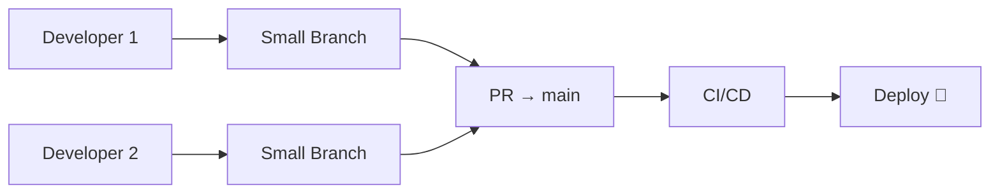
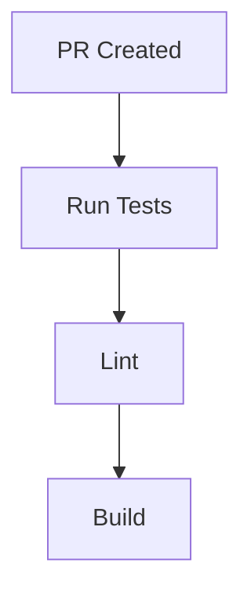
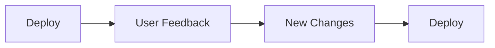
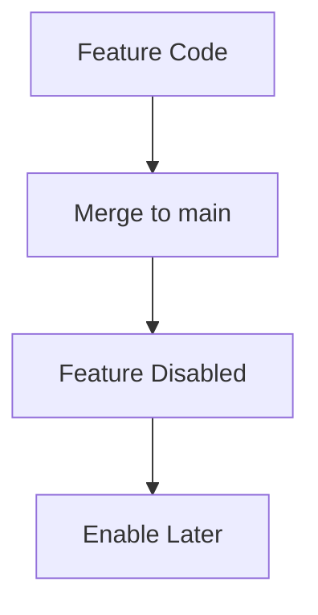

# 🌿 Trunk-Based Development (Modern High-Speed Workflow)

<p align="center">
  
  
  
  
</p>

<p align="center">
  <b>Build, integrate, and deploy continuously using a single main branch — the foundation of modern DevOps.</b>
</p>

---

## 📌 What Is Trunk-Based Development?

Trunk-Based Development (TBD) is:

> A workflow where developers commit frequently to a single main branch (trunk).

---

## 🧠 Core Idea

```text id="tbd-core"
Everyone integrates code into main frequently
````

---

## 🗺️ Big Picture



---

## 🌳 What Is "Trunk"?

```text id="tbd-trunk"
Trunk = main branch (central branch)
```

---

## 🧠 Key Principles

```text id="tbd-principles"
- commit frequently
- keep branches short-lived
- merge daily (or multiple times/day)
- keep main always stable
- rely on CI/CD
```

---

## 🧬 Branch Strategy

```text id="tbd-branch"
main → always deployable
feature/* → short-lived (hours or 1–2 days)
```

---

## 🔄 Workflow Breakdown

---

### 1️⃣ Create Small Branch

```bash id="tbd-step1"
git checkout -b feature/login-button
```

---

### 2️⃣ Develop Quickly

```text id="tbd-step2"
Small, focused changes
```

---

### 3️⃣ Commit Frequently

```bash id="tbd-step3"
git commit -m "Add login button"
```

---

### 4️⃣ Push & Open PR

```bash id="tbd-step4"
git push origin feature/login-button
```

---

### 5️⃣ CI/CD Runs



---

### 6️⃣ Fast Review

```text id="tbd-step6"
Quick approval (1–2 reviewers)
```

---

### 7️⃣ Merge to main

```text id="tbd-step7"
Frequent merges (daily)
```

---

### 8️⃣ Deploy Automatically

```text id="tbd-step8"
Merge → auto deploy 🚀
```

---

## ⚡ Continuous Integration + Deployment

---

### CI

```text id="tbd-ci2"
Every commit is tested automatically
```

---

### CD

```text id="tbd-cd"
Every merge can be deployed
```

---

## 🧠 Why TBD Works

```text id="tbd-why"
Small changes → fewer conflicts
Frequent merges → no divergence
Automation → safe deployment
```

---

## 🔄 Feedback Loop



---

## ⚔️ TBD vs GitFlow

| Feature         | Trunk-Based | GitFlow |
| --------------- | ----------- | ------- |
| Branches        | minimal     | many    |
| Merge frequency | very high   | lower   |
| Complexity      | simple      | complex |
| Releases        | continuous  | staged  |
| Speed           | very fast   | slower  |

---

## 🧠 Key Difference

```text id="tbd-vs"
TBD → integrate continuously
GitFlow → integrate in stages
```

---

## 🧪 Real-World Scenario

```text id="tbd-real"
Morning:
- Dev A merges feature
- Dev B merges fix

Afternoon:
- CI passes
- App deployed

Evening:
- Feedback received
- Improvements added
```

---

## 🚨 Handling Incomplete Features

---

### Problem

```text id="tbd-problem"
Feature not finished but needs to merge
```

---

### Solution: Feature Flags

```text id="tbd-flag"
Hide feature behind toggle
```

---

### Example

```text id="tbd-flag-ex"
Feature deployed but disabled
```

---

## ⚡ Feature Flags Flow



---

## 🧠 Benefits

---

### 1. Faster Development

```text id="tbd-benefit1"
No long-lived branches
```

---

### 2. Fewer Merge Conflicts

```text id="tbd-benefit2"
Frequent integration
```

---

### 3. Better Collaboration

```text id="tbd-benefit3"
Everyone works on same codebase
```

---

### 4. Continuous Delivery

```text id="tbd-benefit4"
Always deploy-ready
```

---

## 🚨 Common Mistakes

---

### ❌ Large PRs

Breaks workflow.

---

### ❌ Long-lived branches

Causes conflicts.

---

### ❌ No CI/CD

Risky merges.

---

### ❌ Unstable main branch

Breaks team productivity.

---

## ✅ Best Practices

* merge at least once per day
* keep PRs small (<300 lines)
* use feature flags
* enforce CI checks
* keep main stable
* automate deployments

---

## 🧠 Pro Tips

* aim for multiple deploys per day
* break features into small pieces
* monitor production constantly
* fix fast instead of delaying

---

## 🧬 Internal Workflow View

```text id="tbd-arch"
Dev → Commit → PR → CI → Merge → Deploy → Feedback → Repeat
```

---

## 🌍 Companies Using TBD

```text id="tbd-companies"
Google
Netflix
Amazon (modern teams)
```

---

## 🎤 Interview Questions

### What is trunk-based development?

A workflow where developers merge frequently into main.

---

### Why is it better for CI/CD?

Because changes are small and continuous.

---

### How do you handle incomplete features?

Using feature flags.

---

### Why avoid long-lived branches?

They cause merge conflicts and delays.

---

### What is the role of CI?

Ensure every change is safe to merge.

---

## 🧪 Practice Lab

---

### Task 1

```text id="lab1"
Create small feature branch
```

---

### Task 2

```text id="lab2"
Open PR and merge quickly
```

---

### Task 3

```text id="lab3"
Simulate CI checks
```

---

### Task 4

```text id="lab4"
Deploy after merge
```

---

## 🎯 Final Takeaway

Trunk-Based Development is about:

```text id="tbd-take"
Speed + Integration + Automation
```

---

## 🚀 Key Insight

> Integrate early, integrate often.

---

## 👉 Next Step

➡️ `gitflow-model.md`
