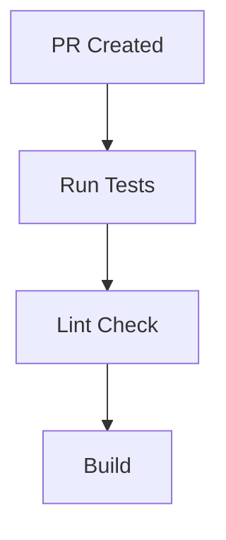
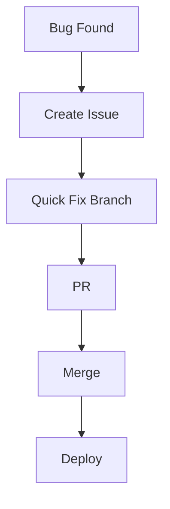

# 🚀 Startup Workflow (Fast Development & Continuous Deployment)

<p align="center">
  
  
  
  
</p>

<p align="center">
  <b>Learn how startups use Git & GitHub to move fast, iterate quickly, and deploy continuously.</b>
</p>

---

## 📌 What Is a Startup Workflow?

A startup workflow is designed for:

```text id="sw-goal"
Speed + Flexibility + Rapid Iteration
````

Startups prioritize:

* fast feature delivery ⚡
* quick feedback loops 🔄
* continuous deployment 🚀

---

## 🧠 Key Principles

```text id="sw-principles"
- ship fast
- keep branches short-lived
- automate everything
- deploy frequently
- fix quickly
```

---

## 🗺️ Big Picture


---

## 🌿 Core Strategy: Trunk-Based Development

Startups mostly use:

```text id="sw-trunk"
Trunk-Based Development
```

---

### Key Rules

```text id="sw-trunk-rules"
- main branch is always active
- small feature branches
- frequent merges
- no long-lived branches
```

---

## 🧬 Workflow Breakdown

---

### 1️⃣ Idea → Issue

```text id="sw-step1"
Idea → GitHub Issue
```

Example:

```text id="sw-ex1"
#101 Add dark mode
```

---

### 2️⃣ Create Small Branch

```bash id="sw-step2"
git checkout -b feature/dark-mode
```

---

### 3️⃣ Quick Development

```text id="sw-step3"
Small change → focused work
```

---

### 4️⃣ Commit Frequently

```bash id="sw-step4"
git commit -m "Add toggle for dark mode"
```

---

### 5️⃣ Push & Open PR

```bash id="sw-step5"
git push origin feature/dark-mode
```

---

### 6️⃣ CI/CD Runs Automatically



---

### 7️⃣ Quick Review

```text id="sw-step7"
Fast approval (often 1 reviewer)
```

---

### 8️⃣ Merge to main

```text id="sw-step8"
PR merged quickly
```

---

### 9️⃣ Auto Deployment

```text id="sw-step9"
Merge → Deploy automatically 🚀
```

---

## ⚡ Continuous Deployment

Startups often use:

```text id="sw-cd"
Every merge → production deploy
```

---

## 🧠 Why This Works

```text id="sw-why"
Small changes = low risk
Fast deploy = quick feedback
Automation = fewer mistakes
```

---

## 🧪 Real Startup Scenario

```text id="sw-real"
1. User requests feature
2. Issue created
3. Dev builds feature in 2 hours
4. PR opened
5. CI passes
6. PR merged
7. Feature live in production
```

---

## 🔄 Feedback Loop


---

## 🧠 Branch Strategy

```text id="sw-branch"
main → production-ready
feature/* → short-lived
```

---

## ⚔️ Why Not GitFlow?

```text id="sw-no-gitflow"
Too slow for startups
Too many branches
Delayed releases
```

---

## ⚙️ Tools Used

```text id="sw-tools"
- GitHub Actions (CI/CD)
- Vercel / Netlify / AWS (deploy)
- Issues + Projects (tracking)
- CODEOWNERS (reviews)
```

---

## 🚨 Handling Bugs

---

### Scenario

```text id="sw-bug"
Bug found in production
```

---

### Flow



---

### Key Idea

```text id="sw-bug2"
Fix fast → deploy fast
```

---

## 🧠 Feature Flags (Advanced)

Instead of delaying releases:

```text id="sw-flag"
Deploy incomplete features hidden behind flags
```

---

## 🧪 Example

```text id="sw-flag-ex"
Feature built → hidden → tested → enabled later
```

---

## ⚡ Speed vs Risk Balance

| Factor   | Startup Approach          |
| -------- | ------------------------- |
| Speed    | very high                 |
| Risk     | managed via small changes |
| Testing  | automated                 |
| Releases | continuous                |

---

## 🚨 Common Mistakes

---

### ❌ Large PRs

Slow review.

---

### ❌ No CI

Breaks production.

---

### ❌ Long branches

Merge conflicts.

---

### ❌ Manual deployment

Slows down team.

---

## ✅ Best Practices

* keep PRs small
* merge frequently
* automate CI/CD
* deploy often
* monitor production
* fix issues quickly

---

## 🧠 Pro Tips

* deploy multiple times per day
* keep main always stable
* use feature flags
* prioritize feedback over perfection

---

## 🧬 Full Startup Architecture

```text id="sw-arch"
Issue → Branch → PR → CI → Merge → Deploy → Feedback → Repeat
```

---

## 🎤 Interview Questions

### What workflow do startups use?

Trunk-based development with CI/CD.

---

### Why avoid long branches?

They cause conflicts and slow delivery.

---

### What is continuous deployment?

Automatically deploying after every successful merge.

---

### How do startups handle bugs?

Quick fixes → fast deployment.

---

### What are feature flags?

A way to deploy incomplete features safely.

---

## 🧪 Practice Lab

---

### Task 1

```text id="lab1"
Create issue → small feature
```

---

### Task 2

```bash id="lab2"
Create short-lived branch
```

---

### Task 3

```text id="lab3"
Open PR → merge quickly
```

---

### Task 4

```text id="lab4"
Simulate CI + deployment
```

---

## 🎯 Final Takeaway

Startup workflow is about:

```text id="sw-take"
Speed + Simplicity + Automation
```

---

## 🚀 Key Insight

> Ship fast, learn fast, improve fast.

---

## 👉 Next Step

➡️ `enterprise-workflow.md`
