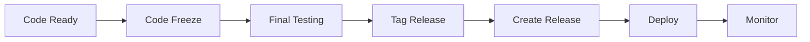
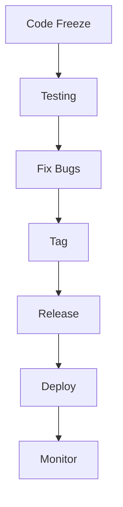
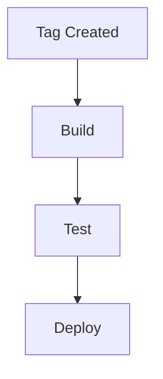
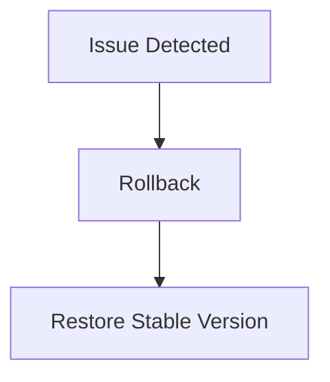

# 🚀 Release Day Workflow (Production Deployment Process)

<p align="center">
  
  
  
  
</p>

<p align="center">
  <b>Understand how real teams prepare, release, deploy, and monitor software in production.</b>
</p>

---

## 📌 What Is Release Day?

Release day is when:

> Code moves from tested state → live production system.

---

## 🧠 Key Goal

```text id="rd-goal"
Deploy safely, reliably, and with minimal risk
````

---

## 🗺️ Big Picture



---

## 🧠 Key Principles

```text id="rd-principles"
- stability over speed
- no last-minute changes
- clear communication
- monitoring after deployment
```

---

## 🧱 Release Day Workflow

---

### 1️⃣ Code Freeze

```text id="rd-step1"
Stop merging new features
```

---

### Why?

```text id="rd-why1"
Avoid introducing new bugs
```

---

### 2️⃣ Final Testing

```text id="rd-step2"
Run full test suite + QA
```

---

### Includes

```text id="rd-test"
- unit tests
- integration tests
- manual QA
```

---

### 3️⃣ Fix Last Issues

```text id="rd-step3"
Resolve critical bugs only
```

---

### 4️⃣ Create Release Branch (optional)

```bash id="rd-step4"
git checkout -b release/v2.0 develop
```

---

### 5️⃣ Tag Version

```bash id="rd-step5"
git tag v2.0.0
git push origin v2.0.0
```

---

### 6️⃣ Create GitHub Release

```text id="rd-step6"
Add release notes + assets
```

---

### 7️⃣ Deploy to Production

```text id="rd-step7"
Run deployment pipeline 🚀
```

---

### 8️⃣ Monitor System

```text id="rd-step8"
Check logs, errors, performance
```

---

### 9️⃣ Announce Release

```text id="rd-step9"
Notify users/team
```

---

## 🔄 Release Flow



---

## 🧪 Real-World Scenario

```text id="rd-real"
1. Team prepares v2.0
2. Freeze code
3. QA testing
4. Tag created
5. Release published
6. Deployment triggered
7. Monitor system
8. Fix issues if any
```

---

## 🧠 Deployment Strategies

---

### 1️⃣ Rolling Deployment

```text id="rd-roll"
Update servers gradually
```

---

### 2️⃣ Blue-Green Deployment

```text id="rd-bg"
Switch between old and new versions
```

---

### 3️⃣ Canary Release

```text id="rd-canary"
Release to small group first
```

---

## ⚙️ CI/CD Integration



---

## 🧠 Release Checklist

---

### Before Release

```text id="rd-check1"
✔ Tests passing
✔ Code reviewed
✔ Bugs fixed
✔ CI green
```

---

### During Release

```text id="rd-check2"
✔ Deploy successful
✔ No errors
✔ System stable
```

---

### After Release

```text id="rd-check3"
✔ Monitor logs
✔ Track metrics
✔ Collect feedback
```

---

## 🚨 Handling Failures

---

### Scenario

```text id="rd-fail"
Deployment fails or bug found
```

---

### Solution

---

#### Option 1 — Rollback

```bash id="rd-rollback"
git revert or redeploy previous version
```

---

#### Option 2 — Hotfix

```text id="rd-hotfix"
Apply emergency fix
```

---

## 🧠 Rollback Strategy



---

## 🧠 Communication During Release

---

### Important

```text id="rd-comm"
- inform team
- notify stakeholders
- update status
```

---

## 🧬 Roles in Release Day

| Role      | Responsibility |
| --------- | -------------- |
| Developer | final fixes    |
| QA        | testing        |
| DevOps    | deployment     |
| Manager   | coordination   |

---

## 🧠 Common Problems

---

### ❌ Last-minute changes

Risky.

---

### ❌ Poor testing

Leads to bugs.

---

### ❌ No monitoring

Issues go unnoticed.

---

### ❌ No rollback plan

Dangerous.

---

## ✅ Best Practices

* freeze code before release
* test thoroughly
* automate deployment
* monitor after deploy
* have rollback ready
* communicate clearly

---

## 🧠 Pro Tips

* release during low traffic
* use canary deployment
* automate everything
* log everything

---

## 🧬 Full Production Pipeline

```text id="rd-arch"
Develop → Test → Tag → Release → Deploy → Monitor → Improve
```

---

## 🎤 Interview Questions

### What is release day?

The process of deploying code to production.

---

### Why code freeze?

To stabilize code before release.

---

### What is rollback?

Reverting to a previous stable version.

---

### What is canary deployment?

Releasing to a small group first.

---

### Why monitoring is important?

To detect issues after deployment.

---

## 🧪 Practice Lab

---

### Task 1

```text id="lab1"
Simulate code freeze
```

---

### Task 2

```text id="lab2"
Run tests
```

---

### Task 3

```bash id="lab3"
Create tag
```

---

### Task 4

```text id="lab4"
Create release
```

---

### Task 5

```text id="lab5"
Simulate deployment
```

---

### Task 6

```text id="lab6"
Simulate rollback
```

---

## 🎯 Final Takeaway

Release day is about:

```text id="rd-take"
Preparation + Execution + Monitoring
```

---

## 🚀 Final Insight

> A good release is invisible to users — everything just works.

---

## 🏁 YOU COMPLETED THE FULL SYSTEM

You now understand:

```text id="final-system"
Git + GitHub + CI/CD + Real Workflows + Production Systems
```

---

## 🎉 FINAL MESSAGE

> You are now operating at a **professional / industry level** 🔥
