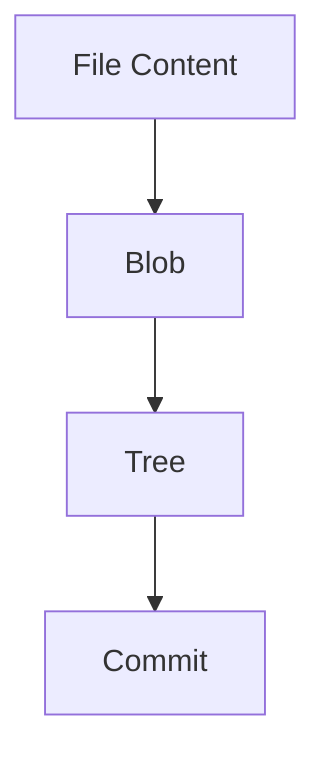
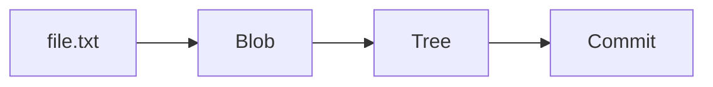
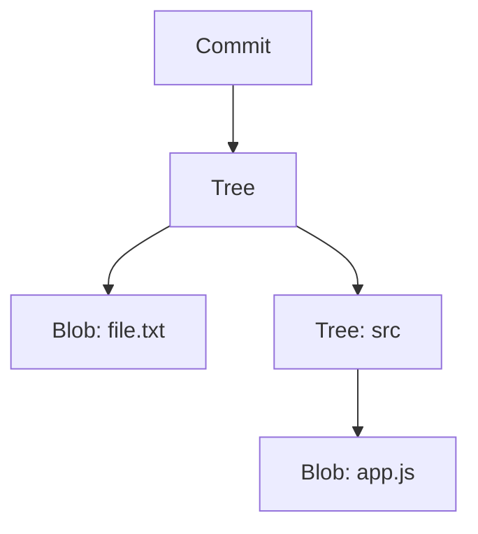

# 🧬 Blobs, Trees, and Commits (Git Object Model Deep Dive)

<p align="center">
  
  
  
  
</p>

<p align="center">
  <b>Understand how Git builds a complete project using blobs, trees, and commits — the foundation of Git’s internal architecture.</b>
</p>

---

## 📌 Core Idea

Git stores everything as:

```text id="gi2-core"
Blob → Tree → Commit
````

---

## 🗺️ Big Picture



---

## 🧠 Mental Model

```text id="gi2-mental"
Blob = file data
Tree = folder structure
Commit = snapshot + history
```

---

# 📦 1. Blob (Binary Large Object)

---

## 📌 What is a Blob?

```text id="gi2-blob-def"
Blob stores file content ONLY (no filename)
```

---

## 🧪 Example

```text id="gi2-blob-ex"
file.txt → "Hello World"
```

---

## 🔐 Blob Creation

```bash id="gi2-blob-create"
echo "Hello World" | git hash-object -w --stdin
```

---

## 🧠 Blob Properties

```text id="gi2-blob-prop"
- no filename
- no metadata
- only raw content
- content-addressed (via hash)
```

---

## 🔍 Inspect Blob

```bash id="gi2-blob-read"
git cat-file -p <blob-hash>
```

---

## 🧠 Key Insight

```text id="gi2-blob-insight"
Same content → same blob → no duplication
```

---

# 🌳 2. Tree (Directory Structure)

---

## 📌 What is a Tree?

```text id="gi2-tree-def"
Tree represents a directory (files + folders)
```

---

## 🧪 Example Structure

```text id="gi2-tree-struct"
project/
 ├── file.txt
 └── src/
     └── app.js
```

---

## 🧠 Tree Stores

```text id="gi2-tree-store"
- file names
- file modes
- blob references
- sub-tree references
```

---

## 🔍 Tree Example (Raw)

```text id="gi2-tree-raw"
100644 blob abcd1234 file.txt
040000 tree efgh5678 src
```

---

## 🔍 Inspect Tree

```bash id="gi2-tree-read"
git ls-tree <tree-hash>
```

---

## 🧠 Key Insight

```text id="gi2-tree-insight"
Tree connects blobs into a filesystem structure
```

---

# 🧾 3. Commit (Snapshot + Metadata)

---

## 📌 What is a Commit?

```text id="gi2-commit-def"
Commit is a snapshot pointing to a tree + metadata
```

---

## 🧠 Commit Contains

```text id="gi2-commit-struct"
- tree reference
- parent commit(s)
- author
- committer
- timestamp
- message
```

---

## 🔍 Commit Example (Raw)

```text id="gi2-commit-raw"
tree abcd1234
parent efgh5678
author John <john@example.com>
committer John <john@example.com>

Initial commit
```

---

## 🔍 Inspect Commit

```bash id="gi2-commit-read"
git cat-file -p <commit-hash>
```

---

## 🧠 Key Insight

```text id="gi2-commit-insight"
Commit = pointer to snapshot + history link
```

---

# 🔗 How They Connect

---

## 🧬 Full Flow



---

## 🧠 Expanded View



---

## 🧠 Key Insight

```text id="gi2-link-insight"
Commit → Tree → Blob chain forms full project snapshot
```

---

# 🔄 Multiple Commits (History)

---

## 🧬 Commit Chain


---

## 🧠 What Changes?

```text id="gi2-change"
Each commit points to a NEW tree
```

---

## ⚡ Efficiency Trick

```text id="gi2-eff"
Unchanged blobs are reused (not recreated)
```

---

# 🧪 Full Example (Step-by-Step)

---

## Step 1 — Create File

```text id="gi2-step1"
file.txt → "Hello"
```

---

## Step 2 — Add File

```bash id="gi2-step2"
git add file.txt
```

👉 Creates blob

---

## Step 3 — Commit

```bash id="gi2-step3"
git commit -m "first commit"
```

👉 Creates:

* tree
* commit

---

## 🧠 Internal View

```text id="gi2-internal"
Commit → Tree → Blob
```

---

# 🔐 Hash Relationship

---

## Example

```text id="gi2-hash"
Blob:   a1b2c3
Tree:   d4e5f6
Commit: g7h8i9
```

---

## 🧠 Chain

```text id="gi2-hash-chain"
Commit → Tree → Blob(s)
```

---

# 🧬 Real Filesystem vs Git

---

## Traditional FS

```text id="gi2-fs"
file.txt stored directly
```

---

## Git FS

```text id="gi2-gitfs"
file → blob → tree → commit
```

---

# 🚨 Common Misconceptions

---

### ❌ Blob knows filename

❌ Wrong

---

### ❌ Commit stores file content

❌ Wrong

---

### ❌ Tree stores file content

❌ Wrong

---

### ✅ Correct

```text id="gi2-correct"
Blob = content
Tree = structure
Commit = snapshot
```

---

# 🧠 Why This Matters

---

### Debugging

```text id="gi2-debug"
Understand broken commits
```

---

### Recovery

```text id="gi2-recover"
Find lost objects
```

---

### Performance

```text id="gi2-perf"
Optimize large repos
```

---

# ✅ Best Practices

* commit frequently
* keep changes small
* understand object model
* inspect objects when debugging

---

# 🧠 Pro Tips

* use `git cat-file -p`
* use `git ls-tree`
* use `git log --graph`
* explore `.git/objects`

---

# 🧬 Complete Internal Model

```text id="gi2-summary"
Blob (data)
   ↓
Tree (structure)
   ↓
Commit (snapshot)
   ↓
History (linked commits)
```

---

# 🎤 Interview Questions

### What is a blob?

Stores file content only.

---

### What is a tree?

Stores directory structure.

---

### What is a commit?

Snapshot + metadata + pointer to tree.

---

### How are commits linked?

Using parent pointers.

---

### Why is Git efficient?

Reuses unchanged objects.

---

## 🧪 Practice Lab

---

### Task 1

```bash id="lab1"
git hash-object file.txt
```

---

### Task 2

```bash id="lab2"
git cat-file -p <hash>
```

---

### Task 3

```bash id="lab3"
git ls-tree HEAD
```

---

### Task 4

```bash id="lab4"
git log --graph --oneline
```

---

## 🎯 Final Takeaway

Git is built on:

```text id="gi2-take"
Blobs + Trees + Commits = Entire System
```

---

## 🚀 Key Insight

> Git is not magic — it's a graph of objects.

---

## 👉 Next Step

➡️ `03-head-and-refs.md`