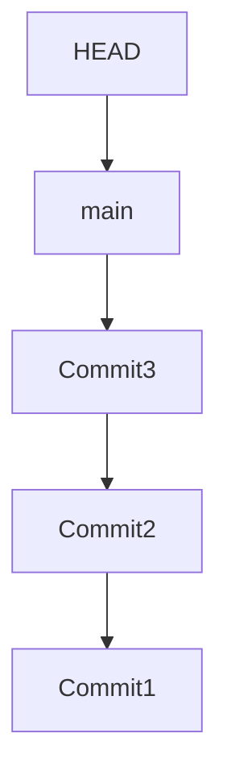

# 🎯 HEAD & Refs (How Git Tracks Your Position)

<p align="center">
  
  
  
  
</p>

<p align="center">
  <b>Understand how Git knows where you are — using HEAD and references (refs).</b>
</p>

---

# 📌 Core Idea

Git doesn’t move files…

```text id="gi3-core"
Git moves POINTERS
````

---

# 🧠 What Are Refs?

Refs (references) are:

```text id="gi3-ref-def"
Pointers to commits
```

---

## 🧪 Example

```text id="gi3-ref-ex"
main → a1b2c3 (commit)
```

---

## 🧠 Types of Refs

```text id="gi3-ref-types"
- branches (main, dev)
- tags (v1.0)
- HEAD (current position)
```

---

# 🎯 What Is HEAD?

---

## 📌 Definition

```text id="gi3-head-def"
HEAD = pointer to your current location in Git
```

---

## 🧠 Simple Meaning

```text id="gi3-head-simple"
HEAD = "Where am I right now?"
```

---

# 🗺️ Visual: HEAD + Branch

```mermaid id="gi3-basic"
flowchart LR
    A[Commit A] --> B[Commit B] --> C[Commit C]
    C <-- main
    main <-- HEAD
```

---

## 🧠 Translation

```text id="gi3-basic-explain"
HEAD → main → latest commit
```

---

# 🧬 How Git Tracks You

---

## Normal State

```text id="gi3-normal"
HEAD → main → commit
```

---

## 🖥️ Real File

```bash id="gi3-head-file"
cat .git/HEAD
```

---

### Output

```text id="gi3-head-content"
ref: refs/heads/main
```

---

## 🧠 Meaning

```text id="gi3-head-meaning"
HEAD points to branch (main)
```

---

# 🌳 Branch = Pointer

---

## 🧠 Important Truth

```text id="gi3-branch-truth"
Branch = pointer to commit
```

---

## Visual

```mermaid id="gi3-branch"
flowchart LR
    A[Commit A] --> B[Commit B] --> C[Commit C]
    C <-- main
```

---

## 🧠 When You Commit

```mermaid id="gi3-commit"
flowchart LR
    A[Commit A] --> B[Commit B] --> C[Commit C]
    C --> D[Commit D]
    D <-- main
```

---

## 🧠 Key Insight

```text id="gi3-commit-insight"
Commit moves the branch forward
```

---

# 🔄 HEAD Moves With You

---

## Example: Switch Branch

```bash id="gi3-switch"
git checkout dev
```

---

## Visual

```mermaid id="gi3-switch-vis"
flowchart LR
    A[Commit A] --> B[Commit B] --> C[Commit C]
    C <-- main
    B <-- dev
    dev <-- HEAD
```

---

## 🧠 Meaning

```text id="gi3-switch-meaning"
HEAD now points to dev branch
```

---

# 🚨 Detached HEAD (Very Important)

---

## 📌 What is Detached HEAD?

```text id="gi3-detached-def"
HEAD points directly to a commit (not a branch)
```

---

## How It Happens

```bash id="gi3-detached"
git checkout <commit-hash>
```

---

## Visual

```mermaid id="gi3-detached-vis"
flowchart LR
    A[Commit A] --> B[Commit B] --> C[Commit C]
    C <-- main
    B <-- HEAD
```

---

## 🧠 Problem

```text id="gi3-detached-problem"
New commits are not attached to a branch
```

---

## ⚠️ Risk

```text id="gi3-detached-risk"
You may lose commits
```

---

## ✅ Fix

```bash id="gi3-detached-fix"
git checkout -b new-branch
```

---

# 🔗 Refs Structure

---

## 📂 Inside `.git/refs`

```text id="gi3-refs-folder"
.git/
 └── refs/
     ├── heads/
     │   ├── main
     │   └── dev
     └── tags/
         └── v1.0
```

---

## 🧠 Each File Stores

```text id="gi3-ref-file"
Commit hash
```

---

## Example

```bash id="gi3-ref-cat"
cat .git/refs/heads/main
```

---

### Output

```text id="gi3-ref-output"
a1b2c3d4...
```

---

# 🧬 Full Pointer System

---



---

## 🧠 Summary

```text id="gi3-summary"
HEAD → branch → commit → history
```

---

# 🔄 Moving Around in Git

---

## Checkout Branch

```bash id="gi3-nav1"
git checkout main
```

👉 moves HEAD

---

## Checkout Commit

```bash id="gi3-nav2"
git checkout <hash>
```

👉 detached HEAD

---

## New Commit

```bash id="gi3-nav3"
git commit
```

👉 moves branch forward

---

# 🧠 Real-Life Analogy

---

## Git = Book

```text id="gi3-analogy"
Commit = page
Branch = bookmark
HEAD = current page you're reading
```

---

# 🚨 Common Mistakes

---

### ❌ Thinking branch = folder

❌ Wrong

---

### ❌ Thinking HEAD is a commit

❌ Wrong

---

### ❌ Ignoring detached HEAD

❌ Dangerous

---

# ✅ Best Practices

* stay on branches (not detached)
* create branch before experimenting
* understand HEAD movement
* use `git status` often

---

# 🧠 Pro Tips

* use `git log --graph --oneline`
* use `git reflog` to track HEAD history
* understand pointer movement before rebasing

---

# 🎤 Interview Questions

### What is HEAD?

Pointer to current branch or commit.

---

### What is a branch?

A pointer to a commit.

---

### What is detached HEAD?

HEAD pointing directly to a commit.

---

### What happens on commit?

Branch pointer moves forward.

---

### Where are refs stored?

Inside `.git/refs/`

---

## 🧪 Practice Lab

---

### Task 1

```bash id="lab1"
cat .git/HEAD
```

---

### Task 2

```bash id="lab2"
cat .git/refs/heads/main
```

---

### Task 3

```bash id="lab3"
git checkout <commit>
```

---

### Task 4

```bash id="lab4"
git checkout -b new-branch
```

---

## 🎯 Final Takeaway

Git navigation is:

```text id="gi3-take"
HEAD + Refs = Everything
```

---

## 🚀 Key Insight

> Git doesn’t move files — it moves pointers.

---

## 👉 Next Step

➡️ `04-packfiles.md`
