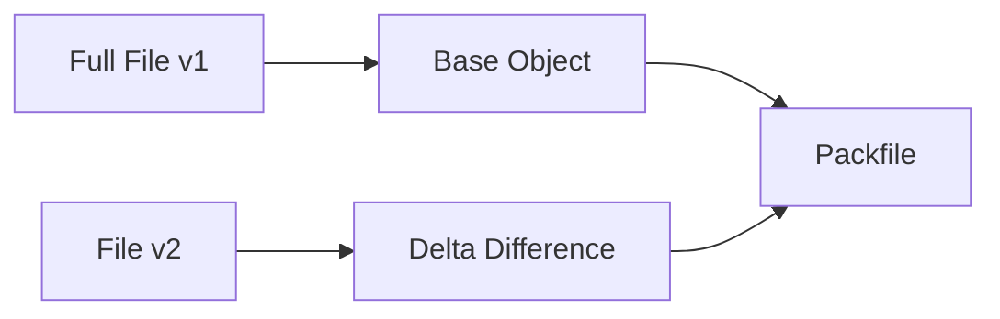

# 📦 Packfiles (Git Compression & Performance Engine)

<p align="center">
  
  
  
  
</p>

<p align="center">
  <b>Understand how Git compresses and optimizes storage using packfiles — the secret behind Git’s speed.</b>
</p>

---

# 📌 Core Idea

Git does NOT store everything separately forever.

```text id="gi4-core"
Git compresses objects into packfiles
````

---

# 🧠 Why Packfiles Exist

Without packfiles:

```text id="gi4-problem"
- thousands of loose objects
- slow performance
- large disk usage
```

---

With packfiles:

```text id="gi4-solution"
- compressed storage
- faster access
- efficient cloning
```

---

# 🗺️ Big Picture


---

# 📂 Loose Objects vs Packfiles

---

## 🧱 Loose Objects

```text id="gi4-loose"
.git/objects/ab/1234...
.git/objects/cd/5678...
```

---

## 📦 Packfiles

```text id="gi4-pack"
.git/objects/pack/
 ├── pack-xxxx.pack
 └── pack-xxxx.idx
```

---

# 🧠 What Is a Packfile?

A packfile is:

```text id="gi4-pack-def"
A compressed file containing many Git objects
```

---

# 🧬 How Git Compresses Data

---

## 🔹 Step 1 — Identify Similar Objects

```text id="gi4-step1"
Git finds similar files/versions
```

---

## 🔹 Step 2 — Store Differences (Delta Compression)

```text id="gi4-step2"
Store only differences between objects
```

---

## 🔹 Step 3 — Pack Everything

```text id="gi4-step3"
Combine into single packfile
```

---

# 🧠 Visual: Delta Compression

---

## Without Compression

```text id="gi4-no-comp"
file_v1: Hello World
file_v2: Hello Git
```

Stored twice ❌

---

## With Delta

```text id="gi4-delta"
base: Hello World
delta: change "World" → "Git"
```

Stored efficiently ✅

---

## Visual



---

# 📦 Packfile Structure

---

## Files

```text id="gi4-files"
.pack → actual data
.idx  → index for fast lookup
```

---

## 🧠 Why Index File?

```text id="gi4-index"
Fast searching of objects
```

---

# 🔍 Inspect Packfiles

---

### List Packfiles

```bash id="gi4-lab1"
ls .git/objects/pack
```

---

### Verify Packfile

```bash id="gi4-lab2"
git verify-pack -v .git/objects/pack/pack-xxxx.idx
```

---

# 🔄 When Are Packfiles Created?

---

## Automatically

```text id="gi4-auto"
During git gc (garbage collection)
```

---

## Manually

```bash id="gi4-manual"
git gc
```

---

# 🧠 What is `git gc`?

```text id="gi4-gc"
Garbage collection:
- compress objects
- clean unused data
```

---

# 🔄 Before vs After `git gc`

---

## Before

```text id="gi4-before"
Thousands of loose objects
```

---

## After

```text id="gi4-after"
Few compact packfiles
```

---

## Visual


---

# ⚡ Why Packfiles Matter

---

## 🚀 Faster Cloning

```text id="gi4-clone"
Transfer compressed data
```

---

## ⚡ Faster Fetch/Pull

```text id="gi4-fetch"
Send only required objects
```

---

## 💾 Reduced Storage

```text id="gi4-storage"
Less disk usage
```

---

# 🧠 Real-World Example

---

## Scenario

```text id="gi4-real"
Large repo with 10,000 commits
```

---

## Without Packfiles

```text id="gi4-real-no"
Huge storage, slow operations
```

---

## With Packfiles

```text id="gi4-real-yes"
Optimized storage + fast performance
```

---

# 🔐 Advanced Concept: Delta Chains

---

## 📌 What is it?

```text id="gi4-chain"
Multiple deltas referencing each other
```

---

## Visual


---

## 🧠 Tradeoff

```text id="gi4-tradeoff"
More compression vs slower reconstruction
```

---

# 🚨 Common Misconceptions

---

### ❌ Git stores everything separately forever

❌ Wrong

---

### ❌ Packfiles remove history

❌ Wrong

---

### ✅ Correct

```text id="gi4-correct"
Packfiles compress history safely
```

---

# ✅ Best Practices

* run `git gc` occasionally
* avoid huge binary files
* use `.gitignore` properly
* monitor repo size

---

# 🧠 Pro Tips

* use `git count-objects -v` to check objects
* use shallow clones for large repos
* use Git LFS for large files

---

# 🧬 Internal Flow Summary

```text id="gi4-summary"
Loose Objects → git gc → Packfile → Optimized Storage
```

---

# 🎤 Interview Questions

### What is a packfile?

Compressed collection of Git objects.

---

### Why does Git use packfiles?

To optimize storage and performance.

---

### What is delta compression?

Storing only differences between objects.

---

### What is `git gc`?

Garbage collection for cleanup and compression.

---

### What is `.idx` file?

Index for fast lookup inside packfile.

---

## 🧪 Practice Lab

---

### Task 1

```bash id="lab1"
git count-objects -v
```

---

### Task 2

```bash id="lab2"
git gc
```

---

### Task 3

```bash id="lab3"
ls .git/objects/pack
```

---

### Task 4

```bash id="lab4"
git verify-pack -v <packfile.idx>
```

---

## 🎯 Final Takeaway

Packfiles provide:

```text id="gi4-take"
Compression + Speed + Efficiency
```

---

## 🚀 Key Insight

> Git is fast because it stores data smartly.

---

## 👉 Next Step

➡️ `05-objects-folder.md`
