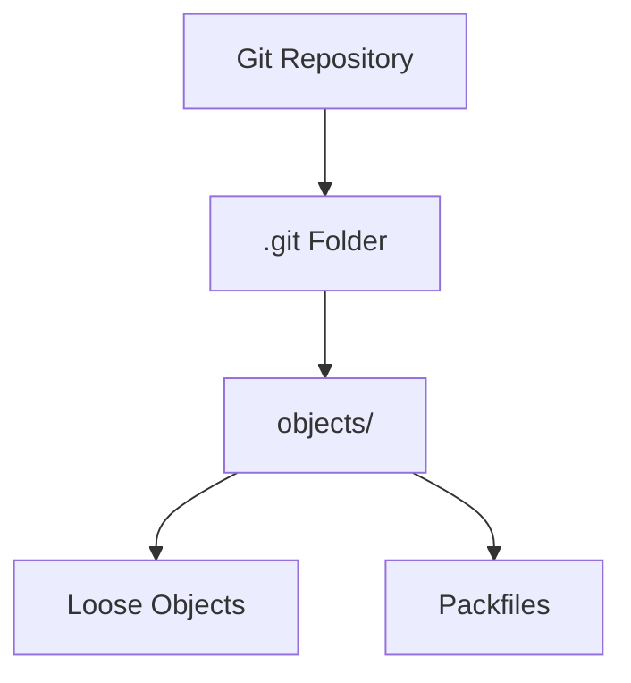
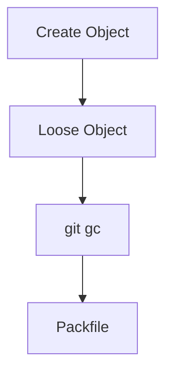

# 📂 .git/objects Folder (Where Git Stores Everything)

<p align="center">
  
  
  
  
</p>

<p align="center">
  <b>Explore the `.git/objects` directory — the core storage system where Git saves all data.</b>
</p>

---

# 📌 Core Idea

```text id="gi5-core"
Everything in Git is stored inside .git/objects
````

---

# 🗺️ Big Picture



---

# 📂 What Is `.git/objects`?

This folder stores:

```text id="gi5-def"
All Git objects (blobs, trees, commits)
```

---

# 🧬 Folder Structure

---

```text id="gi5-structure"
.git/
 └── objects/
     ├── ab/
     │   └── cdef1234...
     ├── cd/
     │   └── 5678abcd...
     └── pack/
         ├── pack-xxxx.pack
         └── pack-xxxx.idx
```

---

# 🧠 Two Types of Storage

---

## 🧱 1. Loose Objects

---

### 📌 What Are Loose Objects?

```text id="gi5-loose-def"
Individual object files stored separately
```

---

### 📂 Example

```text id="gi5-loose-ex"
.git/objects/ab/cdef1234...
```

---

### 🧠 Naming Rule

```text id="gi5-naming"
First 2 chars → folder
Rest → filename
```

---

### Example

```text id="gi5-naming-ex"
Hash: abcd1234...

Stored as:
.git/objects/ab/cd1234...
```

---

### 🧠 Why This Structure?

```text id="gi5-why"
Avoid too many files in one folder
```

---

# 📦 2. Packfiles

---

### 📌 What Are Packfiles?

```text id="gi5-pack-def"
Compressed storage of multiple objects
```

---

### 📂 Location

```text id="gi5-pack-loc"
.git/objects/pack/
```

---

### Files

```text id="gi5-pack-files"
.pack → data
.idx  → index
```

---

# 🔄 Loose vs Packed

---

| Type   | Description      |
| ------ | ---------------- |
| Loose  | individual files |
| Packed | compressed group |

---

## 🧠 Visual


---

# 🔍 Inspecting Objects

---

## 🔹 List Objects

```bash id="gi5-lab1"
ls .git/objects
```

---

## 🔹 View Object Content

```bash id="gi5-lab2"
git cat-file -p <hash>
```

---

## 🔹 Check Object Type

```bash id="gi5-lab3"
git cat-file -t <hash>
```

---

# 🧪 Example Walkthrough

---

## Step 1 — Create File

```text id="gi5-step1"
file.txt → "Hello"
```

---

## Step 2 — Add File

```bash id="gi5-step2"
git add file.txt
```

👉 Blob created inside `.git/objects`

---

## Step 3 — Commit

```bash id="gi5-step3"
git commit -m "first commit"
```

👉 Creates:

* tree
* commit object

---

## 🧠 Internal Storage

```text id="gi5-internal"
objects/
 ├── blob
 ├── tree
 └── commit
```

---

# 🔐 Object Storage Format

---

## 🧠 Objects Are Compressed

```text id="gi5-compress"
Stored using zlib compression
```

---

## 🔍 Raw Object (Compressed)

```text id="gi5-raw"
Binary data (not human-readable)
```

---

# 🧬 How Git Finds Objects

---

## Process

```text id="gi5-find"
1. Use hash
2. Locate folder (first 2 chars)
3. Open file
```

---

## Visual


---

# 🧠 Object Lifecycle

---

## Creation

```text id="gi5-life1"
git add → blob
git commit → tree + commit
```

---

## Storage

```text id="gi5-life2"
Saved as loose objects
```

---

## Optimization

```text id="gi5-life3"
git gc → packfiles
```

---

## Visual



---

# 🧠 Important Insight

```text id="gi5-insight"
Git never deletes data immediately
```

---

# 🚨 Common Mistakes

---

### ❌ Deleting `.git/objects`

Repo breaks completely.

---

### ❌ Editing object files

Corrupts repository.

---

### ❌ Ignoring packfiles

Misses performance understanding.

---

# ✅ Best Practices

* never modify `.git` manually
* use Git commands to inspect
* understand structure for debugging
* run `git gc` occasionally

---

# 🧠 Pro Tips

* use `git fsck` to verify objects
* use `git count-objects -v`
* explore `.git` for learning

---

# 🧬 Full Storage Model

```text id="gi5-summary"
.git/
 └── objects/
     ├── loose objects
     └── packfiles
```

---

# 🎤 Interview Questions

### Where does Git store objects?

Inside `.git/objects`.

---

### What are loose objects?

Individual object files.

---

### What are packfiles?

Compressed storage of objects.

---

### Why split folders by hash?

To avoid filesystem limits.

---

### What happens after `git gc`?

Objects are packed and optimized.

---

## 🧪 Practice Lab

---

### Task 1

```bash id="lab1"
ls .git/objects
```

---

### Task 2

```bash id="lab2"
git cat-file -t <hash>
```

---

### Task 3

```bash id="lab3"
git count-objects -v
```

---

### Task 4

```bash id="lab4"
git gc
```

---

## 🎯 Final Takeaway

`.git/objects` is:

```text id="gi5-take"
The heart of Git storage
```

---

## 🚀 Key Insight

> Git is a filesystem-backed object database.

---

## 👉 Next Step

➡️ `06-hashes-sha.md`
