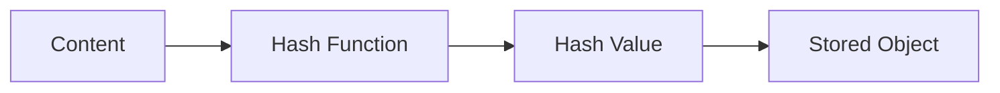
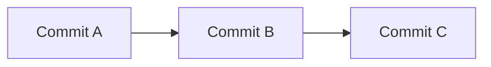
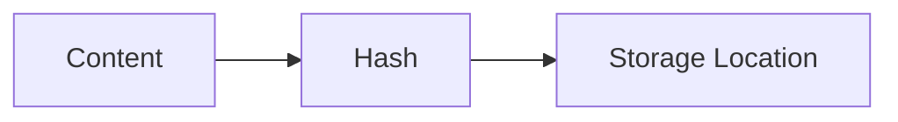

# 🔐 Hashes & SHA (How Git Identifies Everything)

<p align="center">
  
  
  
  
</p>

<p align="center">
  <b>Understand how Git uniquely identifies every object using cryptographic hashes.</b>
</p>

---

# 📌 Core Idea

```text id="gi6-core"
Everything in Git is identified by a hash
````

---

# 🧠 What Is a Hash?

A hash is:

```text id="gi6-def"
A fixed-length fingerprint of data
```

---

## 🧪 Example

```text id="gi6-ex"
"Hello" → a1b2c3d4...
```

---

## 🧠 Properties

```text id="gi6-prop"
- fixed length
- unique (almost)
- deterministic
- irreversible
```

---

# 🔐 What Is SHA?

SHA =

```text id="gi6-sha"
Secure Hash Algorithm
```

---

## 🧠 Versions

```text id="gi6-versions"
SHA-1   → used traditionally
SHA-256 → newer, more secure
```

---

# 🗺️ Big Picture



---

# 🧬 How Git Uses Hashes

---

## 📌 Process

```text id="gi6-process"
Content → Hash → Stored as object
```

---

## 🧠 Example

```text id="gi6-process-ex"
file.txt → "Hello"
↓
SHA-1 → abcd1234...
↓
Stored in .git/objects
```

---

# 🔍 Real Hash Example

```text id="gi6-real"
e3b0c44298fc1c149afbf4c8996fb924...
```

---

# 🧠 Key Insight

```text id="gi6-insight"
Same content → same hash
Different content → different hash
```

---

# 🧪 Try It Yourself

---

### Generate Hash

```bash id="gi6-lab1"
echo "Hello" | git hash-object --stdin
```

---

### Store Object

```bash id="gi6-lab2"
echo "Hello" | git hash-object -w --stdin
```

---

# 🧬 Hash in Git Objects

---

## Blob

```text id="gi6-blob"
Hash = content
```

---

## Tree

```text id="gi6-tree"
Hash = structure + file references
```

---

## Commit

```text id="gi6-commit"
Hash = tree + parent + metadata
```

---

## 🧠 Visual


---

# 🔗 Hash Linking (Very Important)

---

## Commit Chain



---

## 🧠 Why This Works

```text id="gi6-chain-why"
Each commit contains parent hash
```

---

## 🔐 Result

```text id="gi6-chain-result"
Changing one commit breaks entire chain
```

---

# 🧠 Data Integrity

---

## 📌 Why Git is Safe

```text id="gi6-integrity"
Any change → new hash
```

---

## Example

```text id="gi6-integrity-ex"
Hello → hash1
Hello! → hash2
```

---

## 🧠 Meaning

```text id="gi6-integrity-meaning"
Even tiny changes produce new hashes
```

---

# 🚨 Hash Collision (Advanced)

---

## 📌 What is it?

```text id="gi6-collision"
Two different contents → same hash
```

---

## 🧠 In Reality

```text id="gi6-collision-real"
Extremely unlikely
```

---

## ⚠️ SHA-1 Issue

```text id="gi6-sha1-risk"
Theoretical collision possible
```

---

## 🔐 Solution

```text id="gi6-sha256"
Git is moving to SHA-256
```

---

# 🧬 Content-Addressable Storage

---

## 📌 Meaning

```text id="gi6-content"
Data stored by content, not filename
```

---

## Visual



---

## 🧠 Key Insight

```text id="gi6-content-insight"
Hash = address of object
```

---

# ⚡ Why Hashing Makes Git Fast

---

## Fast Lookup

```text id="gi6-fast"
Hash → direct access
```

---

## No Duplication

```text id="gi6-dedupe"
Same content stored once
```

---

## Integrity Check

```text id="gi6-check"
Verify data automatically
```

---

# 🧠 Real-World Analogy

---

## Fingerprint System

```text id="gi6-analogy"
Content = person
Hash = fingerprint
```

---

## Meaning

```text id="gi6-analogy-meaning"
Unique identity for each object
```

---

# 🚨 Common Misconceptions

---

### ❌ Hash = encryption

❌ Wrong

---

### ❌ Hash can be reversed

❌ Wrong

---

### ❌ Git uses filenames for identity

❌ Wrong

---

### ✅ Correct

```text id="gi6-correct"
Git uses content to identify objects
```

---

# ✅ Best Practices

* don’t modify `.git` manually
* trust Git’s integrity system
* understand hashes for debugging
* use short hashes carefully

---

# 🧠 Pro Tips

* use `git log --oneline` (short hashes)
* use `git show <hash>`
* use `git rev-parse HEAD`

---

# 🧬 Internal Model Summary

```text id="gi6-summary"
Content → Hash → Object → Linked History
```

---

# 🎤 Interview Questions

### What is a hash?

A fixed-length fingerprint of data.

---

### Why does Git use hashing?

To uniquely identify objects and ensure integrity.

---

### What is SHA-1?

Hashing algorithm used by Git.

---

### What is collision?

Two different inputs producing same hash.

---

### Why move to SHA-256?

Better security and collision resistance.

---

## 🧪 Practice Lab

---

### Task 1

```bash id="lab1"
git hash-object file.txt
```

---

### Task 2

```bash id="lab2"
git rev-parse HEAD
```

---

### Task 3

```bash id="lab3"
git show <hash>
```

---

### Task 4

```bash id="lab4"
Modify file → observe new hash
```

---

## 🎯 Final Takeaway

Hashes provide:

```text id="gi6-take"
Identity + Integrity + Efficiency
```

---

## 🚀 Key Insight

> Git is a hash-based content-addressable database.

---

## 🏁 Git Internals Completed

You now understand:

```text id="gi6-final"
Storage + Objects + Pointers + Compression + Hashing
```

---

## 🎉 FINAL MESSAGE

> You now understand Git at a **system-level depth** 🔥
