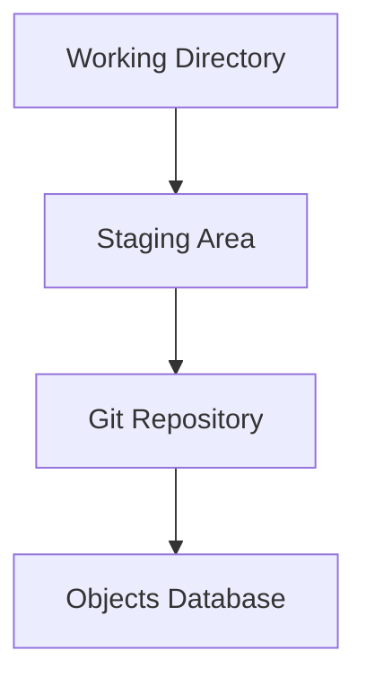
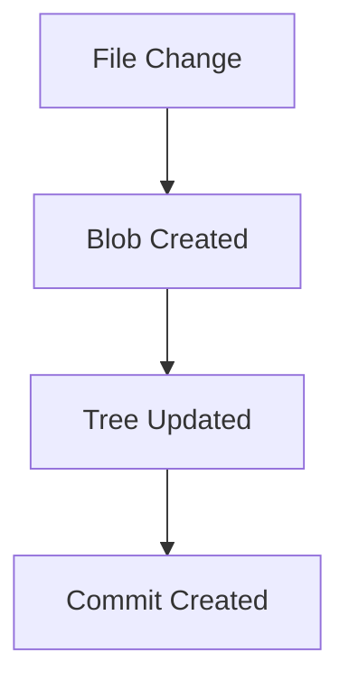

# 🧠 Git Internals (How Git Really Works)

<p align="center">
  
  
  
  
</p>

<p align="center">
  <b>Go beyond commands and understand how Git works internally — objects, storage, hashing, and data model.</b>
</p>

---

## 📌 What Is Git Internals?

Git Internals explains:

```text id="gi-def"
What happens inside .git folder when you use Git
````

---

## 🧠 Why Learn Git Internals?

Without internals:

* memorizing commands ❌
* confusion during errors ❌
* shallow understanding ❌

With internals:

* debug anything ✅
* understand every command ✅
* recover data confidently ✅
* think like a Git expert ✅

---

## 🗺️ Big Picture



---

## 🧬 Git Architecture Overview

```text id="gi-arch"
Working Directory → Index (Staging) → Repository (.git)
```

---

## 🧱 Core Concepts

---

### 📂 1. Working Directory

```text id="gi-wd"
Your actual project files
```

---

### 📦 2. Staging Area (Index)

```text id="gi-index"
Temporary area before commit
```

---

### 🗄️ 3. Repository (.git)

```text id="gi-repo"
Where Git stores history and data
```

---

## 🔍 Inside the `.git` Folder

```text id="gi-folder"
.git/
 ├── objects/
 ├── refs/
 ├── HEAD
 ├── index
 └── config
```

---

## 🧠 What You Will Learn

---

### 📦 Git Objects

* blobs
* trees
* commits

---

### 🔗 References

* branches
* HEAD
* tags

---

### 🔐 Hashing

* SHA-1 / SHA-256
* content-based storage

---

### 📦 Storage System

* object database
* packfiles

---

### 🔄 Data Flow


---

## 🧬 Git Object Model

---

### 🔹 Blob

```text id="gi-blob"
Stores file content
```

---

### 🔹 Tree

```text id="gi-tree"
Stores directory structure
```

---

### 🔹 Commit

```text id="gi-commit"
Snapshot of project + metadata
```

---

## 🧠 Key Insight

```text id="gi-insight"
Git stores snapshots, not differences
```

---

## 🧪 Example Flow

```text id="gi-example"
1. Modify file
2. git add → create blob
3. git commit → create commit object
```

---

## 🔐 Hashing System

```text id="gi-hash"
Each object has unique hash
```

---

### Example

```text id="gi-hash-ex"
e3b0c44298fc1c149afbf4c8996fb924...
```

---

## 🧠 Why Hashing Matters

* ensures data integrity
* enables fast lookup
* prevents duplication

---

## 🔄 Git Data Flow



---

## 🧠 Internal Storage Concept

```text id="gi-storage"
Everything = object
Objects = stored in .git/objects
```

---

## 🧪 Real-World Importance

Understanding internals helps in:

* debugging corrupted repos
* recovering lost commits
* understanding rebasing/merging
* optimizing Git performance

---

## 🧱 Topics Covered

| File                        | Concept             |
| --------------------------- | ------------------- |
| `01-how-git-stores-data.md` | storage model       |
| `02-blobs-trees-commits.md` | object types        |
| `03-head-and-refs.md`       | references          |
| `04-packfiles.md`           | compression         |
| `05-objects-folder.md`      | storage structure   |
| `06-hashes-sha.md`          | hashing system      |
| `diagrams.md`               | visual explanations |

---

## 🧠 Git vs Traditional VCS

| Traditional VCS | Git              |
| --------------- | ---------------- |
| stores diffs    | stores snapshots |
| centralized     | distributed      |
| slower          | faster           |

---

## 🔥 Advanced Concepts Preview

You’ll understand:

* how `git log` works internally
* how branches are just pointers
* how commits are linked
* how data is never really lost

---

## 🧠 Mental Model

```text id="gi-mental"
Git = Graph of commits (linked by hashes)
```

---

## 🧬 Commit Graph


---

## 🎤 Interview Questions

### How does Git store data?

As objects (blob, tree, commit).

---

### What is a commit internally?

A snapshot with metadata and pointer to tree.

---

### What is HEAD?

Pointer to current branch.

---

### What is a blob?

File content storage object.

---

### Why is Git fast?

Content-addressable storage + hashing.

---

## 🧪 Practice Lab

---

### Task 1

```bash id="lab1"
ls .git
```

---

### Task 2

```bash id="lab2"
git cat-file -p <hash>
```

---

### Task 3

```bash id="lab3"
git hash-object file.txt
```

---

## 🎯 Final Takeaway

Git Internals gives you:

```text id="gi-take"
Deep understanding + Debugging power + True mastery
```

---

## 🚀 Key Insight

> Once you understand internals, Git becomes predictable.

---

## 👉 Next Step

➡️ `01-how-git-stores-data.md`
