# 🧠 Git Internals — Ultimate Visual Guide

<p align="center">
  
  
  
  
</p>

<p align="center">
  <b>The ultimate visual breakdown of how Git works internally — from files to commits to production.</b>
</p>

---

# 🧭 SECTION 1 — COMPLETE GIT SYSTEM

---

## 🗺️ Full Git Architecture

```mermaid
flowchart LR
    A[Working Directory] --> B[Staging Area]
    B --> C[Local Repo (.git)]
    C --> D[Remote Repo]
````

---

## 🧠 Mental Model

```text
Files → Staging → Commit → History → Remote
```

---

# 📦 SECTION 2 — OBJECT MODEL

---

## 🧬 Blob → Tree → Commit

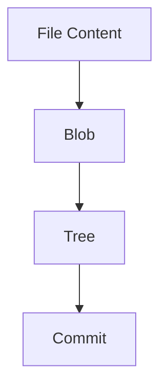

---

## 🧬 Deep Structure

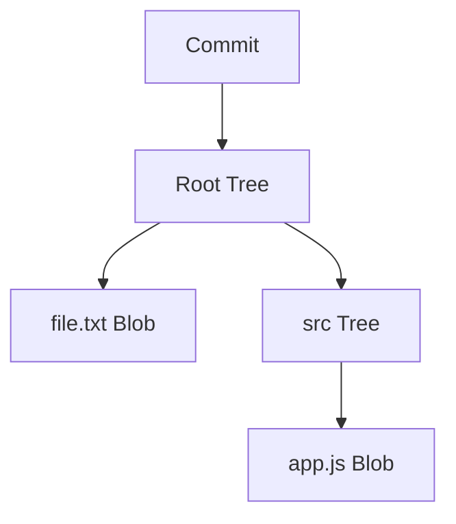

---

## 🧠 Snapshot Model


---

# 🔗 SECTION 3 — COMMIT GRAPH

---

## Linear History


---

## Branching

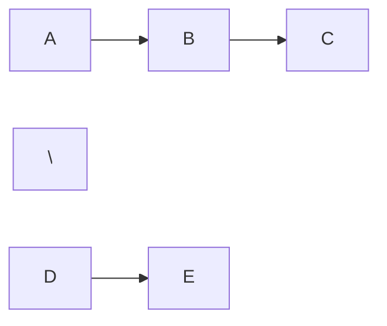

---

## Merge

```mermaid
flowchart TD
    A --> B --> C
     \         /
      D ------ 
```

---

## Rebase

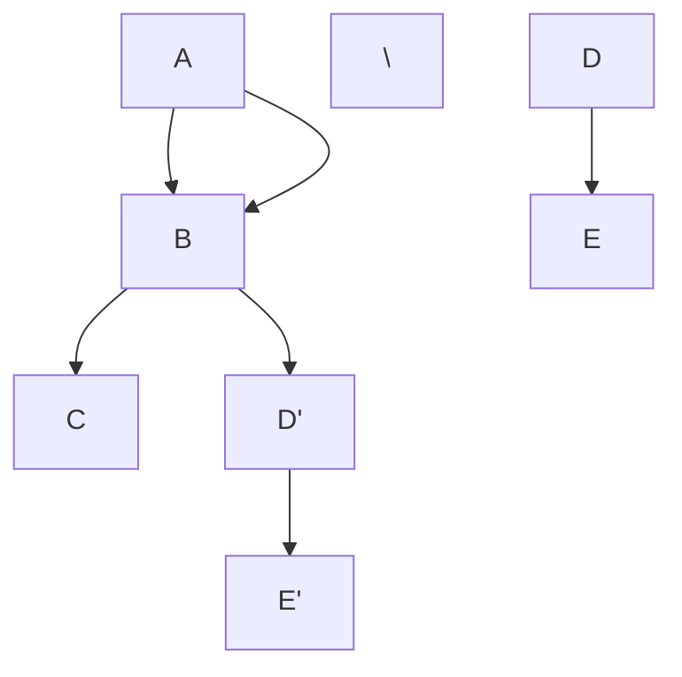

---

# 🎯 SECTION 4 — HEAD & REFS

---

## HEAD Pointer


---

## Detached HEAD

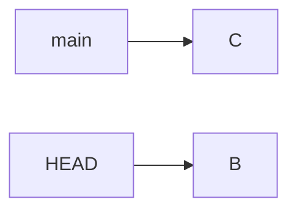

---

## Branch Movement

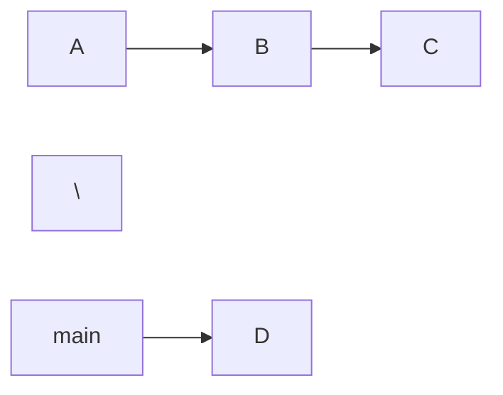

---

# 🔄 SECTION 5 — DATA FLOW

---

## Commit Flow

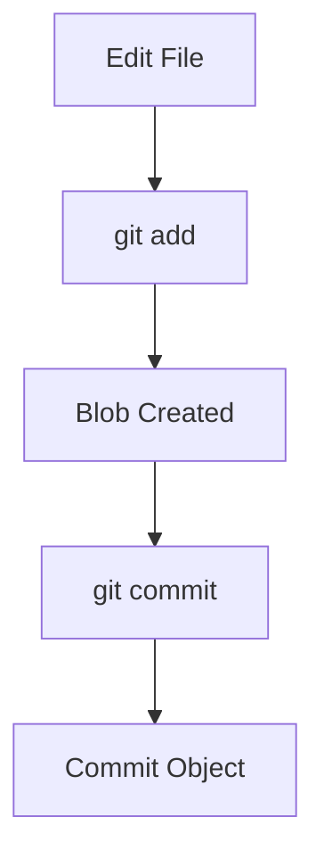

---

## Push Flow


---

## Pull Flow


---

# 📦 SECTION 6 — STORAGE SYSTEM

---

## Loose Objects

```text
.git/objects/ab/cd1234...
```

---

## Packfiles

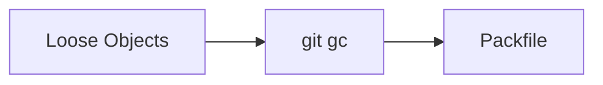

---

## Delta Compression

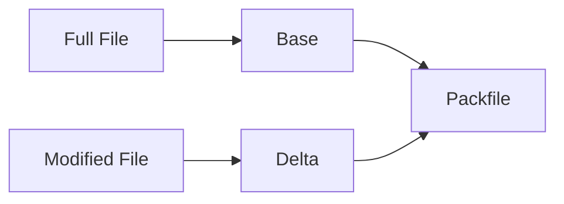

---

# 🔐 SECTION 7 — HASHING SYSTEM

---

## Hash Flow

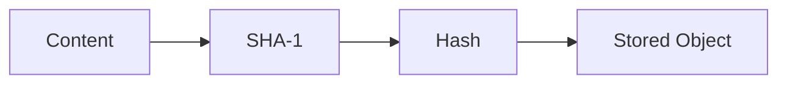

---

## Integrity Chain


---

## Change Impact

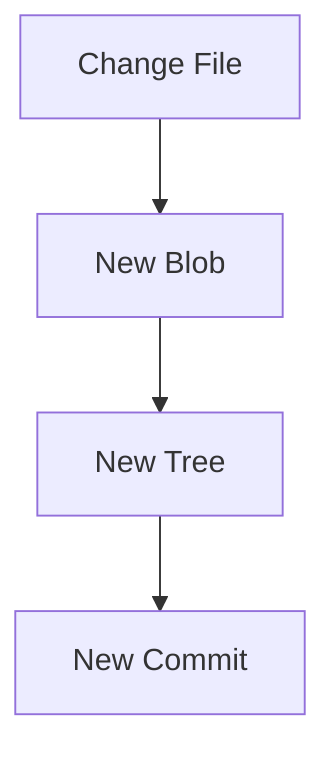

---

# ⚙️ SECTION 8 — GIT COMMANDS (INTERNAL FLOW)

---

## git add

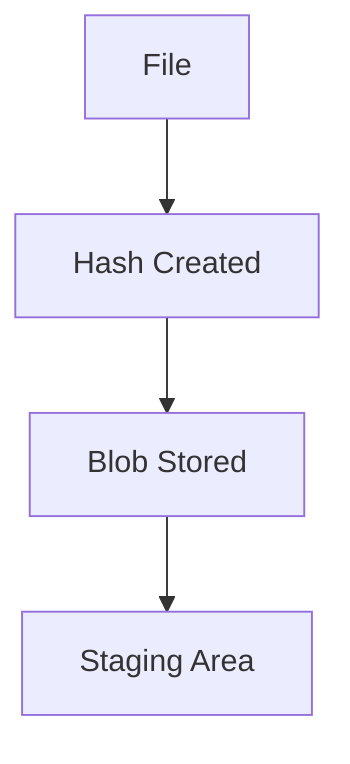

---

## git commit

```mermaid
flowchart TD
    A[Staged Files] --> B[Tree Created]
    B --> C[Commit Created]
```

---

## git checkout

```mermaid
flowchart TD
    A[HEAD moves] --> B[Files updated]
```

---

## git merge

```mermaid
flowchart TD
    A[Branch A] --> C[Merge Commit]
    B[Branch B] --> C
```

---

## git rebase

```mermaid
flowchart TD
    A[Old Commits] --> B[Rewritten Commits]
```

---

# 🚀 SECTION 9 — CI/CD FLOW

---

## Full Pipeline

```mermaid
flowchart LR
    A[Commit] --> B[CI Tests]
    B --> C[Build]
    C --> D[Deploy]
```

---

# 🌍 SECTION 10 — REAL-WORLD FLOW

---

## Startup Workflow

```mermaid
flowchart LR
    A[Idea] --> B[PR] --> C[Merge] --> D[Deploy]
```

---

## Enterprise Workflow

```mermaid
flowchart LR
    A[Feature] --> B[Develop] --> C[Release] --> D[Production]
```

---

# 🔥 SECTION 11 — DEBUGGING FLOW

---

## Lost Commit Recovery

```mermaid
flowchart TD
    A[Lost Commit] --> B[git reflog]
    B --> C[Recover Hash]
    C --> D[Restore Branch]
```

---

## Merge Conflict

```mermaid
flowchart TD
    A[Conflict] --> B[Manual Fix]
    B --> C[git add]
    C --> D[Commit]
```

---

# 📋 SECTION 12 — CHEAT SHEET

---

## Core Flow

```text
edit → add → commit → push
```

---

## Object Model

```text
blob → tree → commit
```

---

## Navigation

```text
HEAD → branch → commit
```

---

## Recovery

```text
reflog → checkout → restore
```

---

# 🧠 SECTION 13 — MASTER INSIGHT

---

## Git = Graph Database

```mermaid
flowchart LR
    A[Commit] --> B[Commit] --> C[Commit]
```

---

## Final Model

```text
Git = Objects + Hashes + Pointers + Graph
```

---

# 🎯 FINAL TAKEAWAY

```text
Git is not a file system.

Git is a content-addressable graph database.
```

---

# 🚀 FINAL MESSAGE

> If you understand these diagrams,
> you understand Git better than 90% of developers 🔥
