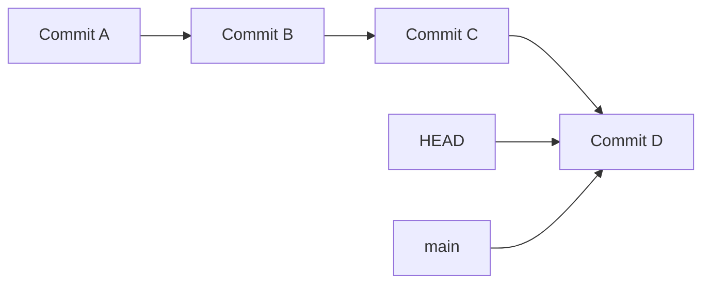
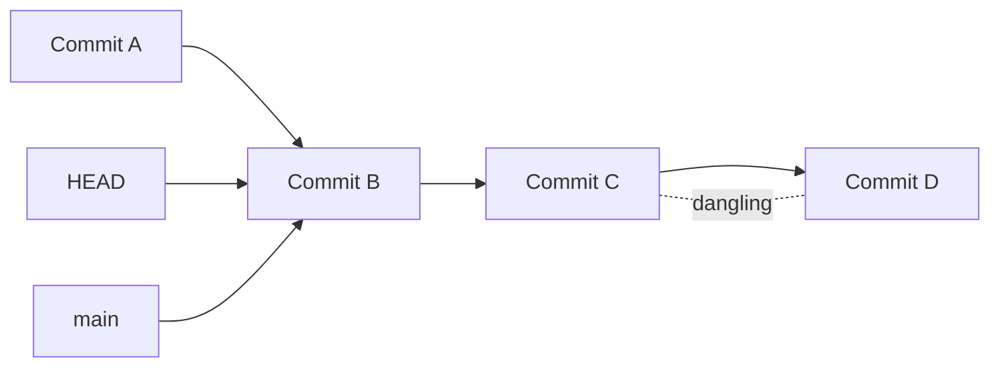
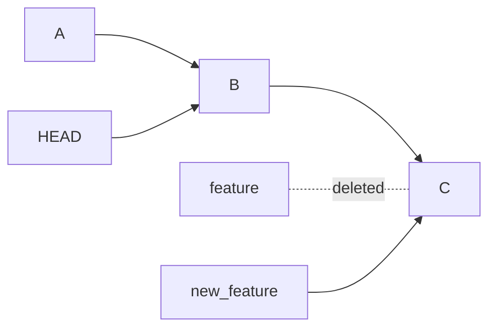
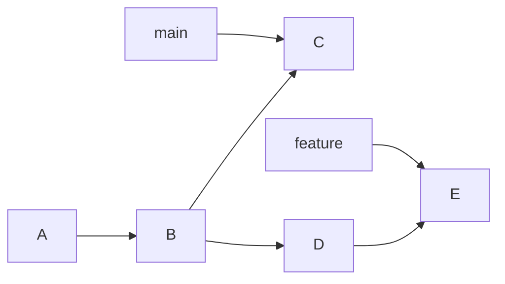
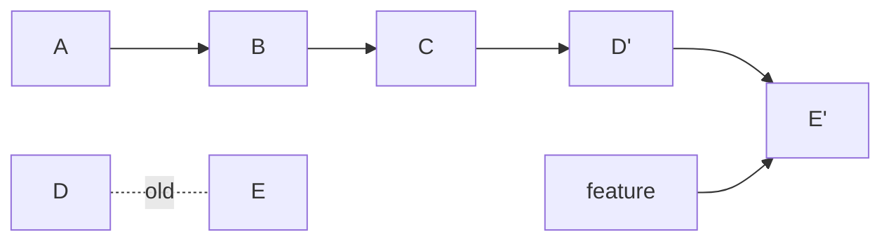
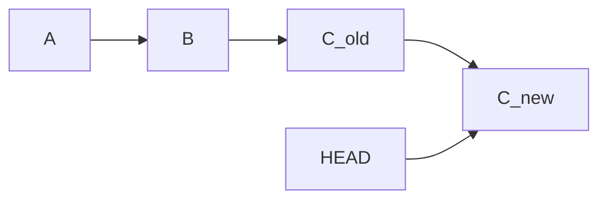
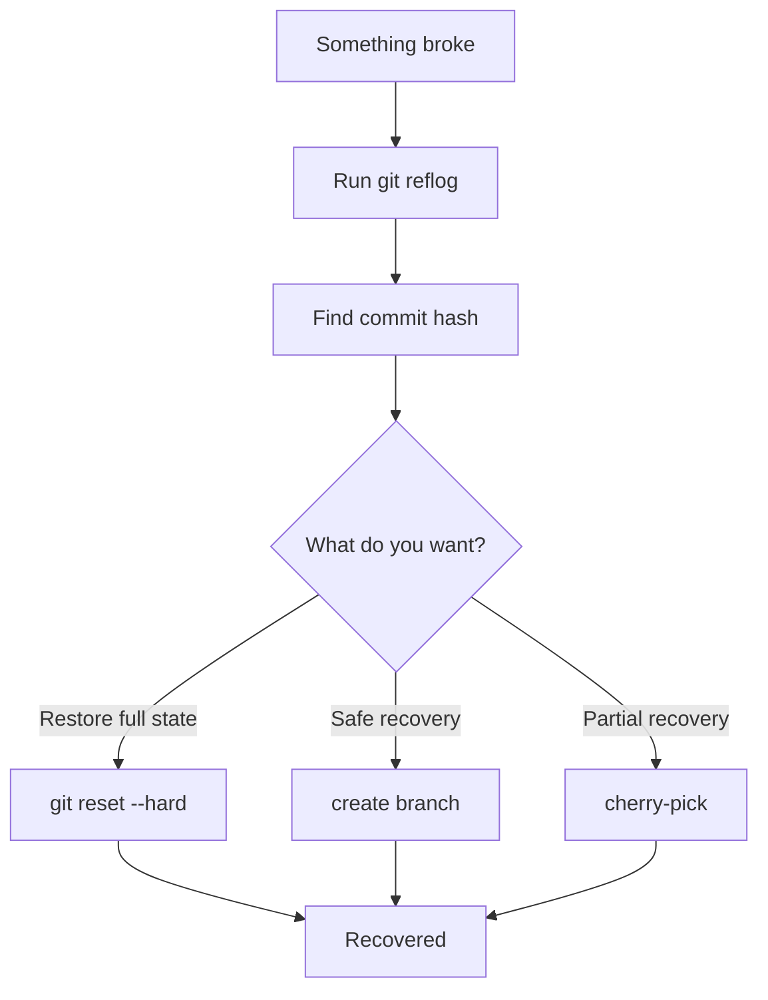

# 🔍 Recover Lost Commit (Reflog Mastery)

> “Commits don’t disappear — only references do.”

---

## 🎯 What You’ll Learn

* Recover commits after `reset --hard`
* Restore deleted branches
* Use `git reflog` like a pro
* Understand how Git tracks history internally

---

## 🧠 Core Truth

> ❗ If you made a commit, Git almost always still has it.

Even if:

* You ran `git reset --hard`
* You deleted a branch
* You messed up history

👉 The commit still exists in Git objects.

---

## 🧬 How Git Tracks Your Moves



---

### After a reset:

```bash
git reset --hard HEAD~2
```



👉 Commits **C and D are NOT deleted**
They are just **unreachable (dangling)**

---

## 🔑 The Superpower: `git reflog`

```bash
git reflog
```

---

### 🧠 What reflog stores:

```mermaid
graph TD
    R1[HEAD@{0} → reset to B]
    R2[HEAD@{1} → commit D]
    R3[HEAD@{2} → commit C]
    R4[HEAD@{3} → commit B]

    R1 --> R2 --> R3 --> R4
```

👉 Reflog tracks:

* Every HEAD movement
* Every commit, reset, checkout

---

## 🔍 Scenario 1: Lost Commit After Reset

### 💥 You did:

```bash
git reset --hard HEAD~1
```

---

### 🔎 Step 1: Check reflog

```bash
git reflog
```

Example:

```text
a1b2c3 HEAD@{0}: reset: moving to HEAD~1
d4e5f6 HEAD@{1}: commit: Added feature
```

---

### ✅ Step 2: Restore commit

```bash
git reset --hard d4e5f6
```

---

### 🧠 Visual Recovery


---

## 🔍 Scenario 2: Recover Deleted Branch

### 💥 You did:

```bash
git branch -D feature
```

---

### 🔎 Find commit via reflog:

```bash
git reflog
```

---

### ✅ Restore branch:

```bash
git checkout -b feature <commit-hash>
```

---

### 🧠 Visual



---

## 🔍 Scenario 3: Lost After Rebase

Rebase rewrites history:



---

After rebase:



👉 Old commits still exist → reflog can restore them

---

## 🔍 Scenario 4: Accidentally Overwritten Commit

```bash
git commit --amend
```

Old commit is replaced, but:



👉 `C_old` still recoverable via reflog

---

## ⚙️ Recovery Strategies

### 🧩 Strategy 1: Restore HEAD

```bash
git reset --hard <commit>
```

---

### 🧩 Strategy 2: Create new branch

```bash
git checkout -b recovery <commit>
```

---

### 🧩 Strategy 3: Cherry-pick commit

```bash
git cherry-pick <commit>
```

---

## 🧠 Deep Internal Insight

Git stores commits in:

```text
.git/objects/
```

Even if:

* No branch points to them
* They are “lost”

👉 They remain until garbage collection runs

---

## ⏳ When Do You REALLY Lose Commits?

```mermaid
flowchart TD
    A[Commit Created] --> B[Becomes Dangling]
    B --> C{Garbage Collection?}
    C -->|No| D[Still Recoverable]
    C -->|Yes (~30 days)| E[Deleted Permanently]
```

👉 Default safety window ≈ **30 days**

---

## 🧭 Full Recovery Flow



---

## ❗ Common Mistakes

* ❌ Panic and run more commands
* ❌ Force push again (worse damage)
* ❌ Assume commits are gone

---

## 🧠 Interview Insight

👉 Question:
**How do you recover a lost commit after a hard reset?**

👉 Answer:

* Use `git reflog` to find commit
* Use `git reset --hard <hash>` or create a branch

---

## ⚡ Pro Tips (Elite Level)

* `git reflog` = your **time machine**
* Always create recovery branch first (safe approach)
* Avoid immediate garbage collection
* Use:

```bash
git fsck --lost-found
```

👉 to find unreachable commits

---

## 🏁 Final Thought

> “Git never loses data — it only hides it from beginners.”

---

## Next step

➡️ `04-detached-head-fix.md`
