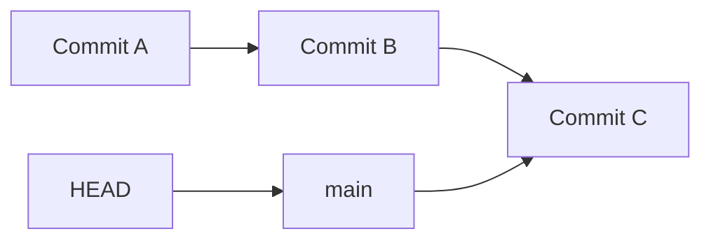
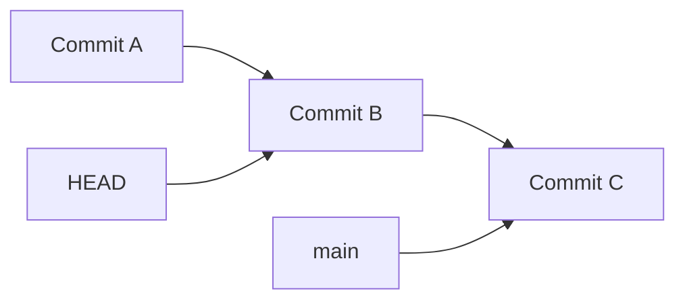
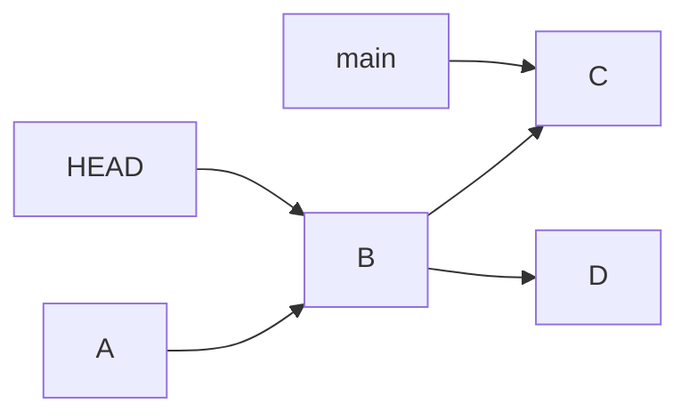
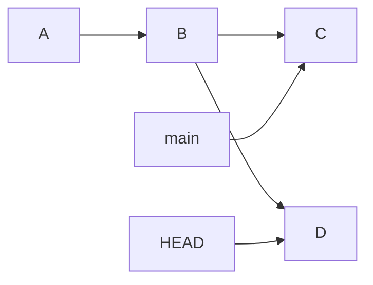
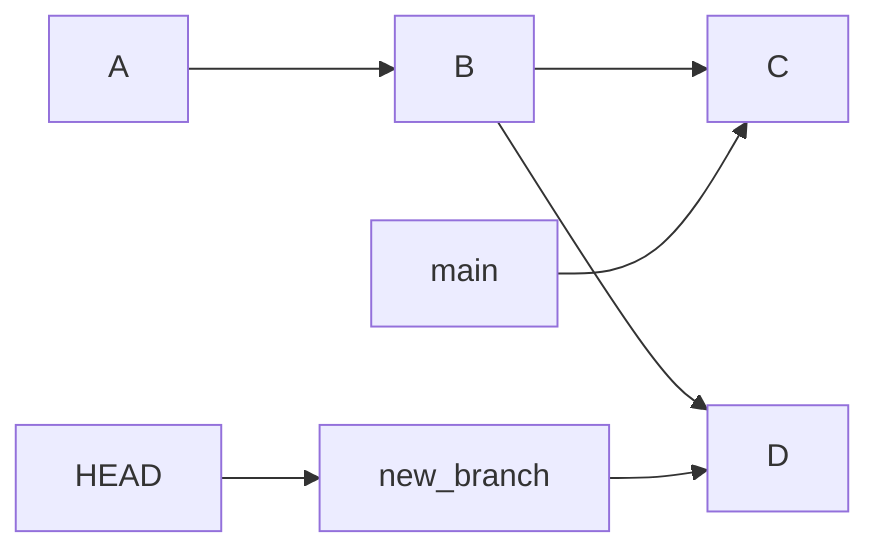
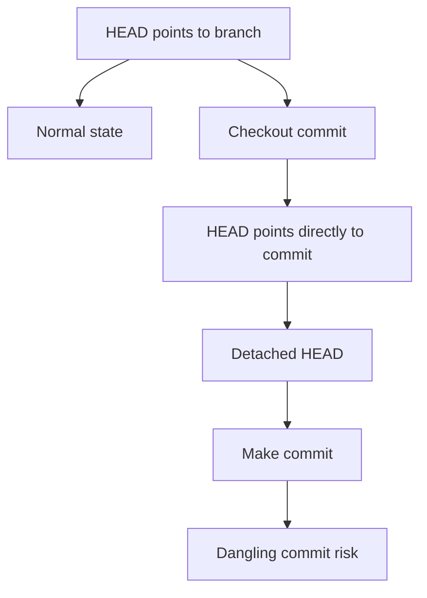
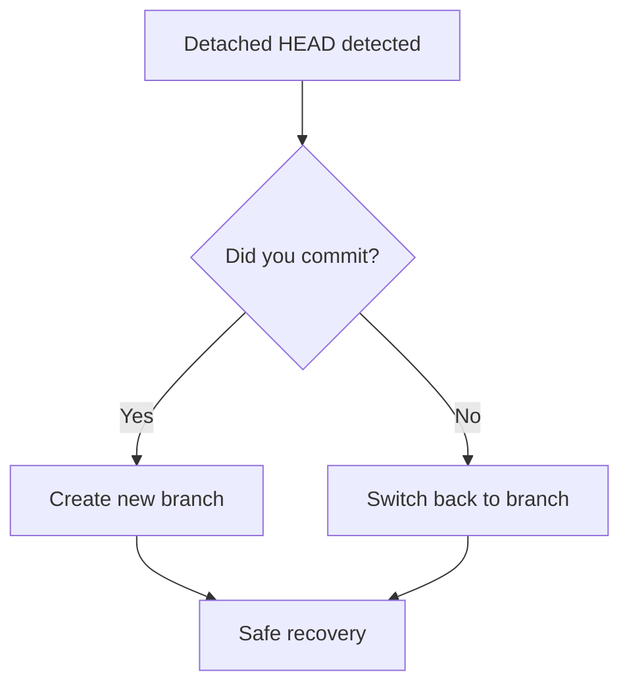
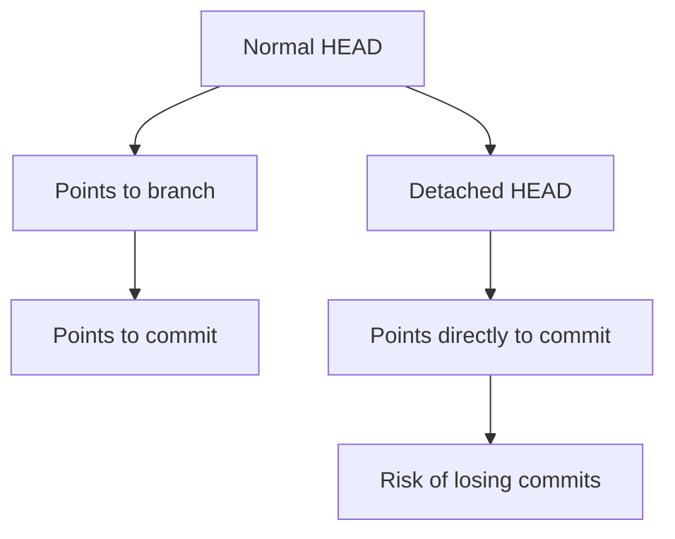

# 🧭 Fix Detached HEAD (Understand It Like a Pro)

> “Detached HEAD is not an error — it’s Git telling you: you are exploring history.”

---

## 🎯 What You’ll Learn

* What **Detached HEAD** actually means
* Why it happens
* How to safely fix it
* How to **use it like a pro (not fear it)**

---

## 🧠 First: What is HEAD?



👉 Normally:

* `HEAD` → points to a **branch**
* Branch → points to a **commit**

---

## 💥 What is Detached HEAD?



👉 Now:

* `HEAD` points directly to a **commit**
* NOT to any branch ❗

This is called:

# ⚠️ Detached HEAD State

---

## 🔍 How It Happens

### 1. Checking out a commit

```bash
git checkout <commit-hash>
```

---

### 2. Checking out old history

```bash
git checkout HEAD~1
```

---

### 3. Tag checkout

```bash
git checkout v1.0
```

---

## 🧠 Real Meaning

> You are no longer “on a branch” —
> You are just **looking at a snapshot in time**

---

## ⚠️ The Real Danger

If you make commits here:



👉 Commit `D` is:

* Not connected to any branch
* Easy to lose

---

## 🔍 Scenario 1: You Just Entered Detached HEAD

### 🧪 Check status:

```bash
git status
```

Output:

```text
HEAD detached at abc123
```

---

### ✅ Solution (Go Back Safely)

```bash
git checkout main
```

---

## 🔍 Scenario 2: You Made a Commit in Detached HEAD

### 💥 Situation:



---

### ⚠️ If you switch branches now:

```bash
git checkout main
```

👉 Commit `D` becomes **dangling**

---

## ✅ Fix: Save Your Work

### Option 1: Create a branch (BEST)

```bash
git checkout -b new-branch
```

---

### 🧠 Visual



---

### Option 2: Use cherry-pick

```bash
git checkout main
git cherry-pick <commit-hash>
```

---

## 🔍 Scenario 3: You Lost Detached HEAD Commit

👉 Don’t panic — use reflog:

```bash
git reflog
```

Example:

```text
abc123 HEAD@{1}: commit: experimental change
```

---

### ✅ Recover:

```bash
git checkout -b recovery abc123
```

---

## 🔬 Internal Behavior



---

## ⚙️ Best Practice Flow



---

## 🧠 Pro Insight (Very Important)

Detached HEAD is actually useful for:

* 🔬 Testing old versions
* 🧪 Experimenting safely
* 🔍 Debugging past commits

---

## 🧪 Safe Experiment Workflow

```bash
git checkout <old-commit>
git checkout -b experiment-branch
```

👉 Now you are safe to experiment 💡

---

## ❗ Common Mistakes

* ❌ Ignoring warning message
* ❌ Switching branch without saving commits
* ❌ Thinking repo is broken

---

## 🧠 Interview Insight

👉 Question:
**What is a detached HEAD in Git?**

👉 Answer:

* HEAD points directly to a commit instead of a branch
* Any new commits are not part of a branch
* Must create a branch to preserve work

---

## ⚡ Pro Tips (Elite Level)

* Always read Git warnings carefully
* Immediately branch if you commit in detached state
* Use reflog for recovery
* Treat detached HEAD as a **temporary lab**

---

## 🧭 Quick Summary



---

## 🏁 Final Thought

> “Detached HEAD is not danger — it’s freedom without safety rails.”

---

## Next step

➡️ `05-wrong-branch-commit.md`
