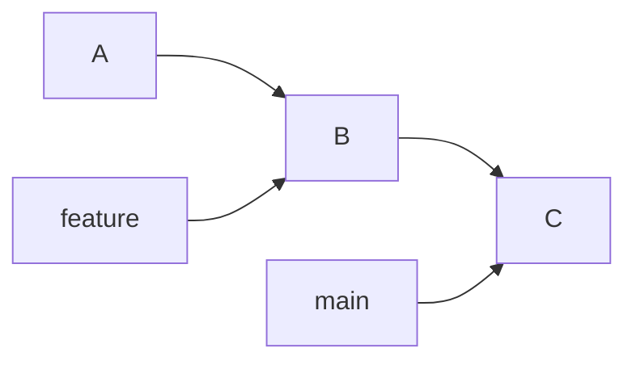
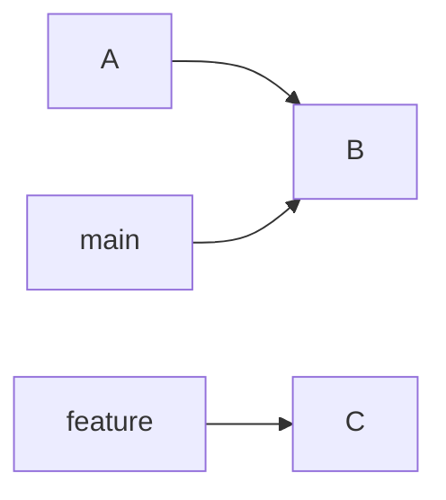
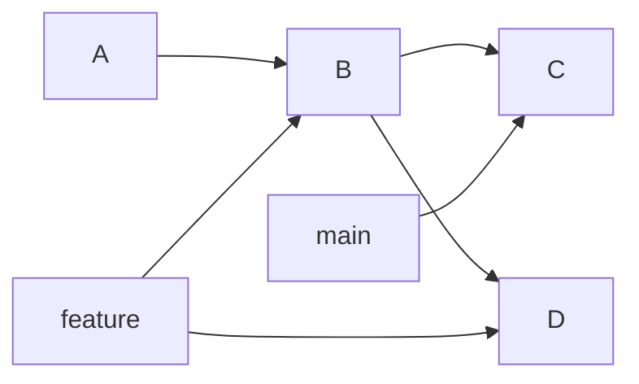
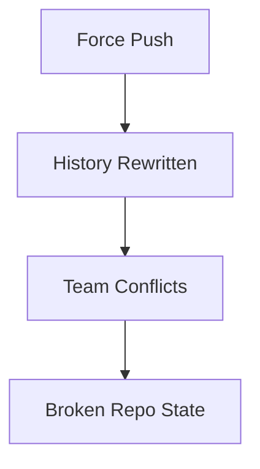
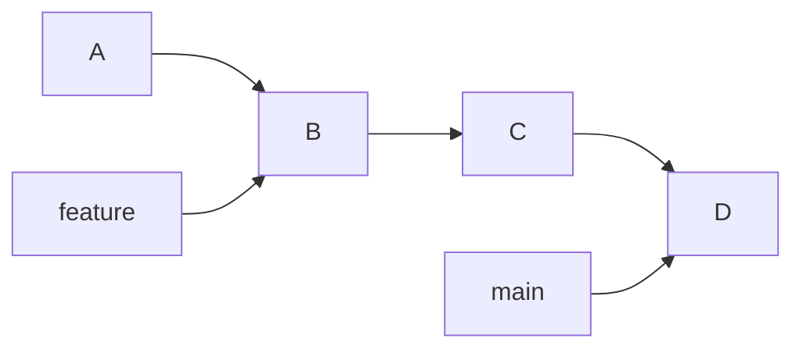
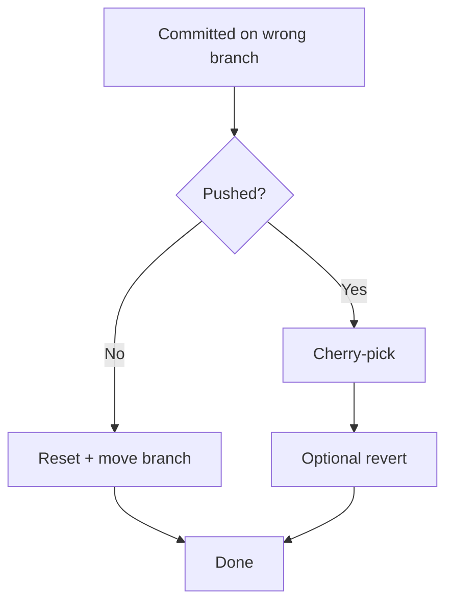

# 🌿 Commit on Wrong Branch (Fix Like a Pro)

> “You didn’t mess up — you just committed to the wrong timeline.”

---

## 🎯 What You’ll Learn

* Move commits between branches safely
* Use `reset`, `cherry-pick`, and `stash`
* Fix mistakes without losing work
* Choose the **right strategy based on situation**

---

## 🧠 The Problem

```mermaid
graph LR
    A --> B --> C

    main --> C
    feature --> B

    C[Your Commit ❌ (should be on feature)]
```

👉 You accidentally committed on `main`
👉 It should be on `feature`

---

## 🔍 Step 1: Identify Situation

Ask:

```text
Have I pushed the commit?
```

---

## ⚙️ Scenario 1: NOT Pushed (Best Case)

### 💥 Situation



---

## ✅ Solution: Move commit using reset + checkout

### Step 1: Create correct branch

```bash
git checkout -b feature
```

---

### Step 2: Go back on main

```bash
git checkout main
git reset --hard HEAD~1
```

---

### 🧠 Result



---

## ⚠️ Scenario 2: Already Pushed

👉 Now it's dangerous — others may have pulled it

---

## ✅ Solution 1: Cherry-pick (SAFE)

### Step 1: Copy commit to correct branch

```bash
git checkout feature
git cherry-pick <commit-hash>
```

---

### Step 2: Remove from wrong branch (optional)

```bash
git checkout main
git revert <commit-hash>
```

---

### 🧠 Visual



---

## ⚠️ Solution 2: Reset + Force Push (DANGEROUS)

```bash
git reset --hard HEAD~1
git push --force
```

---

### 🚨 Risk



👉 Only use if:

* You’re working alone
* Team agrees

---

## 🧪 Scenario 3: Multiple Commits on Wrong Branch



---

### ✅ Solution

```bash
git checkout feature
git cherry-pick C D
```

---

Then clean main:

```bash
git checkout main
git revert C D
```

---

## 🧠 Internal Insight

Git doesn’t care about "wrong branch"
👉 It just moves **commit pointers**

---

## ⚙️ Strategy Comparison

| Method        | Safe          | Use Case       |
| ------------- | ------------- | -------------- |
| `reset`       | ❌ (if pushed) | Local fix      |
| `cherry-pick` | ✅             | Best for teams |
| `revert`      | ✅             | Undo safely    |
| `force push`  | 💣            | Last resort    |

---

## 🧭 Best Practice Flow



---

## ❗ Common Mistakes

* ❌ Force pushing blindly
* ❌ Resetting shared branches
* ❌ Losing commits during cleanup

---

## 🧠 Interview Insight

👉 Question:
**How do you fix a commit made on the wrong branch?**

👉 Answer:

* If not pushed → use `reset`
* If pushed → use `cherry-pick` + `revert`

---

## ⚡ Pro Tips

* Always check branch before commit
* Use meaningful branch names
* Prefer **cherry-pick in teams**
* Avoid rewriting shared history

---

## 🚀 Next Step

➡️ Move to: **`06-force-push-danger.md`**
