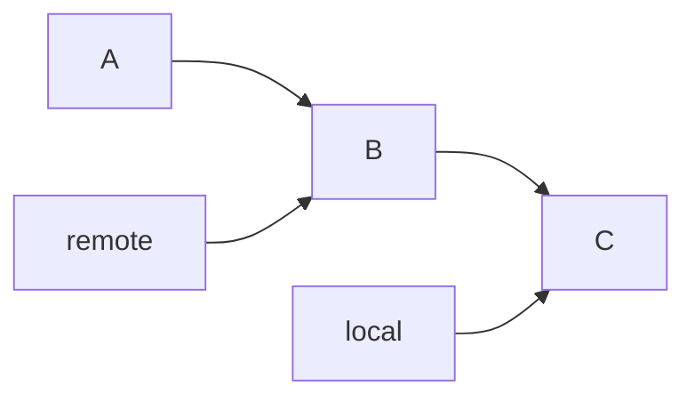
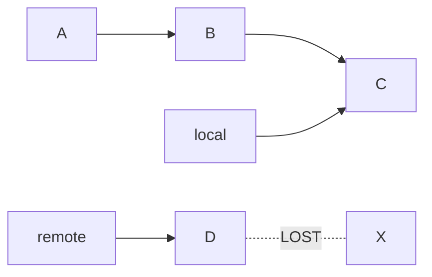
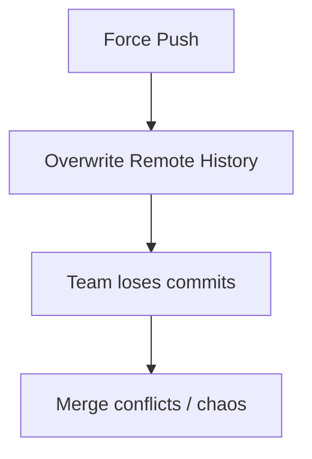
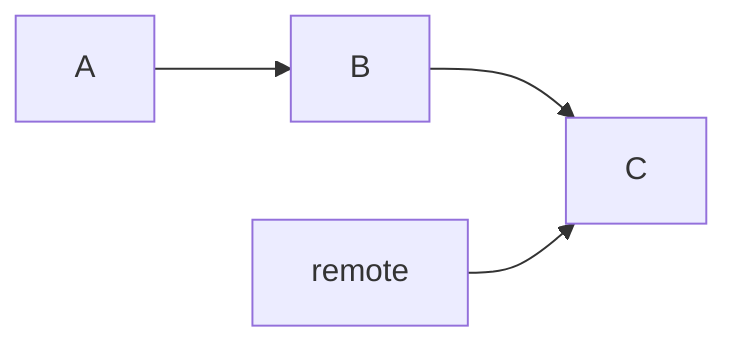
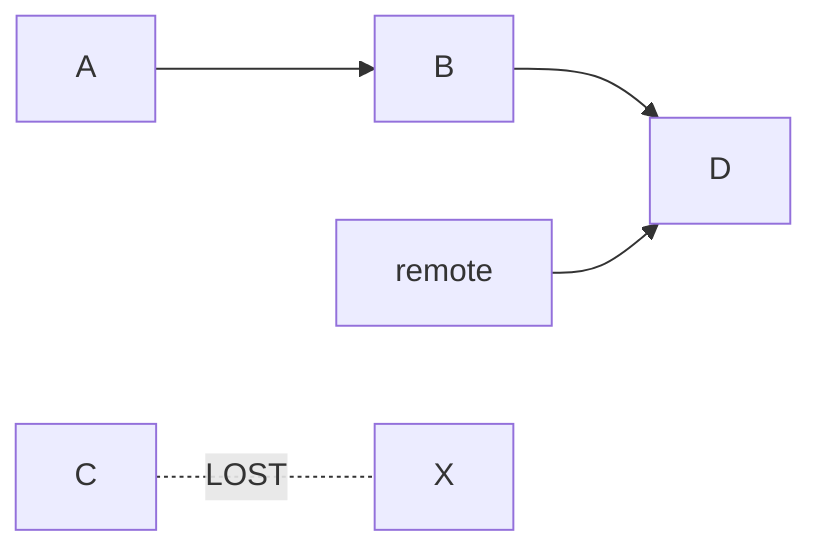
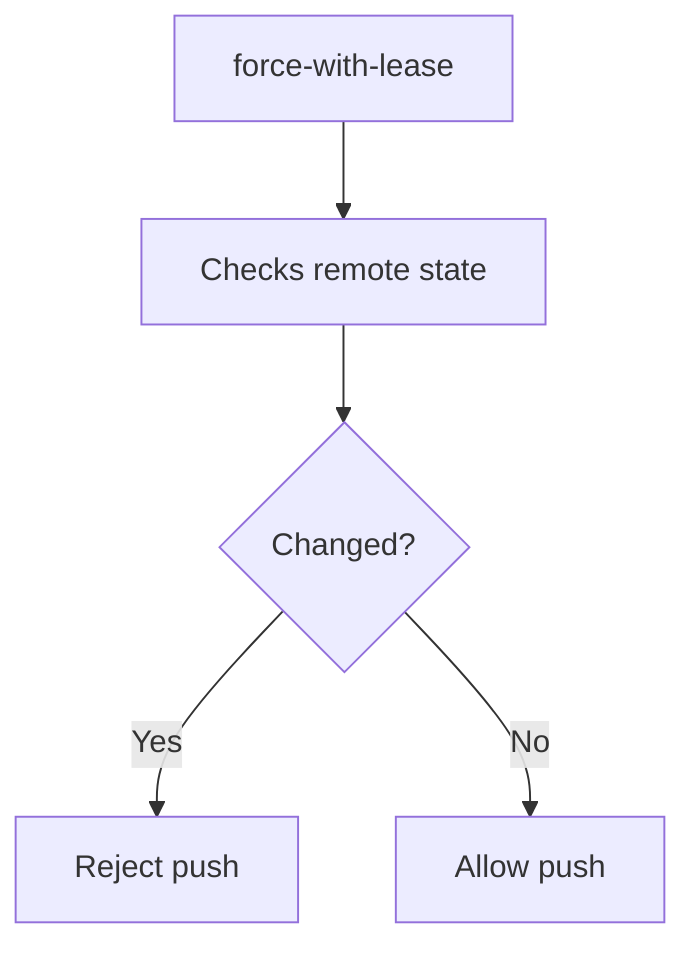
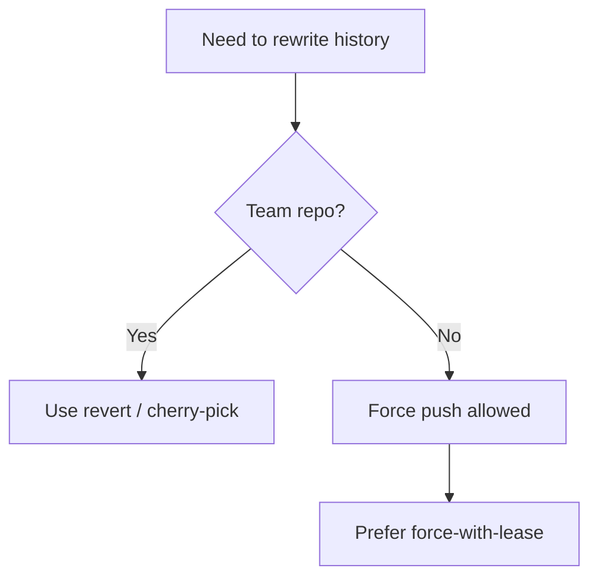

# 💣 Force Push Danger (Handle With Care)

> “Force push is not evil — but misuse can destroy your team’s history.”

---

## 🎯 What You’ll Learn

* What `git push --force` really does
* Why it’s dangerous
* How to recover after damage
* Safe alternatives

---

## 🧠 What is Force Push?

```bash
git push --force
```

👉 It overwrites remote history with local history

---

## 🔬 Normal Push vs Force Push

### ✅ Normal Push



👉 Git prevents overwrite

---

### 💣 Force Push



👉 Remote commits get deleted ❗

---

## ⚠️ Why It’s Dangerous



---

## 🔍 Scenario: Real Disaster

Teammate pushes:



You force push:



👉 Commit `C` is gone from remote

---

## 🚑 Recovery Strategy

### Step 1: Check reflog (local or teammate)

```bash
git reflog
```

---

### Step 2: Find lost commit

```text
abc123 commit: teammate work
```

---

### Step 3: Restore

```bash
git checkout -b recovery abc123
git push origin recovery
```

---

## 🧠 Advanced Recovery (Remote)

If someone still has commit:

👉 Ask teammate to run:

```bash
git reflog
```

👉 Then restore from their system

---

## ⚙️ Safer Alternative: `--force-with-lease`

```bash
git push --force-with-lease
```

---

### 🧠 Why better?



👉 Prevents accidental overwrite

---

## 🧭 Best Practice Flow



---

## ❗ Golden Rules

* ❌ Never force push shared branches (`main`, `dev`)
* ✅ Use feature branches
* ✅ Communicate before rewriting history

---

## 🧠 Internal Insight

Force push replaces:

```text
Remote branch pointer → new commit
Old commits → unreachable
```

👉 Still recoverable temporarily (reflog)

---

## 🧪 Safe Workflow

```bash
git pull --rebase
git push
```

👉 Avoids need for force push

---

## 🧠 Interview Insight

👉 Question:
**What is the difference between `--force` and `--force-with-lease`?**

👉 Answer:

* `--force` → blindly overwrites
* `--force-with-lease` → checks before overwriting

---

## ⚡ Pro Tips (Elite Level)

* Always prefer `--force-with-lease`
* Backup branch before risky push
* Use protected branches on GitHub
* Enable PR-based workflows

---

## 🚀 Next Step

➡️ Move to: **`07-reset-vs-revert.md`**

