# 🔄 Git Reset vs Revert (Master the Difference)

> “Reset rewrites history. Revert writes new history.”

---

## 🎯 What You’ll Learn

* Core difference between `reset` and `revert`
* When to use each (real-world scenarios)
* Internal behavior of both commands
* Safe vs dangerous operations

---

## 🧠 The Core Idea

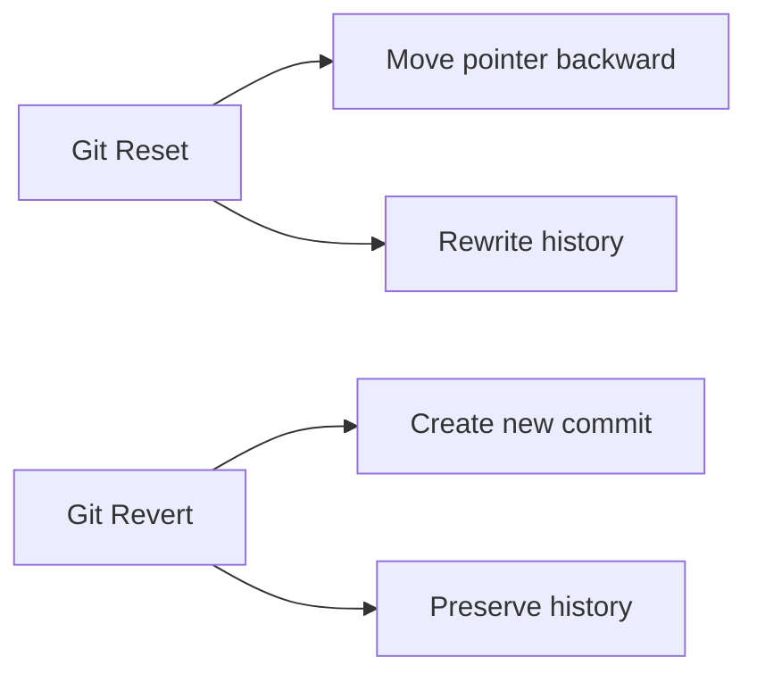

---

## 🔬 Starting Point

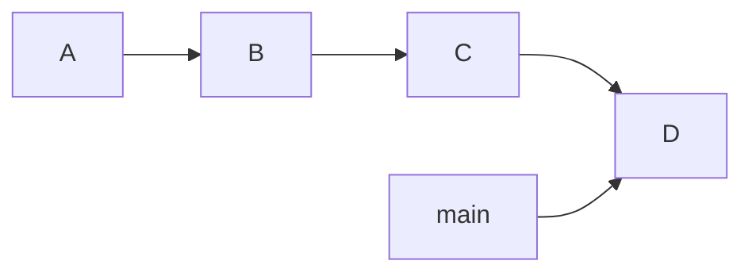

---

# ⚙️ Git Reset

---

## 🧠 What Reset Does

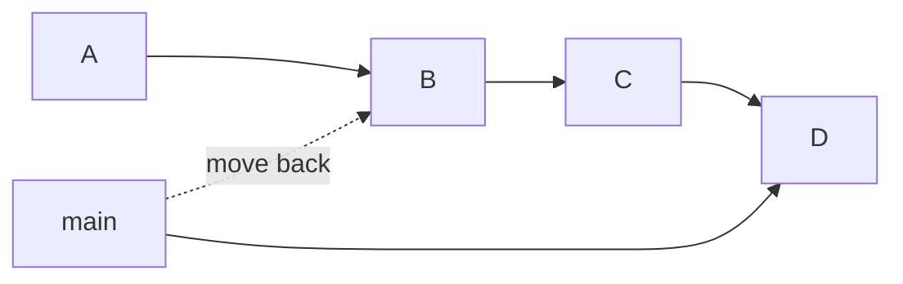

👉 Moves branch pointer backward
👉 Deletes commits from history (log view)

---

## 🧪 Command

```bash id="98f1tq"
git reset --hard HEAD~2
```

---

## 🧠 Result

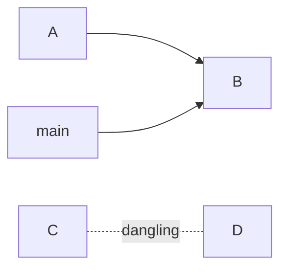

👉 Commits `C` and `D`:

* Not visible in history
* Still exist internally (temporarily)

---

## ⚠️ Reset Types Recap

| Type      | Effect               |
| --------- | -------------------- |
| `--soft`  | Keep staged changes  |
| `--mixed` | Keep working changes |
| `--hard`  | Delete everything    |

---

## ❗ When to Use Reset

* Local cleanup
* Before pushing
* Fixing recent commits

---

# 🔁 Git Revert

---

## 🧠 What Revert Does

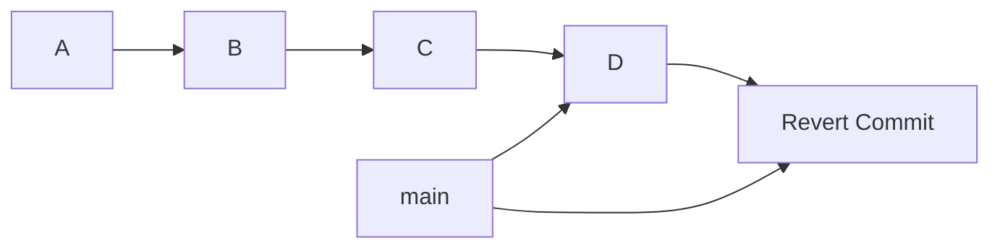

👉 Creates a new commit that **undoes changes**

---

## 🧪 Command

```bash id="7q7xch"
git revert HEAD
```

---

## 🧠 Result

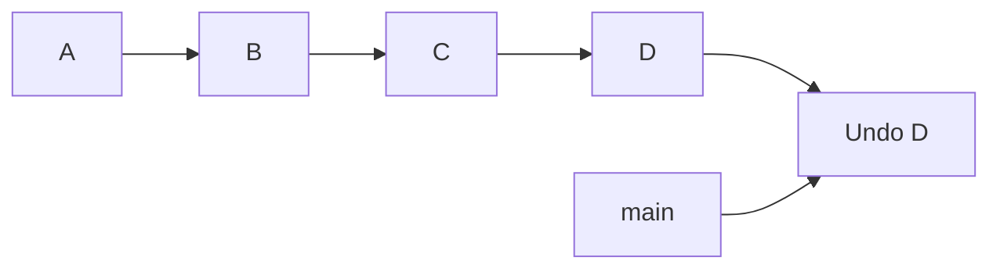

👉 History is preserved
👉 No commits are deleted

---

## ❗ When to Use Revert

* Shared branches
* Team projects
* Production code

---

# ⚔️ Side-by-Side Comparison

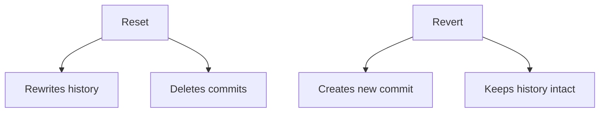

---

## 📊 Comparison Table

| Feature            | Reset     | Revert     |
| ------------------ | --------- | ---------- |
| History            | Rewritten | Preserved  |
| Safe for teams     | ❌ No      | ✅ Yes      |
| Deletes commits    | ✅ Yes     | ❌ No       |
| Creates new commit | ❌ No      | ✅ Yes      |
| Use case           | Local fix | Public fix |

---

## 🔍 Real-World Scenario

### ❌ Wrong Commit Pushed

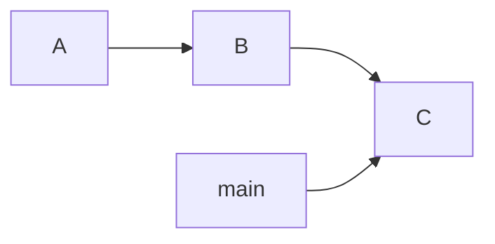

---

### Option 1: Reset (Bad for team)

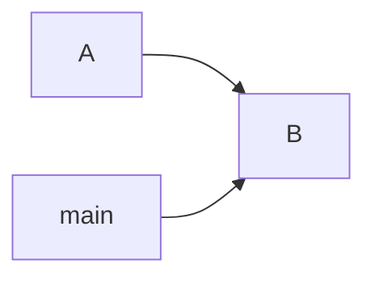

👉 Breaks team history ❗

---

### Option 2: Revert (Correct)

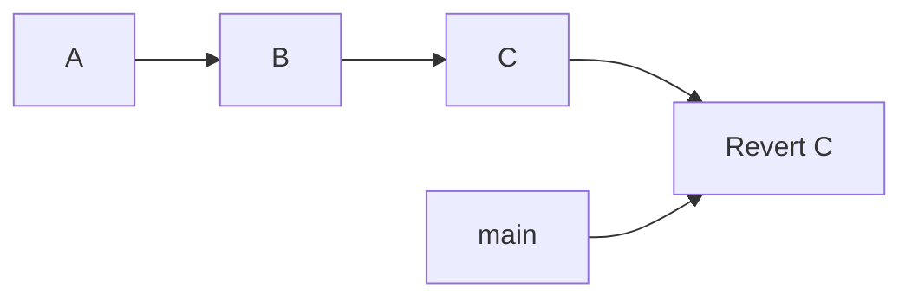

👉 Safe & traceable ✅

---

## 🧠 Internal Behavior

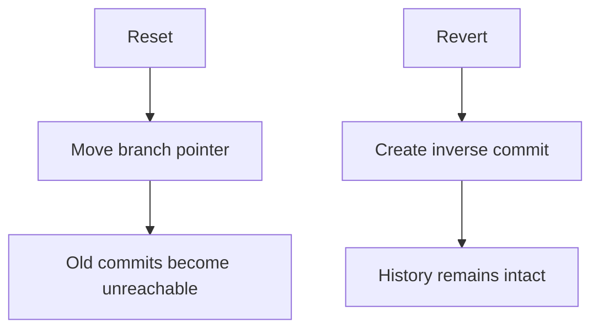

---

## 🧭 Decision Flow

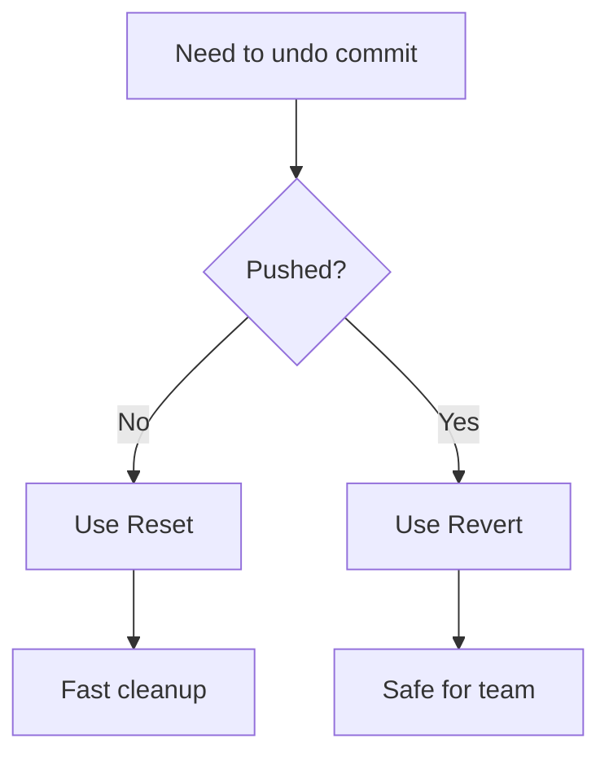

---

## ❗ Common Mistakes

* ❌ Using reset on shared branches
* ❌ Force pushing after reset
* ❌ Not understanding history rewrite

---

## 🧠 Interview Insight

👉 Question:
**Difference between `git reset` and `git revert`?**

👉 Answer:

* `reset` → moves pointer, rewrites history
* `revert` → creates new commit, keeps history

---

## ⚡ Pro Tips (Elite Level)

* Use reset only **locally**
* Use revert in **collaborative environments**
* Combine:

  * `revert` + `cherry-pick` for advanced workflows
* Always think:
  👉 “Is this branch shared?”

---

## 🧪 Advanced Trick

Revert multiple commits:

```bash id="tr2z5s"
git revert HEAD~3..HEAD
```

---

## 🚀 Next Step

➡️ Move to: **`emergency-guide.md`**
