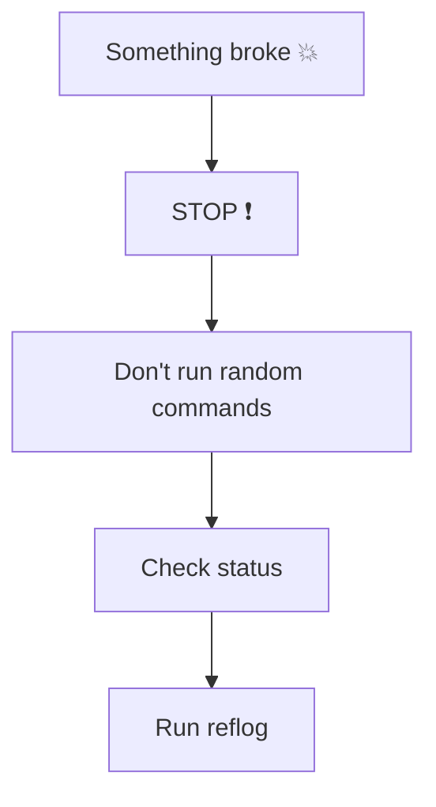
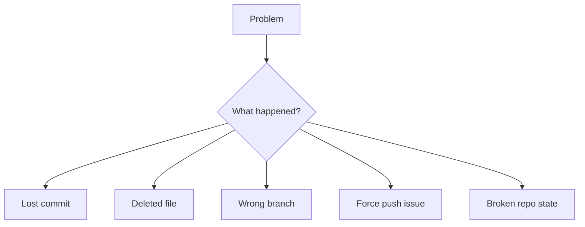
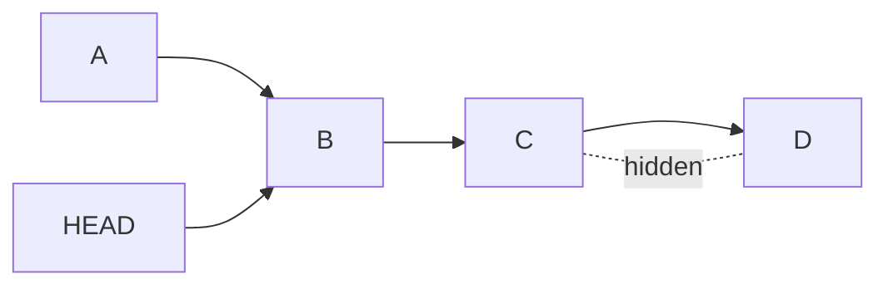
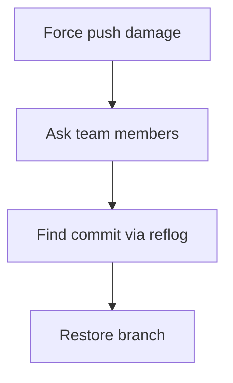
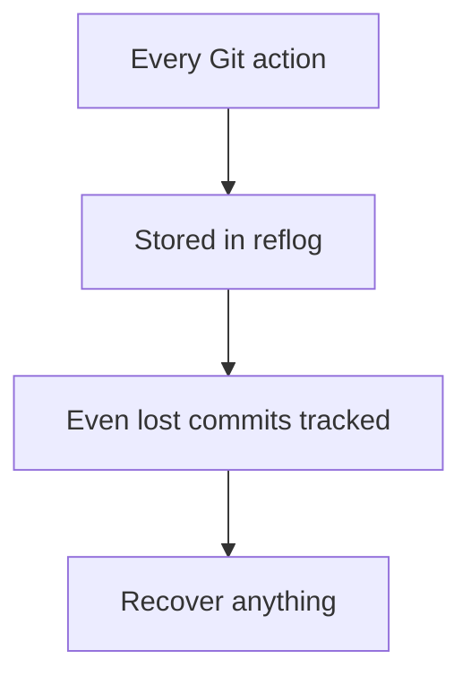
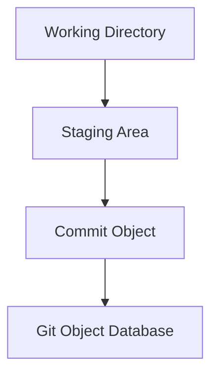
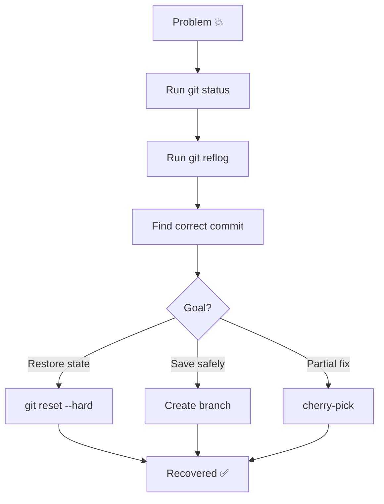
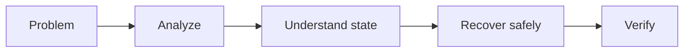

# 🚑 Git Emergency Guide (Ultimate Recovery Playbook)

> “When everything breaks — this is where you think clearly and recover everything.”

---

## 🧠 Rule #1: STOP



👉 Most damage happens after panic.

---

## 🧭 Step 0: Diagnose the Situation

Run:

```bash
git status
git log --oneline --graph --all
git reflog
```

---

## 🧠 Identify Your Problem Type



---

# 🔍 1. Recover Lost Commit

---

## 💥 Situation

* `git reset --hard`
* commit disappeared

---

## ✅ Solution

```bash
git reflog
```

Find:

```text
abc123 commit: important work
```

Restore:

```bash
git reset --hard abc123
```

---

## 🧠 Visual



---

# 🗑️ 2. Restore Deleted File

---

## ✅ Quick Fix

```bash
git restore file.txt
```

---

## 🔎 From old commit

```bash
git checkout HEAD~1 -- file.txt
```

---

# 🌿 3. Fix Wrong Branch Commit

---

## ✅ Safe Method

```bash
git checkout correct-branch
git cherry-pick <commit>
```

---

## ❌ Avoid

```bash
git push --force
```

(unless you know what you’re doing)

---

# 💣 4. Force Push Disaster

---

## 💥 Situation

* Team commits lost

---

## 🚑 Recovery

```bash
git reflog
git checkout -b recovery <commit>
git push origin recovery
```

---

## 🧠 Team Recovery Flow



---

# 🧭 5. Detached HEAD Panic

---

## ✅ Fix

```bash
git checkout -b safe-branch
```

---

👉 Always save before switching branches

---

# ⚙️ 6. Broken Merge / Conflict Chaos

---

## 💥 Situation

* Merge conflicts everywhere

---

## ✅ Abort safely

```bash
git merge --abort
```

---

## Or for rebase:

```bash
git rebase --abort
```

---

# 🧠 MASTER TOOL: Reflog

---

## 🔥 Why it's powerful



---

## 🧪 Use

```bash
git reflog
```

---

## ⚡ Restore anything

```bash
git checkout <commit>
git reset --hard <commit>
```

---

# 🔬 Advanced Debugging Handbook (Internals)

---

## 🧠 How Git Actually Works



---

## 🧩 Git Object Types

| Object | Description         |
| ------ | ------------------- |
| Blob   | File content        |
| Tree   | Folder structure    |
| Commit | Snapshot + metadata |

---

## 🔎 Inspect Internals

```bash
git cat-file -p <hash>
```

---

## 🧠 HEAD Internals


Detached:


---

# 🧪 Deep Debug Commands

---

## 🔍 Find lost objects

```bash
git fsck --lost-found
```

---

## 📦 Show commit details

```bash
git show <commit>
```

---

## 🧭 Visual history

```bash
git log --graph --oneline --all
```

---

## 🧠 Track file history

```bash
git log -- file.txt
```

---

# ⚠️ Dangerous Commands (Use Carefully)

---

| Command            | Risk                    |
| ------------------ | ----------------------- |
| `git reset --hard` | Deletes working changes |
| `git push --force` | Overwrites remote       |
| `git clean -fd`    | Deletes untracked files |

---

# 🧭 Ultimate Recovery Flow



---

# 🧠 Pro-Level Safety Rules

* ✅ Always create a backup branch before risky actions
* ✅ Use `--force-with-lease` instead of `--force`
* ✅ Never rewrite shared history casually
* ✅ Learn reflog deeply

---

# ⚡ Elite Debugging Mindset



---

# 🧪 Real-World Debug Example

### 💥 You ran:

```bash
git reset --hard HEAD~3
```

---

### ✅ Recovery:

```bash
git reflog
git reset --hard HEAD@{1}
```

---

# 🏁 Final Thought

> “Git is not dangerous — blind commands are.”

---

# 🚀 Next Step

➡️ Move to:

* `12-Interview-Questions/`
