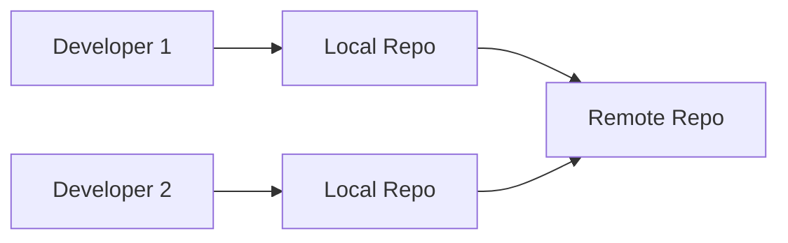
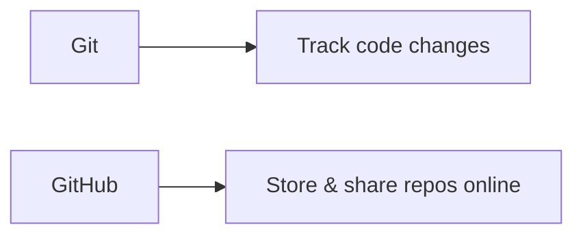
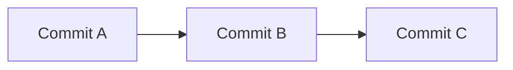
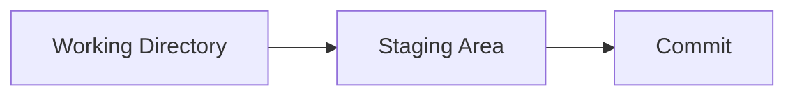
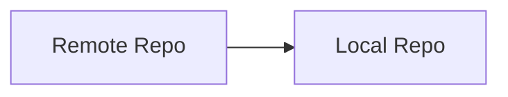
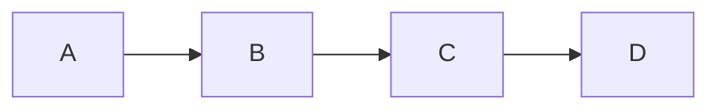
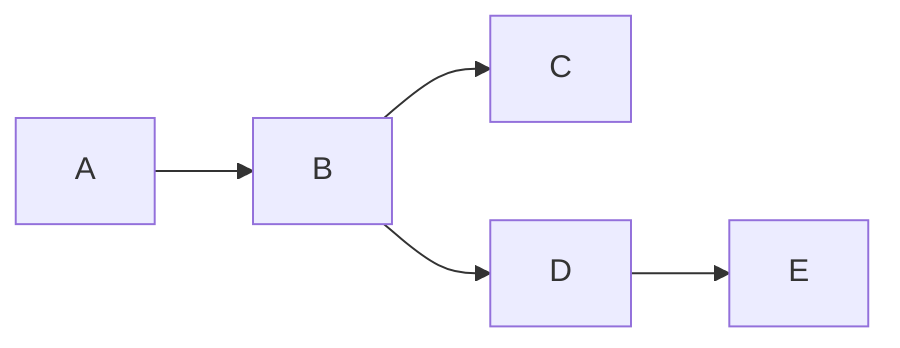
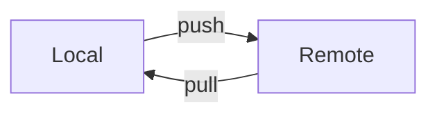
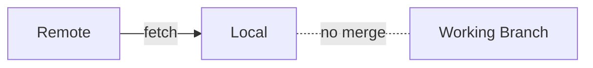
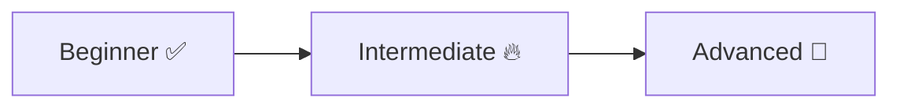

# 🟢 Beginner Git Interview Answers

> “Clarity > complexity. Interviewers want simple, correct explanations.”

---

## 🧠 Q1. What is Git?

👉 **Answer:**

Git is a **distributed version control system** used to track changes in code and collaborate with others.

---

### 🔍 Visual



---

## 🧠 Q2. Git vs GitHub

👉 **Answer:**

* Git → version control system (tool)
* GitHub → hosting platform for Git repositories

---



---

## 🧠 Q3. What is a repository?

👉 **Answer:**

A repository is a **project folder tracked by Git**, containing:

* Code
* History
* Configuration

---

## 🧠 Q4. What is a commit?

👉 **Answer:**

A commit is a **snapshot of your project at a specific point in time**.

---



---

## 🧠 Q5. What is the staging area?

👉 **Answer:**

The staging area is where changes are **prepared before committing**.

---



---

## 🧠 Q6. git add vs git commit

👉 **Answer:**

* `git add` → moves changes to staging area
* `git commit` → saves snapshot to history

---

## 🧠 Q7. What does git init do?

👉 **Answer:**

Initializes a new Git repository by creating a `.git` folder.

---

## 🧠 Q8. What does git clone do?

👉 **Answer:**

Copies a remote repository to your local machine.

---



---

## 🧠 Q9. What is git status?

👉 **Answer:**

Shows the current state of:

* modified files
* staged files
* branch info

---

## 🧠 Q10. What is git log?

👉 **Answer:**

Displays commit history.

---



---

## 🧠 Q11. What is a branch?

👉 **Answer:**

A branch is a **separate line of development**.

---



---

## 🧠 Q12. Default branch

👉 **Answer:**

Usually `main` (earlier `master`)

---

## 🧠 Q13. Create & switch branch

👉 **Answer:**

```bash
git checkout -b feature
```

or

```bash
git switch -c feature
```

---

## 🧠 Q14. Why use branches?

👉 **Answer:**

* Isolate features
* Avoid breaking main code
* Enable parallel work

---

## 🧠 Q15. What is a remote repository?

👉 **Answer:**

A repository hosted on a server (e.g., GitHub) for collaboration.

---

## 🧠 Q16. git push vs git pull

👉 **Answer:**

* `push` → send changes to remote
* `pull` → get changes from remote

---



---

## 🧠 Q17. What is git fetch?

👉 **Answer:**

Downloads changes from remote **without merging**.

---



---

# ⚡ Rapid Revision (Bonus)

```text
Git = version control
Commit = snapshot
Branch = separate line
Add = stage
Commit = save
Push = upload
Pull = download + merge
Fetch = download only
```

---

# 🚀 Next Step

➡️ Move to: `02-Intermediate/`

---

### 🔥 What You’ll Learn Next

* Merge vs Rebase
* Reset vs Revert
* Conflict resolution
* Real workflows

---



---

## 🏁 Final Thought

> “If you can explain Git simply, you understand it deeply.”