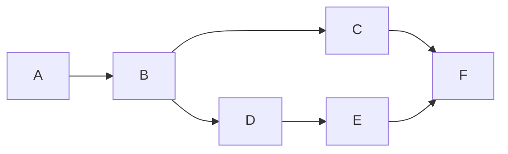
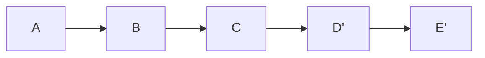
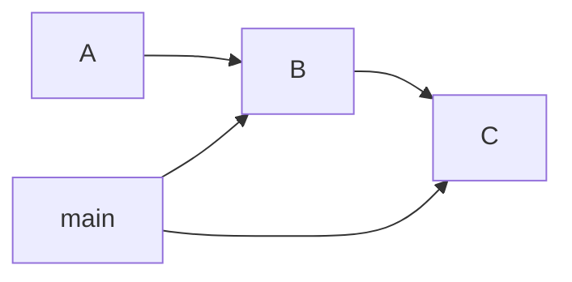
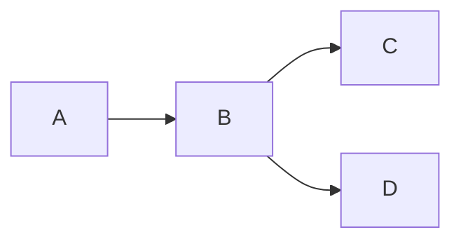
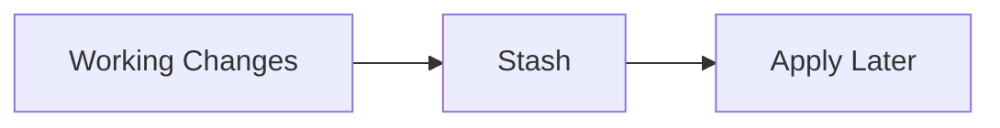
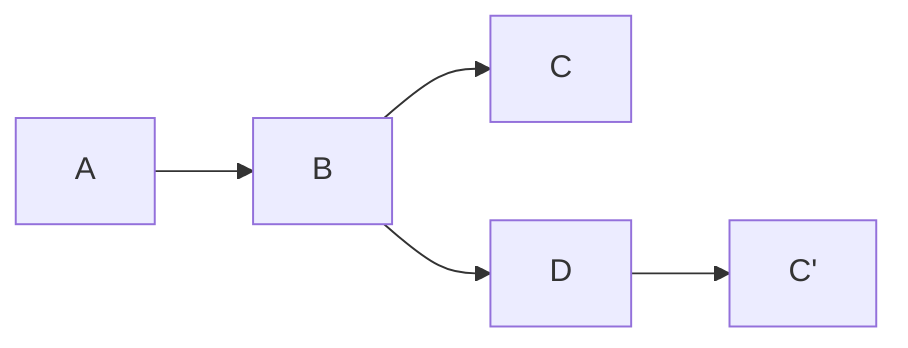
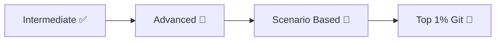

# 🟡 Intermediate Git Interview Answers

> “This is where clarity + real-world thinking wins.”

---

## 🧠 Q1. Merge vs Rebase

👉 **Answer:**

* `merge` → combines histories with a merge commit
* `rebase` → rewrites history to create a linear timeline

---



(merge)



(rebase)

---

## 🧠 Q2. Merge Conflict

👉 **Answer:**

Occurs when Git cannot automatically merge changes from two branches.

---

## 🧠 Q3. Resolve Conflict

👉 **Answer:**

* Open conflicted file
* Edit manually
* Add file
* Commit

---

```bash id="i3"
git add file.txt
git commit
```

---

## 🧠 Q4. Fast-forward Merge

👉 **Answer:**

When no divergence exists — Git just moves the pointer forward.

---



---

## 🧠 Q5. Three-way Merge

👉 **Answer:**

Uses:

* base commit
* two branch tips

---



---

## 🧠 Q6. Reset vs Revert

👉 Already covered deeply:

* Reset → rewrite history
* Revert → safe undo

---

## 🧠 Q7. Reset Types

👉 **Answer:**

* soft → keep staged
* mixed → keep working
* hard → delete all

---

## 🧠 Q8. Avoid Reset When

👉 **Answer:**

* Working on shared branches
* Code already pushed

---

## 🧠 Q9. Git Stash

👉 **Answer:**

Temporarily saves uncommitted changes.

---



---

## 🧠 Q10. Stash vs Commit

👉 **Answer:**

* stash → temporary
* commit → permanent

---

## 🧠 Q11. Apply Stash

```bash id="i7"
git stash apply
git stash pop
```

---

## 🧠 Q12. git pull

👉 **Answer:**

Fetch + merge

---

## 🧠 Q13. Fetch vs Pull

👉 **Answer:**

* fetch → download only
* pull → download + merge

---

## 🧠 Q14. origin

👉 **Answer:**

Default name of remote repository.

---

## 🧠 Q15. Upstream Tracking

👉 **Answer:**

Link between local branch and remote branch.

---

## 🧠 Q16. Reflog

👉 **Answer:**

Tracks all HEAD movements.

---

```mermaid id="i8"
graph TD
    A[HEAD@{0}]
    B[HEAD@{1}]
    C[HEAD@{2}]
```

---

## 🧠 Q17. Reflog vs Log

👉 **Answer:**

* log → commit history
* reflog → HEAD history

---

## 🧠 Q18. Cherry-pick

👉 **Answer:**

Apply a specific commit to another branch.

---



---

## 🧠 Q19. When to use cherry-pick

👉 **Answer:**

* Move commit between branches
* Apply bug fix

---

## 🧠 Q20. Wrong branch commit

👉 **Answer:**

* use cherry-pick
* or reset (if not pushed)

---

## 🧠 Q21. Deleted file

👉 **Answer:**

```bash id="i10"
git restore file.txt
```

---

## 🧠 Q22. Lost commit

👉 **Answer:**

```bash id="i11"
git reflog
git reset --hard <commit>
```

---

# ⚡ Rapid Revision

```text id="j3w2hs"
merge = combine
rebase = rewrite
stash = temporary save
fetch = download
pull = fetch + merge
reflog = recovery tool
cherry-pick = copy commit
```

---

# 🚀 Next Step

➡️ Move to: `03-Advanced/`

---

### 🔥 Next You’ll Learn

* Git internals
* Object model
* Garbage collection
* Advanced debugging

---



---

## 🏁 Final Thought

> “Intermediate Git is where you stop memorizing and start thinking.”