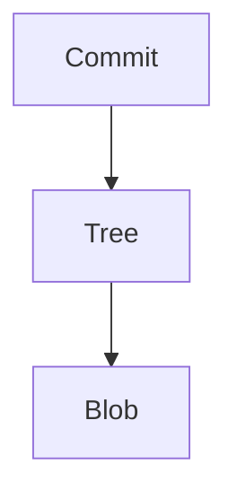
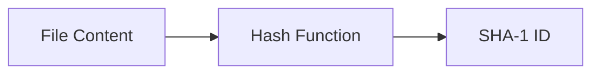
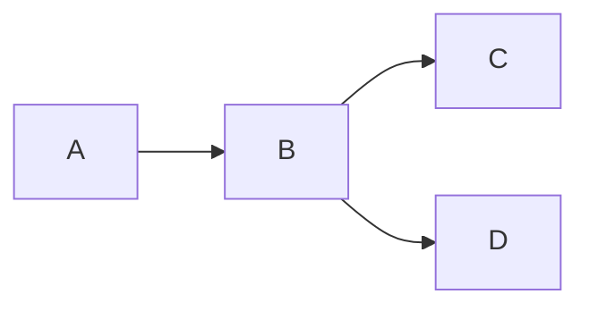
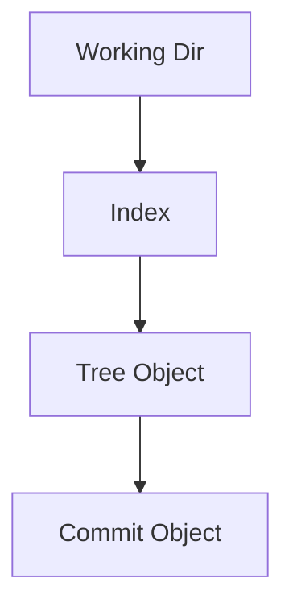
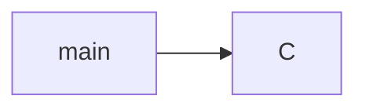
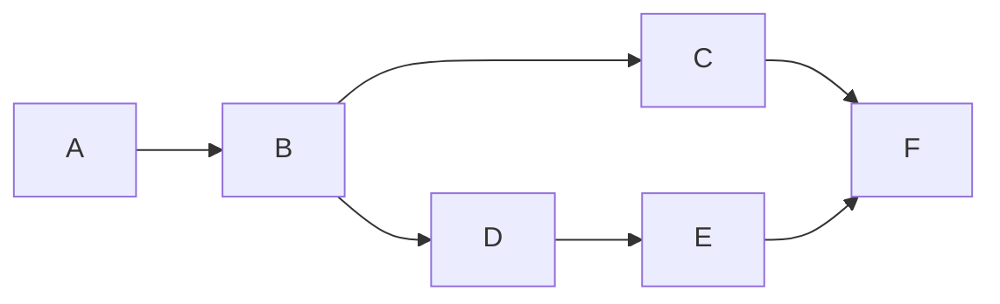
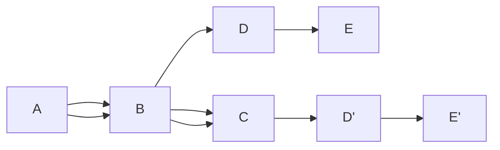
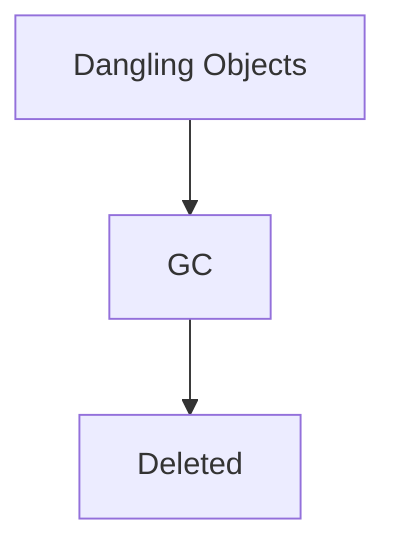

# 🔴 Advanced Git Answers (Deep Internals)

> “Explain like an engineer, not a user.”

---

## 🧠 Q1. Git Objects

👉 **Answer:**

Git stores everything as objects:

* Blob → file content
* Tree → directory structure
* Commit → snapshot metadata

---



---

## 🧠 Q2. Blob, Tree, Commit

👉 **Answer:**

* Blob → raw file data
* Tree → mapping of files & directories
* Commit → pointer to tree + metadata

---

## 🧠 Q3. Internal Storage

👉 **Answer:**

Stored inside:

```text id="a3"
.git/objects/
```

Each object is identified by SHA-1 hash.

---

## 🧠 Q4. `.git` Directory

👉 **Answer:**

Contains:

* objects
* refs
* HEAD
* config

---

## 🧠 Q5. SHA-1 Hash

👉 **Answer:**

A unique identifier for every Git object based on its content.

---



---

## 🧠 Q6. Commit History

👉 **Answer:**

Git stores commits as a graph, not a list.

---



---

## 🧠 Q7. DAG

👉 **Answer:**

Directed Acyclic Graph:

* Directed → commits point backward
* Acyclic → no loops

---

## 🧠 Q8. HEAD Internally

👉 **Answer:**

HEAD is a pointer:


---

## 🧠 Q9. Commit Internals

👉 **Answer:**

Steps:



---

## 🧠 Q10. Branch Internals

👉 **Answer:**

A branch is just a pointer to a commit.

---



---

## 🧠 Q11. Switching Branch

👉 **Answer:**

* Update HEAD
* Update working directory
* Update index

---

## 🧠 Q12. Detached HEAD

👉 **Answer:**

HEAD points directly to commit, not branch.

---

## 🧠 Q13. Merge Internals

👉 **Answer:**

* Find common ancestor
* Combine changes
* Create merge commit

---



---

## 🧠 Q14. Rebase Internals

👉 **Answer:**

* Take commits
* Replay on new base

---



---

## 🧠 Q15. Why Rebase Rewrites History

👉 **Answer:**

Creates new commit IDs (hash changes).

---

## 🧠 Q16. Git Index

👉 **Answer:**

A staging area storing file snapshots before commit.

---

## 🧠 Q17. Index Internals

👉 **Answer:**

Stored as a binary file in:

```text id="a17"
.git/index
```

---

## 🧠 Q18. Reflog Internals

👉 **Answer:**

Stored in:

```text id="a18"
.git/logs/
```

Tracks HEAD movements.

---

## 🧠 Q19. Recover Lost Commits

👉 **Answer:**

Because objects remain in `.git/objects` even if unreferenced.

---

## 🧠 Q20. Garbage Collection

👉 **Answer:**

Removes unreachable objects after a time period.

---



---

## 🧠 Q21. Packfile

👉 **Answer:**

Compressed storage format for Git objects.

---

## 🧠 Q22. Storage Optimization

👉 **Answer:**

* Deduplication
* Compression
* Delta storage

---

## 🧠 Q23. git fsck

👉 **Answer:**

Checks repository integrity.

---

## 🧠 Q24. git clone Internals

👉 **Answer:**

* Copies objects
* Sets remote
* Creates working directory

---


---

## 🧠 Q25. Shallow Clone

👉 **Answer:**

Clones limited history:

```bash id="a25"
git clone --depth=1
```

---

# ⚡ Rapid Revision (Advanced)

```text id="a26"
Blob = file
Tree = folder
Commit = snapshot
Branch = pointer
HEAD = current pointer
Rebase = rewrite
Merge = combine
Reflog = recovery
GC = cleanup
```

---

## 🏁 Final Thought

> “At advanced level, Git is no longer a tool — it’s a system you understand.”

---

# 🚀 Next Step

➡️ Move to: `04-Scenario-Based/`

