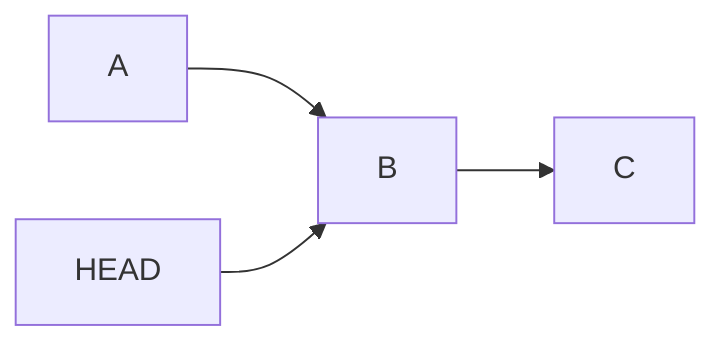
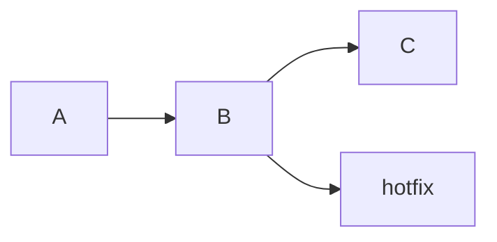
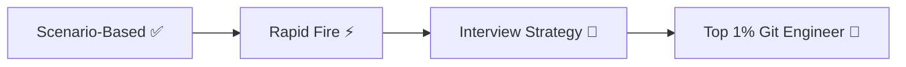

# 🧠 Scenario-Based Git Answers (Real Cases)

> “Answer like this in interviews = instant strong signal.”

---

## 🧠 Q1. Sensitive data committed

👉 **Answer:**

* Remove using `git filter-repo` or `filter-branch`
* Rotate credentials immediately
* Force push cleaned history

---

## 🧠 Q2. Combine commits

👉 **Answer:**

```bash
git rebase -i HEAD~n
```

Use `squash`

---

## 🧠 Q3. Fix commit message

```bash
git commit --amend
```

---

## 🧠 Q4. Wrong branch commit

👉 **Answer:**

* `cherry-pick` to correct branch
* `reset` or `revert` on wrong branch

---

## 🧠 Q5. Undo commit keep changes

```bash
git reset --soft HEAD~1
```

---

## 🧠 Q6. Lost commits after reset

```bash
git reflog
git reset --hard <commit>
```

---



---

## 🧠 Q7. Deleted branch

```bash
git reflog
git checkout -b recovered <commit>
```

---

## 🧠 Q8. Deleted file

```bash
git checkout HEAD~1 -- file.txt
```

---

## 🧠 Q9. Lost uncommitted changes

👉 If not stashed → unrecoverable
👉 If stashed → `git stash pop`

---

## 🧠 Q10. Old commit recovery

```bash
git log
git checkout <commit>
```

---

## 🧠 Q11. Merge conflicts

👉 Resolve manually → add → commit

---

## 🧠 Q12. Clean history

👉 Use rebase:

```bash
git rebase main
```

---

## 🧠 Q13. Same file conflict

👉 Git marks:

```text
<<<<<<< HEAD
=======
>>>>>>> branch
```

Fix manually

---

## 🧠 Q14. Branch behind main

👉 Options:

```bash
git merge main
```

or

```bash
git rebase main
```

---

## 🧠 Q15. Force push damage

👉 Recover via reflog or teammate repo

---

## 🧠 Q16. Someone removed your commits

👉 Use your local reflog → restore → push

---

## 🧠 Q17. Push rejected

👉 Pull + resolve:

```bash
git pull --rebase
```

---

## 🧠 Q18. Avoid merge commits

```bash
git pull --rebase
```

---

## 🧠 Q19. Broken repo

👉 Steps:

```bash
git status
git reflog
git reset
```

---

## 🧠 Q20. Detached HEAD

👉 Create branch:

```bash
git checkout -b fix
```

---

## 🧠 Q21. Move commit

```bash
git cherry-pick <commit>
```

---

## 🧠 Q22. Inspect commit

```bash
git show <commit>
```

---

## 🧠 Q23. Urgent bug fix

👉 Checkout commit → create branch → fix → deploy

---



---

## 🧠 Q24. Rollback feature

👉 Use revert:

```bash
git revert <commit>
```

---

## 🧠 Q25. Clean history

👉 Interactive rebase

---

## 🧠 Q26. Huge repo performance

👉 Use shallow clone:

```bash
git clone --depth=1
```

---

# ⚡ Rapid Thinking Pattern

```text
Problem → Identify → Use reflog/log → Restore safely
```

---

# 🚀 Next Step

➡️ Move to:

* `05-Rapid-Fire/`
* `06-Interview-Strategy/`

---



---

## 🏁 Final Thought

> “In interviews, they don’t test Git — they test how you think with Git.”
