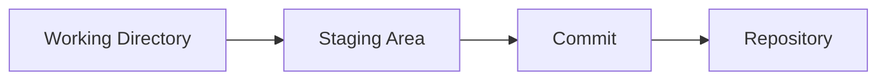
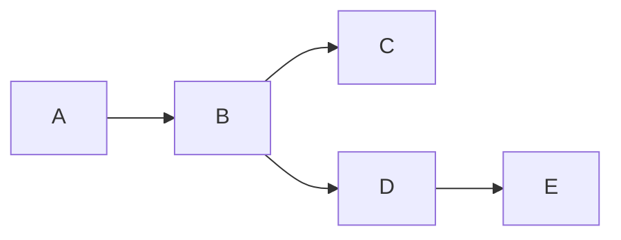
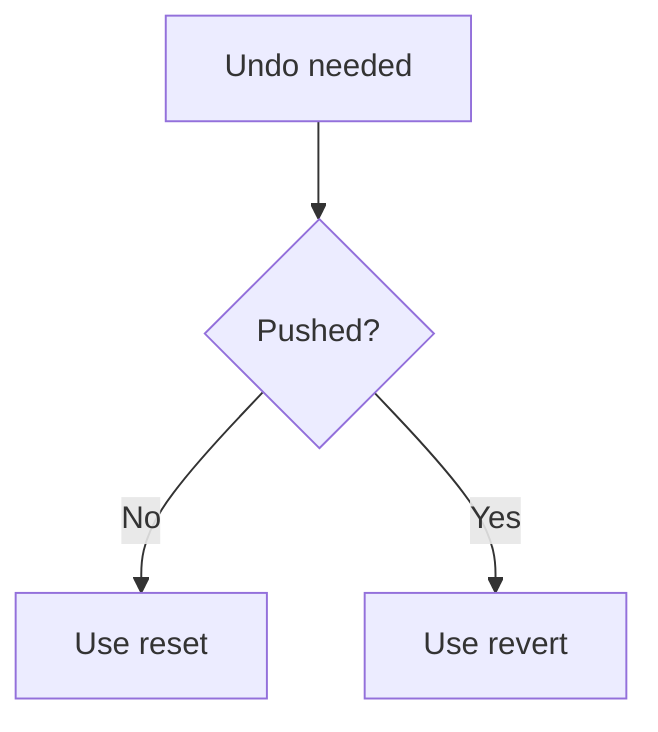
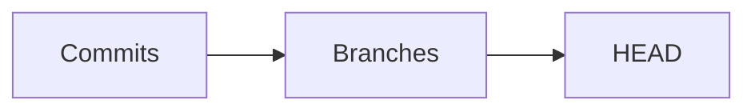

# ⚡ Git Rapid-Fire Cheat Sheet (Killer Revision)

> “If you can answer these instantly, you’re interview-ready.”

---

## 🧠 Core Concepts (1-Liners)

```text
Git = distributed version control system
Repository = tracked project
Commit = snapshot of code
Branch = pointer to commit
HEAD = current position
```

---

## ⚙️ Workflow Memory



```text
edit → add → commit → push
```

---

## 🌿 Branching

```text
Branch = independent line of development
main = default branch
checkout/switch = move between branches
```

---

## 🔀 Merge vs Rebase

```text
Merge = combine histories (keeps graph)
Rebase = rewrite history (linear)
```



---

## 🔄 Reset vs Revert

```text
Reset = move pointer (danger)
Revert = new commit (safe)
```

---

## 📦 Staging

```text
git add = move to staging
git commit = save snapshot
```

---

## 🌍 Remote

```text
origin = remote repo
push = upload
pull = fetch + merge
fetch = download only
```

---

## 🧠 Reflog (Superpower)

```text
reflog = history of HEAD
used for recovery
```

```mermaid
graph TD
    A[HEAD@{0}]
    B[HEAD@{1}]
    C[HEAD@{2}]
```

---

## 🧪 Undo Commands

```text
Undo commit (keep changes) = git reset --soft
Undo commit (unstage) = git reset
Delete commit = git reset --hard
Safe undo = git revert
```

---

## 🗑️ File Recovery

```text
restore file = git restore file.txt
old version = git checkout <commit> -- file
```

---

## 🧭 Common Fixes

```text
Wrong branch commit → cherry-pick
Lost commit → reflog
Detached HEAD → create branch
Merge conflict → edit + add + commit
```

---

## ⚡ Cherry-Pick

```text
copy commit to another branch
```

---

## ⚠️ Dangerous Commands

```text
git reset --hard → deletes changes
git push --force → overwrites history
git clean -fd → deletes untracked files
```

---

## 🧠 Internals (Quick)

```text
Blob = file
Tree = directory
Commit = snapshot
SHA = unique ID
```

---

## 🔍 Debug Toolkit

```bash
git status
git log --oneline --graph
git reflog
git show <commit>
git diff
```

---

## 🧪 Conflict Markers

```text
<<<<<<< HEAD
=======
>>>>>>> branch
```

---

## 🧭 Decision Rules (Important)



---

## ⚡ Interview Traps

```text
Rebase vs merge
Reset vs revert
Fetch vs pull
```

👉 Always explain with **use case**

---

## 🧠 Golden Rules

```text
Never rewrite shared history
Always check git status
Use reflog before panic
Prefer safety over speed
```

---

## 🚀 10-Second Revision

```text
Git = snapshots
Branch = pointer
HEAD = current position
Merge = combine
Rebase = rewrite
Reset = dangerous
Revert = safe
Reflog = recovery
```

---

## 🧭 Mental Model



---

## 🏁 Final Thought

> “In interviews, speed + clarity = confidence.”

---

# 🚀 Next Step

➡️ Move to: `06-Interview-Strategy/`
