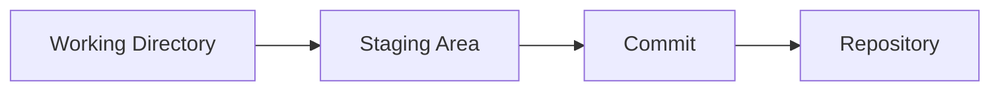
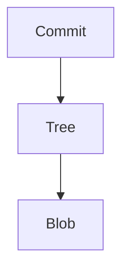
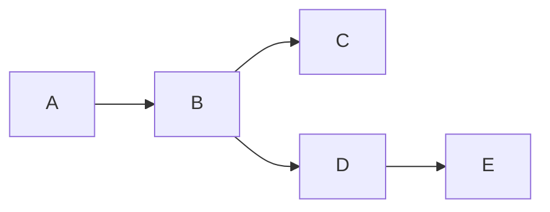
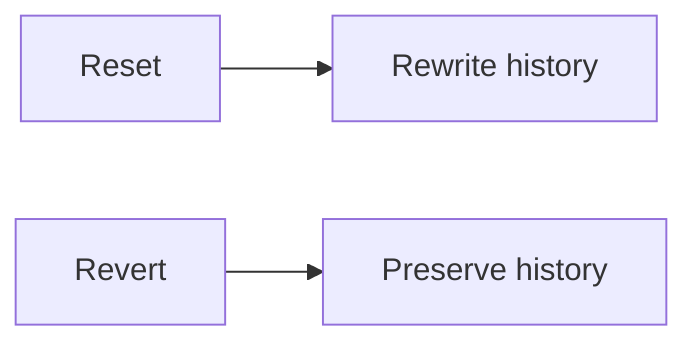
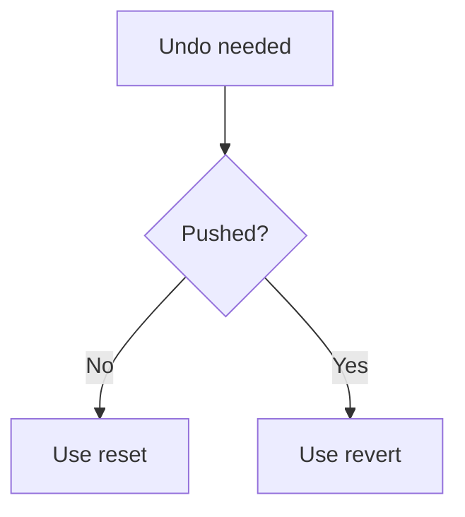
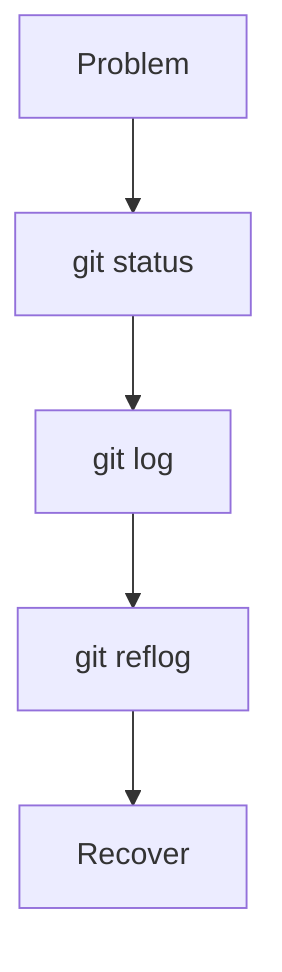
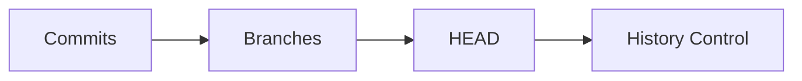

# 🧠 Git Ultimate Cheat Sheet (Memory + Recall)

> “If you remember this, you can answer almost any Git question.”

---

# ⚡ 1. Core Mental Model


```text id="csm1"
Git = commits + pointers
Branch = pointer to commit
HEAD = current pointer
```

---

# ⚙️ 2. Git Workflow



```text id="csm2"
edit → add → commit → push
```

---

# 🧩 3. Git Internals (Must Know)

```text id="csm3"
Blob = file content
Tree = directory structure
Commit = snapshot + metadata
SHA = unique ID
```

---



---

# 🌿 4. Branching

```text id="csm4"
Branch = pointer
Switch = move HEAD
Merge = combine
Rebase = rewrite
```

---



---

# 🔀 5. Merge vs Rebase

```text id="csm5"
Merge = keeps history (safe)
Rebase = linear history (clean but rewrites)
```

---


---

# 🔄 6. Reset vs Revert

```text id="csm6"
Reset = move pointer (danger)
Revert = new commit (safe)
```

---



---

# 📦 7. Staging Area

```text id="csm7"
git add = stage changes
git commit = save snapshot
```

---

# 🌍 8. Remote Basics

```text id="csm8"
origin = remote repo
push = upload
pull = fetch + merge
fetch = download only
```

---


---

# 🧠 9. Reflog (Recovery Tool)

```text id="csm9"
reflog = history of HEAD
used to recover lost commits
```

---

```mermaid id="cs9"
graph TD
    A[HEAD@{0}]
    B[HEAD@{1}]
    C[HEAD@{2}]
```

---

# 🧪 10. Undo Cheats

```text id="csm10"
Undo commit keep changes → git reset --soft
Undo commit unstage → git reset
Delete commit → git reset --hard
Safe undo → git revert
```

---

# 🗑️ 11. File Recovery

```text id="csm11"
restore file → git restore file.txt
old version → git checkout <commit> -- file
```

---

# 🧭 12. Common Fixes

```text id="csm12"
Wrong branch → cherry-pick
Lost commit → reflog
Detached HEAD → create branch
Conflict → edit + add + commit
```

---

# ⚡ 13. Cherry-Pick

```text id="csm13"
copy commit from one branch to another
```

---

# ⚠️ 14. Dangerous Commands

```text id="csm14"
git reset --hard → deletes changes
git push --force → overwrites history
git clean -fd → deletes untracked files
```

---

# 🔍 15. Debug Toolkit

```bash id="csm15"
git status
git log --oneline --graph --all
git reflog
git show <commit>
git diff
```

---

# 🧪 16. Conflict Markers

```text id="csm16"
<<<<<<< HEAD
=======
>>>>>>> branch
```

---

# 🧭 17. Decision Rules



---

# 🧠 18. Interview Traps

```text id="csm18"
merge vs rebase
reset vs revert
fetch vs pull
```

👉 Always explain with:

* difference
* use case

---

# ⚡ 19. Power Words

```text id="csm19"
snapshot
pointer
object database
history rewrite
reference
```

---

# 🧪 20. Fast Debug Flow



---

# ⚡ 21. 10-Second Full Revision

```text id="csm21"
Git = snapshots
Branch = pointer
HEAD = current
Merge = combine
Rebase = rewrite
Reset = dangerous
Revert = safe
Reflog = recovery
```

---

# 🧭 22. Master Thought



---

# 🏁 Final Thought

> “If you understand pointers and history, Git becomes simple.”

---

# 🚀 You Are Now


---

## 🎯 Final Message

> “This cheat sheet is not for reading —
> it’s for **thinking instantly under pressure**.”

