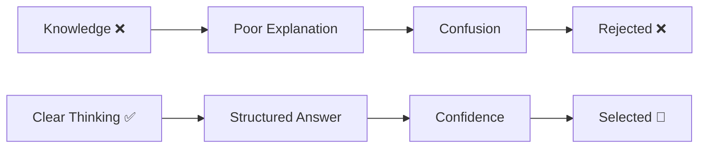
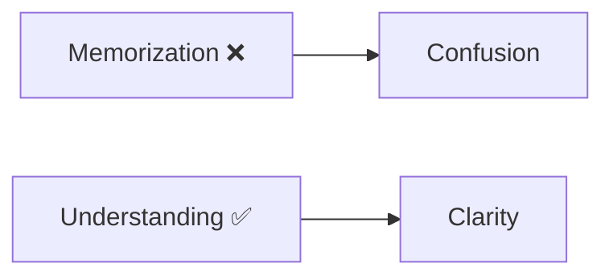
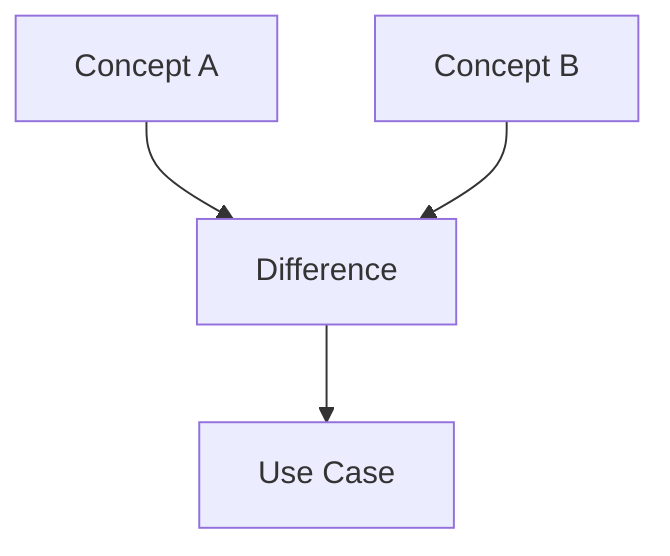
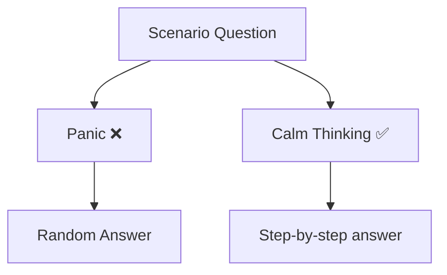
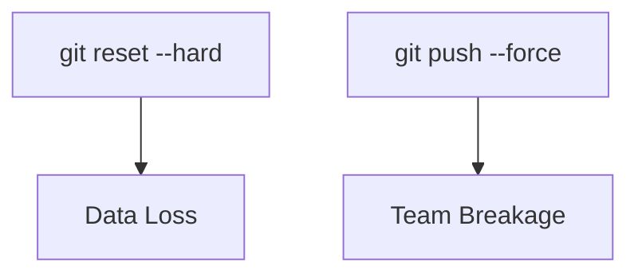
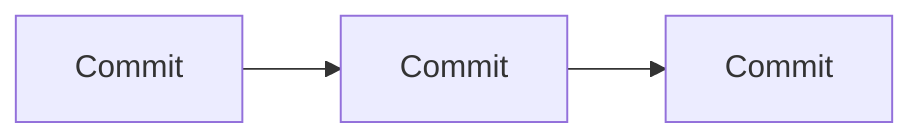
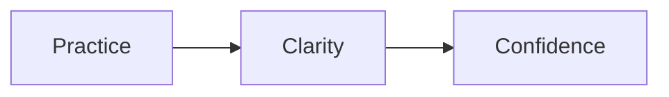
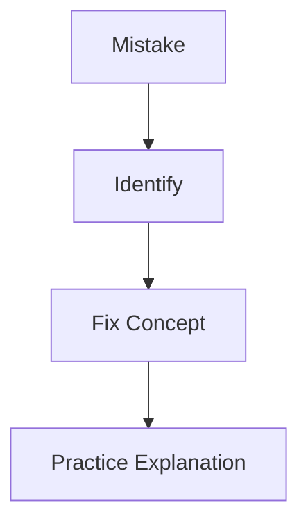
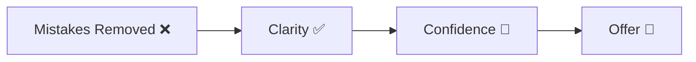

# ❌ Git Interview Mistakes (What Candidates Do Wrong)

> “Avoid these, and you’re already ahead of 80% of candidates.”

---

## 🧠 Big Picture



---

# ❌ 1. Giving One-Line Answers

---

### 🚫 Bad:

> “Git is a version control system.”

---

### ✅ Good:

> Git is a distributed version control system used to track changes in code.
> It stores snapshots of files and allows collaboration through branching and merging.

---

👉 **Mistake:** Too shallow
👉 **Fix:** Add explanation + use case

---

# ❌ 2. Memorizing Commands Without Understanding

---

### 🚫 Bad:

> “Use git reset… I don’t remember why.”

---

### ✅ Good:

> Git reset moves the branch pointer and can modify the staging area and working directory depending on the mode.

---



---

👉 Interviewers test:

* **Concept clarity**, not command memory

---

# ❌ 3. Not Explaining “WHY”

---

### 🚫 Bad:

> “Use git revert.”

---

### ✅ Good:

> We use git revert because it safely undoes changes by creating a new commit, which is important in shared repositories.

---

👉 Always include:

```text
WHAT → HOW → WHY
```

---

# ❌ 4. Confusing Similar Concepts

---

### 🚫 Common Confusions:

```text
merge vs rebase
reset vs revert
fetch vs pull
```

---

### 🔥 Fix Strategy:



---

👉 Always explain:

* difference
* use case

---

# ❌ 5. Ignoring Real-World Scenarios

---

### 🚫 Bad:

> “I haven’t faced this situation.”

---

### ✅ Good:

> I would approach this by first checking git reflog to identify lost commits, then restore using reset or by creating a branch.

---

👉 Even if you haven’t done it:

* **Think logically**

---

# ❌ 6. Panic During Scenario Questions

---



---

### ✅ Fix:

Say:

> “Let me walk through this step by step…”

---

👉 This shows:

* maturity
* problem-solving ability

---

# ❌ 7. Not Using Examples

---

### 🚫 Bad:

> “Branch is a pointer.”

---

### ✅ Good:

> A branch is a pointer to a commit. For example, when creating a feature branch, it points to the latest commit and grows independently.

---

👉 Example = clarity booster

---

# ❌ 8. Overcomplicating Simple Questions

---

### 🚫 Bad:

> (Long, confusing explanation for basic question)

---

### ✅ Good:

> Simple, structured answer

---

👉 Rule:

```text
Simple question → simple answer
Complex question → structured answer
```

---

# ❌ 9. Not Understanding Git Internals

---

### 🚫 Bad:

> “Git stores files…”

---

### ✅ Good:

> Git stores snapshots as objects (blob, tree, commit) in its object database.

---

👉 This is what separates:

* average vs strong candidates

---

# ❌ 10. Using Wrong Terminology

---

### 🚫 Bad Words:

```text
“copy”
“save file”
“folder tracking”
```

---

### ✅ Correct Words:

```text
snapshot
pointer
object
commit graph
```

---

👉 Language = perception

---

# ❌ 11. Blindly Using Dangerous Commands

---



---

### 🚫 Bad:

> “I would just force push.”

---

### ✅ Good:

> I would avoid force push unless necessary and prefer revert or cherry-pick to maintain history.

---

---

# ❌ 12. Not Checking Current State

---

### 🚫 Bad:

Running commands blindly

---

### ✅ Good:

```bash
git status
git log
```

---

👉 Always understand state first

---

# ❌ 13. Not Thinking in Terms of History

---

### 🚫 Bad:

> Thinking Git is file-based

---

### ✅ Good:

> Git is **history + pointers**, not files

---



---

---

# ❌ 14. No Confidence in Delivery

---

### 🚫 Signs:

* Hesitation
* Unclear explanation
* Frequent pauses

---

### ✅ Fix:



---

---

# ❌ 15. Not Practicing Out Loud

---

👉 Biggest hidden mistake

---

### ✅ Fix:

* Speak answers
* Explain like teaching someone

---

---

# 🧠 Golden Correction Strategy

---



---

---

# ⚡ Top 5 Instant Fixes

```text
1. Always structure answers
2. Always give example
3. Always explain WHY
4. Use correct terminology
5. Stay calm in scenarios
```

---

---

# 🏁 Final Thought

> “Interviewers don’t reject wrong answers —
> they reject unclear thinking.”

---

# 🚀 Next Step

➡️ Move to:

* `cheat-sheet.md`

---


