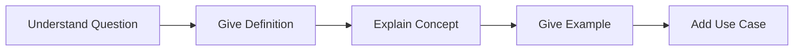
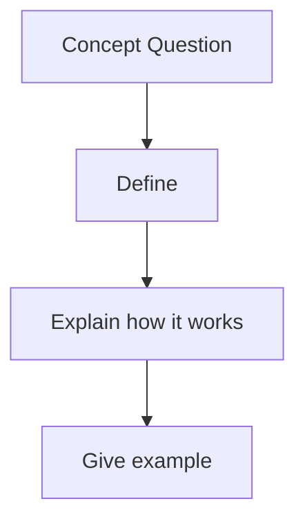
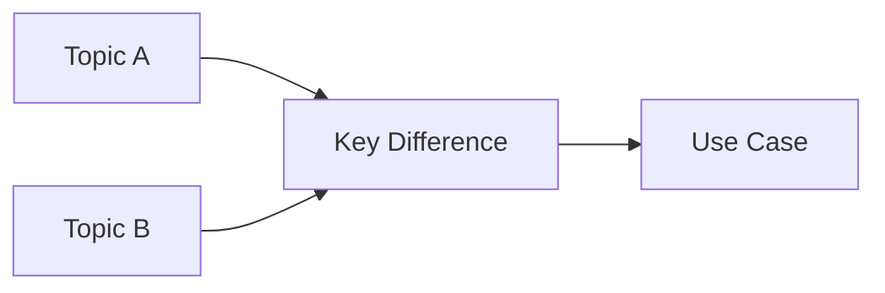
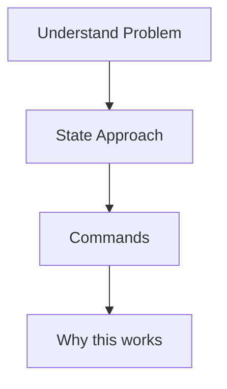
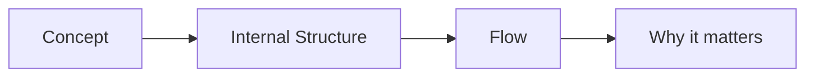
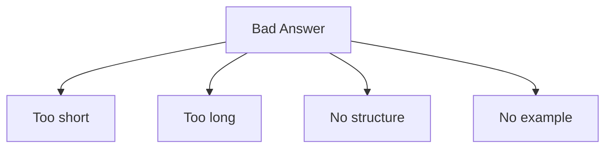
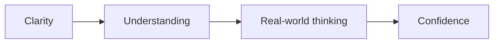
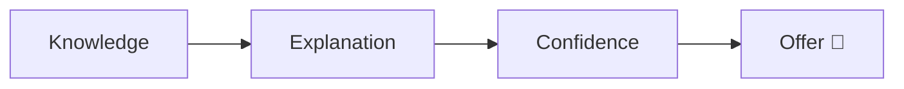

# 🎯 Git Interview Strategy (What to Say + How to Say)

> “Your answer is not judged by correctness alone — but by clarity, structure, and confidence.”

---

## 🧠 The Golden Rule



👉 Always follow this structure.

---

# 🗣️ 1. How to Structure Every Answer

---

## ✅ The PERFECT Format

```text id="fmt1"
1. Definition (1 line)
2. Explanation (2–3 lines)
3. Example (real-world)
4. When to use (important)
```

---

## 🎯 Example: “What is Git?”

❌ Weak Answer:

> Git is a version control system.

---

✅ Strong Answer:

> Git is a distributed version control system used to track changes in code.
> It stores snapshots of your project, allowing you to manage versions and collaborate efficiently.
> For example, multiple developers can work on features independently using branches.
> It is used in almost all modern software development workflows.

---

# 🧠 2. How to Answer Concept Questions

---

## 🎯 Pattern



---

### Example: “What is a branch?”

✅ Answer:

> A branch is a pointer to a commit that represents a separate line of development.
> It allows developers to work independently without affecting the main code.
> For example, a feature branch can be created to develop a new feature before merging it into main.

---

# ⚔️ 3. How to Answer Difference Questions

---

## 🎯 Pattern



---

### Example: Reset vs Revert

✅ Answer:

> Git reset moves the branch pointer backward and rewrites history, while git revert creates a new commit that undoes changes.
> Reset is used for local changes, whereas revert is safer for shared repositories.

---

👉 Always include:

* difference
* risk
* use case

---

# 🧠 4. How to Answer Scenario Questions

---

## 🎯 Pattern (VERY IMPORTANT)



---

### Example: “You lost a commit”

✅ Answer:

> First, I would check git reflog to find the lost commit.
> Then I would identify the commit hash and restore it using git reset --hard or by creating a new branch.
> This works because Git keeps commits in its object database even if they are not referenced.

---

---

# 🧠 5. How to Explain Internals (Advanced)

---

## 🎯 Pattern



---

### Example: “What happens during commit?”

✅ Answer:

> When you commit, Git first takes the staged files and creates a tree object.
> Then it creates a commit object that points to this tree along with metadata.
> This commit is stored in the object database and referenced by the branch.
> This design makes Git fast and efficient.

---

---

# ⚡ 6. Power Words (Use These!)

Use these to sound **senior-level**:

```text id="power1"
"pointer"
"snapshot"
"history rewrite"
"object database"
"reference"
"linear history"
"distributed system"
```

---

👉 Example:

Instead of:
❌ “Git stores files”

Say:
✅ “Git stores snapshots of content as objects in its database”

---

# ❗ 7. Common Mistakes (Avoid These)

---



---

## ❌ Mistakes:

* One-line answers
* Over-explaining without structure
* No real-world example
* Not mentioning use case

---

# 🧠 8. Think Like an Interviewer

---

## 🎯 What they check:



---

👉 Not just:

* Commands
  But:
* **Why + When + How**

---

# 🧪 9. Real Interview Trick

If stuck:

👉 Say this:

> “Let me think through this step by step…”

This shows:

* Calm thinking
* Structured approach

---

# ⚡ 10. 5-Second Answer Formula

```text id="fast1"
Define → Explain → Example → Use case
```

---

# 🧭 11. Full Answer Template

Use this everywhere:

```text id="template1"
<Concept> is ...
It works by ...
For example ...
We use it when ...
```

---

# 🏁 Final Thought

> “Interview success is not about knowing more — it’s about explaining better.”

---

# 🚀 Next Step

➡️ Move to:

* `common-mistakes.md`
* `cheat-sheet.md`

---

