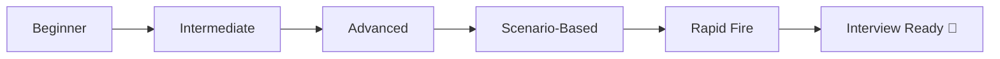
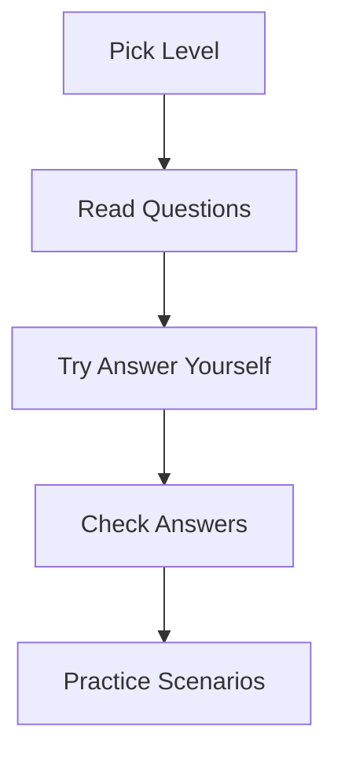

# 🎯 Git Interview Mastery Hub

> “Knowing Git is good. Explaining it clearly — that’s what gets you hired.”

---

## 🚀 What This Section Covers

* 🟢 Beginner → fundamentals
* 🟡 Intermediate → real workflows
* 🔴 Advanced → internals & edge cases
* 🧠 Scenario-based → real interview problems
* ⚡ Rapid-fire → quick revision
* 🎯 Strategy → how to answer like a pro

---

## 🧭 Learning Roadmap

---

## 📚 Modules

### 🟢 Beginner

➡️ `01-Beginner/`

* What is Git?
* What is a commit?
* Difference between Git & GitHub

---

### 🟡 Intermediate

➡️ `02-Intermediate/`

* Branching & merging
* Rebase vs merge
* Reset vs revert

---

### 🔴 Advanced

➡️ `03-Advanced/`

* Git internals
* Reflog deep dive
* Object model

---

### 🧠 Scenario-Based

➡️ `04-Scenario-Based/`

* Real-world debugging
* Recovery questions
* Team conflict situations

---

### ⚡ Rapid Fire

➡️ `05-Rapid-Fire/`

* 1-line answers
* Quick revision
* High-frequency questions

---

### 🎯 Interview Strategy

➡️ `06-Interview-Strategy/`

* How to answer confidently
* Common mistakes
* Cheat sheet

---

## 🧠 How to Use This Section

---

## ⚡ Pro Tip

> Don’t just read answers — **practice explaining them out loud**

---

## 🚀 Next Step

After finishing this:

➡️ Move to: `13-Challenges/`
