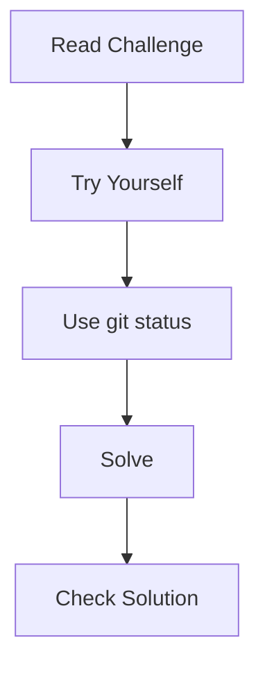

# 🟢 Beginner Git Challenges

> “Don’t read — do. That’s how Git sticks.”

---

## 🧠 Instructions

---

## ⚡ Challenge 1: Initialize Repository

### 🎯 Goal:

Create a new Git repository.

### 📌 Task:

* Create a folder
* Initialize Git

---

## ⚡ Challenge 2: First Commit

### 🎯 Goal:

Create your first commit.

### 📌 Task:

* Create `file.txt`
* Add content
* Commit it

---

## ⚡ Challenge 3: Modify & Track Changes

### 🎯 Goal:

Understand working directory vs staging

### 📌 Task:

* Modify file
* Check status
* Stage changes
* Commit

---

## ⚡ Challenge 4: View History

### 🎯 Goal:

Check commit history

### 📌 Task:

* View commit log
* Use short format

---

## ⚡ Challenge 5: Create Branch

### 🎯 Goal:

Create a new branch

### 📌 Task:

* Create `feature` branch
* Switch to it

---

## ⚡ Challenge 6: Work on Branch

### 🎯 Goal:

Make changes in a branch

### 📌 Task:

* Modify file
* Commit changes

---

## ⚡ Challenge 7: Switch Branches

### 🎯 Goal:

Understand branch switching

### 📌 Task:

* Switch back to main
* Check file differences

---

## ⚡ Challenge 8: Merge Branch

### 🎯 Goal:

Merge feature into main

### 📌 Task:

* Merge branch
* Check history

---

## ⚡ Challenge 9: Undo Last Commit

### 🎯 Goal:

Undo last commit but keep changes

### 📌 Task:

* Undo commit safely

---

## ⚡ Challenge 10: Restore Deleted File

### 🎯 Goal:

Recover deleted file

### 📌 Task:

* Delete file
* Restore it

---

## ⚡ Challenge 11: Use Stash

### 🎯 Goal:

Temporarily save changes

### 📌 Task:

* Modify file
* Stash changes
* Apply them

---

## ⚡ Challenge 12: Clone Repo

### 🎯 Goal:

Clone repository

### 📌 Task:

* Clone any GitHub repo

---

## ⚡ Challenge 13: Push Changes

### 🎯 Goal:

Push local commits to remote

### 📌 Task:

* Connect remote
* Push branch

---

## ⚡ Challenge 14: Pull Changes

### 🎯 Goal:

Get updates from remote

### 📌 Task:

* Pull changes

---

## ⚡ Challenge 15: Check Differences

### 🎯 Goal:

See file differences

### 📌 Task:

* Modify file
* View diff
