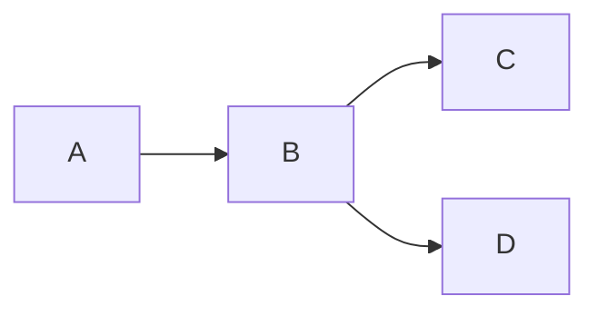
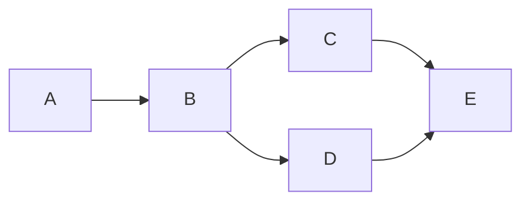

# 🟢 Beginner Challenge Solutions

> “Check only after trying — that’s how you grow.”

---

## ✅ Challenge 1

```bash
mkdir repo
cd repo
git init
```

---

## ✅ Challenge 2

```bash
echo "Hello Git" > file.txt
git add file.txt
git commit -m "first commit"
```

---

## ✅ Challenge 3

```bash
echo "New line" >> file.txt
git status
git add file.txt
git commit -m "updated file"
```

---

## ✅ Challenge 4

```bash
git log --oneline
```

---

## ✅ Challenge 5

```bash
git checkout -b feature
```

or

```bash
git switch -c feature
```

---

## ✅ Challenge 6

```bash
echo "feature work" >> file.txt
git add .
git commit -m "feature work"
```

---

## 🧠 Visual



---

## ✅ Challenge 7

```bash
git checkout main
```

👉 File content changes based on branch

---

## ✅ Challenge 8

```bash
git merge feature
```

---



---

## ✅ Challenge 9

```bash
git reset --soft HEAD~1
```

---

## ✅ Challenge 10

```bash
rm file.txt
git restore file.txt
```

---

## ✅ Challenge 11

```bash
git stash
git stash apply
```

---

## ✅ Challenge 12

```bash
git clone <repo-url>
```

---

## ✅ Challenge 13

```bash
git remote add origin <url>
git push -u origin main
```

---

## ✅ Challenge 14

```bash
git pull
```

---

## ✅ Challenge 15

```bash
git diff
```

---

## ⚡ Key Learning Summary

```text id="bsum"
init → start repo
add → stage
commit → save
branch → isolate work
merge → combine
stash → temporary save
restore → recover
```

---

## 🚀 Next Step

➡️ Move to: `02-Branching/`

---


---

## 🏁 Final Thought

> “If you can solve these without looking — you’re no longer a beginner.”
