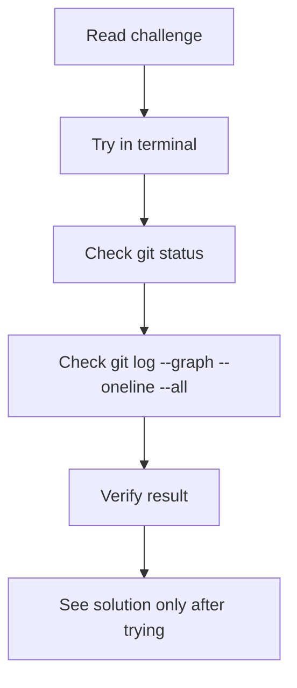
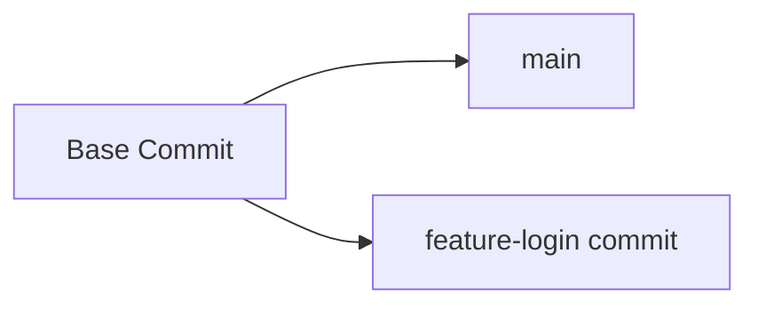
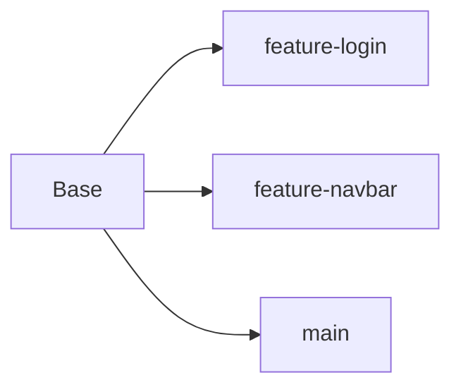
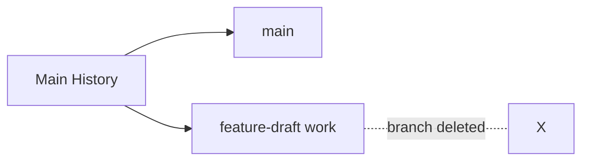
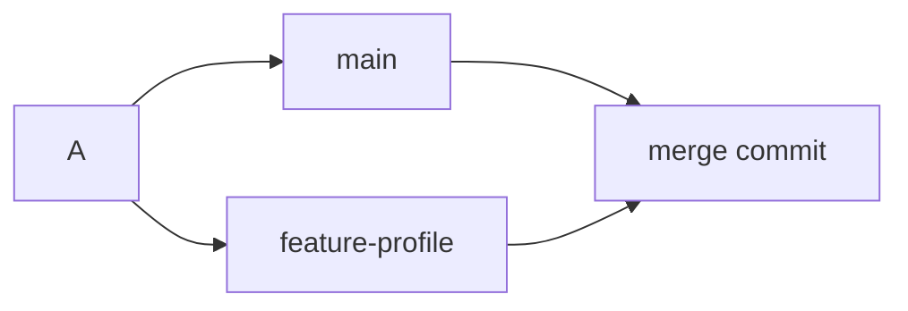
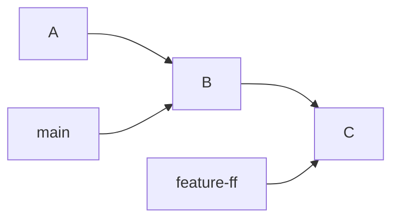
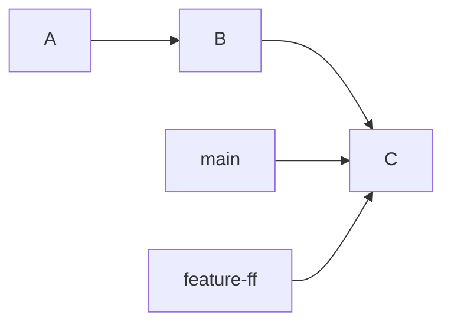
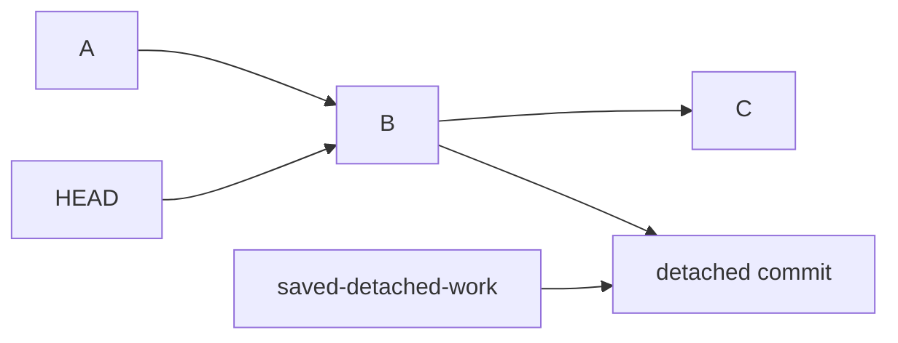
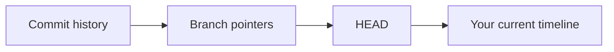
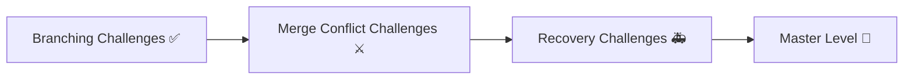

# 🌿 Branching Challenges

> “Branches are not just features — they are parallel timelines.”

---

## 🧠 How to Use These Challenges



---

## ⚡ Challenge 1: Create Your First Feature Branch

### 🎯 Goal

Create a branch called `feature-login` and switch to it.

### 📌 Task

* Start from `main`
* Create `feature-login`
* Confirm you are on that branch

---

## ⚡ Challenge 2: Make Branch-Specific Changes

### 🎯 Goal

Understand that each branch can have different history.

### 📌 Task

* On `feature-login`, create `login.txt`
* Add some content
* Commit the file

---

## ⚡ Challenge 3: Switch Back to Main

### 🎯 Goal

Observe how files change when branches change.

### 📌 Task

* Switch back to `main`
* Check whether `login.txt` exists
* Explain why

---

## ⚡ Challenge 4: Create a Second Branch from Main

### 🎯 Goal

Work on parallel branches from the same base.

### 📌 Task

* Create a branch named `feature-navbar`
* Add `navbar.txt`
* Commit it

---

## ⚡ Challenge 5: View Branch Structure

### 🎯 Goal

Visualize branch divergence.

### 📌 Task

* Use a log command to see all branches
* Verify that `feature-login` and `feature-navbar` diverged from `main`

---

## ⚡ Challenge 6: Merge a Branch into Main

### 🎯 Goal

Merge completed work back into main.

### 📌 Task

* Switch to `main`
* Merge `feature-login`
* Check history

---

## ⚡ Challenge 7: Merge Another Branch

### 🎯 Goal

Practice repeated merge workflow.

### 📌 Task

* Merge `feature-navbar` into `main`
* Verify both features are now in `main`

---

## ⚡ Challenge 8: Delete a Merged Branch

### 🎯 Goal

Clean up safely after merge.

### 📌 Task

* Delete `feature-login`
* Confirm it is gone

---

## ⚡ Challenge 9: Try Deleting an Unmerged Branch

### 🎯 Goal

See Git’s safety mechanism.

### 📌 Task

* Create a branch named `feature-draft`
* Make one commit on it
* Switch to `main`
* Try deleting it with safe delete

---

## ⚡ Challenge 10: Force Delete a Branch

### 🎯 Goal

Understand difference between safe delete and force delete.

### 📌 Task

* Delete `feature-draft` using force delete
* Reflect on why it is dangerous

---

## ⚡ Challenge 11: Rename a Branch

### 🎯 Goal

Rename a local branch cleanly.

### 📌 Task

* Create a branch called `feature-auth-old`
* Rename it to `feature-auth`

---

## ⚡ Challenge 12: Move a Commit to the Correct Branch

### 🎯 Goal

Fix a common real-world mistake.

### 📌 Task

* Make a commit on `main` by mistake
* Move that commit to a new branch called `feature-payment`
* Remove it from `main`

---

## ⚡ Challenge 13: Create a Branch from an Older Commit

### 🎯 Goal

Branch from history.

### 📌 Task

* Find an older commit
* Create a branch from that commit called `hotfix-old-state`

---

## ⚡ Challenge 14: Compare Two Branches

### 🎯 Goal

See what differs between branches.

### 📌 Task

* Compare `main` and `feature-navbar`
* Find which commits are unique to each

---

## ⚡ Challenge 15: Merge with a Merge Commit Explicitly

### 🎯 Goal

Understand non-fast-forward merge.

### 📌 Task

* Create a branch
* Make one commit
* Merge it into `main` using `--no-ff`

---

## ⚡ Challenge 16: Fast-Forward Merge

### 🎯 Goal

See how Git can merge without creating a merge commit.

### 📌 Task

* Create a fresh branch from `main`
* Add one commit
* Merge it back
* Observe that Git only moved the pointer

---

## ⚡ Challenge 17: Inspect Current Branch

### 🎯 Goal

Know where you are before acting.

### 📌 Task

* Show current branch name
* Show all branches
* Identify which one is checked out

---

## ⚡ Challenge 18: Track Branch Timeline Visually

### 🎯 Goal

Develop branch graph thinking.

### 📌 Task

* Create two branches
* Add at least one commit to each
* Display graph view of the history

---

## ⚡ Challenge 19: Cherry-Pick Between Branches

### 🎯 Goal

Move one specific commit from one branch to another.

### 📌 Task

* Create a branch `bugfix-ui`
* Commit a fix there
* Move only that commit onto `main`

---

## ⚡ Challenge 20: Simulate Team Workflow

### 🎯 Goal

Practice realistic branch workflow.

### 📌 Task

* Create `feature-search`
* Commit twice
* Rebase or merge latest `main`
* Merge back into `main`

---

## ⚡ Challenge 21: Branch Safety Before Merge

### 🎯 Goal

Verify before integrating work.

### 📌 Task

Before merging a branch, check:

* current branch
* branch history
* changed files
* final diff

---

## ⚡ Challenge 22: Recover Deleted Branch from History

### 🎯 Goal

Realize branches are just pointers.

### 📌 Task

* Delete a branch
* Recover it using reflog or commit hash

---

## ⚡ Challenge 23: Detached HEAD to Branch

### 🎯 Goal

Save work made outside a branch.

### 📌 Task

* Checkout an old commit
* Make a commit
* Save that work by attaching it to a new branch

---

## ⚡ Challenge 24: List Merged vs Unmerged Branches

### 🎯 Goal

Audit repo state cleanly.

### 📌 Task

* Show all merged branches
* Show all unmerged branches

---

## ⚡ Challenge 25: Branch Cleanup Drill

### 🎯 Goal

Practice a full feature lifecycle.

### 📌 Task

* Create a branch
* Commit work
* Merge into `main`
* Delete the branch
* Confirm final clean history

---

# 📄 `02-Branching/solutions.md`

---

# 🌿 Branching Challenge Solutions

> “Branches become easy when you start thinking in commit pointers.”

---

## ✅ Challenge 1: Create Your First Feature Branch

```bash
git checkout main
git checkout -b feature-login
git branch
```

Or modern version:

```bash
git switch main
git switch -c feature-login
git branch
```

---

## ✅ Challenge 2: Make Branch-Specific Changes

```bash
echo "Login feature" > login.txt
git add login.txt
git commit -m "Add login feature file"
```

---

## ✅ Challenge 3: Switch Back to Main

```bash
git checkout main
ls
```

### 🧠 Why?

`login.txt` was committed only on `feature-login`, so `main` does not have that commit yet.



---

## ✅ Challenge 4: Create a Second Branch from Main

```bash
git checkout main
git checkout -b feature-navbar
echo "Navbar feature" > navbar.txt
git add navbar.txt
git commit -m "Add navbar feature file"
```

---

## ✅ Challenge 5: View Branch Structure

```bash
git log --oneline --graph --all --decorate
```



---

## ✅ Challenge 6: Merge a Branch into Main

```bash
git checkout main
git merge feature-login
git log --oneline --graph --all --decorate
```

---

## ✅ Challenge 7: Merge Another Branch

```bash
git checkout main
git merge feature-navbar
git log --oneline --graph --all --decorate
```

### 🧠 Result

Now `main` contains both feature histories.

---

## ✅ Challenge 8: Delete a Merged Branch

```bash
git branch -d feature-login
git branch
```

---

## ✅ Challenge 9: Try Deleting an Unmerged Branch

```bash
git checkout -b feature-draft
echo "Draft work" > draft.txt
git add draft.txt
git commit -m "Add draft work"

git checkout main
git branch -d feature-draft
```

### 🧠 What happens?

Git will refuse because the branch is not fully merged.

---

## ✅ Challenge 10: Force Delete a Branch

```bash
git branch -D feature-draft
```

### ⚠️ Why dangerous?

Because you may remove the only branch reference to commits you still need.



---

## ✅ Challenge 11: Rename a Branch

```bash
git checkout -b feature-auth-old
git branch -m feature-auth
git branch
```

Or rename from outside the branch:

```bash
git branch -m feature-auth-old feature-auth
```

---

## ✅ Challenge 12: Move a Commit to the Correct Branch

### Step 1: accidentally commit on main

```bash
git checkout main
echo "Payment logic" > payment.txt
git add payment.txt
git commit -m "Add payment logic"
```

### Step 2: create correct branch at current commit

```bash
git branch feature-payment
```

### Step 3: remove commit from main

```bash
git reset --hard HEAD~1
```

### Step 4: switch to correct branch

```bash
git checkout feature-payment
```

### 🧠 Safer pushed-case alternative

If already pushed, use `cherry-pick` + `revert` instead of reset.

---

## ✅ Challenge 13: Create a Branch from an Older Commit

```bash
git log --oneline
git checkout -b hotfix-old-state <old-commit-hash>
```

---

## ✅ Challenge 14: Compare Two Branches

```bash
git log main..feature-navbar --oneline
git log feature-navbar..main --oneline
git diff main..feature-navbar
```

---

## ✅ Challenge 15: Merge with a Merge Commit Explicitly

```bash
git checkout main
git checkout -b feature-profile
echo "Profile feature" > profile.txt
git add profile.txt
git commit -m "Add profile feature"

git checkout main
git merge --no-ff feature-profile -m "Merge feature-profile"
```



---

## ✅ Challenge 16: Fast-Forward Merge

```bash
git checkout main
git checkout -b feature-ff
echo "Fast forward feature" > ff.txt
git add ff.txt
git commit -m "Add fast-forward feature"

git checkout main
git merge feature-ff
```

### 🧠 What happened?

Git only moved `main` forward because no divergence existed.



After merge:



---

## ✅ Challenge 17: Inspect Current Branch

```bash
git branch
git branch --show-current
```

---

## ✅ Challenge 18: Track Branch Timeline Visually

```bash
git checkout main
git checkout -b feature-a
echo "A work" > a.txt
git add a.txt
git commit -m "Add A work"

git checkout main
git checkout -b feature-b
echo "B work" > b.txt
git add b.txt
git commit -m "Add B work"

git log --oneline --graph --all --decorate
```

---

## ✅ Challenge 19: Cherry-Pick Between Branches

```bash
git checkout -b bugfix-ui
echo "UI bug fix" > ui-fix.txt
git add ui-fix.txt
git commit -m "Fix UI bug"

git log --oneline
# copy the commit hash

git checkout main
git cherry-pick <commit-hash>
```

### 🧠 Use case

Useful when only one commit from a branch is needed.

---

## ✅ Challenge 20: Simulate Team Workflow

```bash
git checkout -b feature-search
echo "Search step 1" > search.txt
git add search.txt
git commit -m "Add search step 1"

echo "Search step 2" >> search.txt
git add search.txt
git commit -m "Add search step 2"

git checkout main
echo "Main update" > main-update.txt
git add main-update.txt
git commit -m "Update main"

git checkout feature-search
git merge main
# or git rebase main

git checkout main
git merge feature-search
```

---

## ✅ Challenge 21: Branch Safety Before Merge

```bash
git branch --show-current
git log --oneline --graph --all --decorate
git diff main..feature-search
git diff --name-only main..feature-search
```

### 🧠 Habit

Never merge blindly.

---

## ✅ Challenge 22: Recover Deleted Branch from History

```bash
git reflog
git checkout -b recovered-branch <commit-hash>
```

Or use log:

```bash
git log --all --oneline
git checkout -b recovered-branch <commit-hash>
```

---

## ✅ Challenge 23: Detached HEAD to Branch

```bash
git log --oneline
git checkout <old-commit-hash>

echo "Detached work" > detached.txt
git add detached.txt
git commit -m "Work in detached HEAD"

git checkout -b saved-detached-work
```



---

## ✅ Challenge 24: List Merged vs Unmerged Branches

```bash
git branch --merged
git branch --no-merged
```

---

## ✅ Challenge 25: Branch Cleanup Drill

```bash
git checkout main
git checkout -b feature-cleanup
echo "Cleanup flow" > cleanup.txt
git add cleanup.txt
git commit -m "Add cleanup flow"

git checkout main
git merge feature-cleanup
git branch -d feature-cleanup

git log --oneline --graph --all --decorate
git branch
```

---

# 🧠 Branching Summary

```text
branch = pointer
switch = move HEAD
merge = combine histories
rebase = replay commits
cherry-pick = copy one commit
delete merged branch = safe cleanup
force delete branch = risky
```

---

## ⚡ Branching Mental Model



---

## 🚀 Next Step

➡️ Move to: `03-Merge-Conflicts/`

### What’s next

* conflict markers
* manual resolution
* merge vs rebase conflict handling
* real-world conflict drills



---

## 🏁 Final Thought

> “Once you understand branches as pointers, Git becomes much less scary.”
