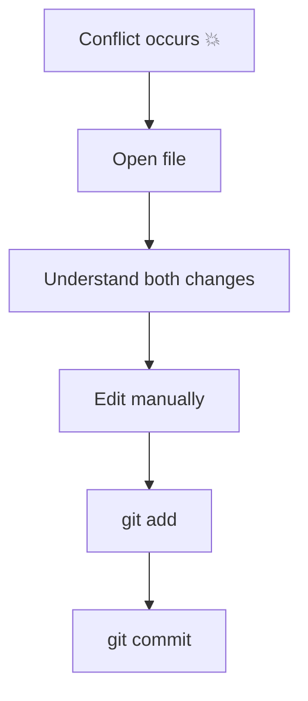

# ⚔️ Merge Conflict Challenges

> “Conflicts are not errors — they are Git asking you to decide.”

---

## 🧠 How to Approach Conflicts



---

## ⚡ Challenge 1: Basic Merge Conflict

### 🎯 Goal

Create your first merge conflict.

### 📌 Task

* Create a file `app.txt` on `main`
* Commit it
* Create branch `feature-a`
* Modify same line in `app.txt`
* Commit
* Switch back to `main`
* Modify same line differently
* Merge `feature-a` into `main`

👉 Observe conflict

---

## ⚡ Challenge 2: Understand Conflict Markers

### 🎯 Goal

Read conflict syntax

### 📌 Task

Open conflicted file and identify:

```text
<<<<<<< HEAD
=======
>>>>>>> branch
```

Explain what each part represents.

---

## ⚡ Challenge 3: Resolve Conflict Manually

### 🎯 Goal

Fix conflict properly

### 📌 Task

* Edit file to keep correct content
* Remove markers
* Mark file resolved

---

## ⚡ Challenge 4: Abort a Merge

### 🎯 Goal

Cancel merge safely

### 📌 Task

* Start a merge conflict
* Abort the merge

---

## ⚡ Challenge 5: Multiple File Conflicts

### 🎯 Goal

Handle conflicts across multiple files

### 📌 Task

* Modify 2 files in both branches
* Cause conflicts
* Resolve both

---

## ⚡ Challenge 6: Conflict in Rebase

### 🎯 Goal

Understand rebase conflicts

### 📌 Task

* Create 2 branches
* Make conflicting changes
* Rebase one branch onto another

---

## ⚡ Challenge 7: Continue Rebase After Conflict

### 🎯 Goal

Complete interrupted rebase

### 📌 Task

* Resolve conflict
* Continue rebase

---

## ⚡ Challenge 8: Skip Commit During Rebase

### 🎯 Goal

Skip problematic commit

### 📌 Task

* During rebase conflict
* Skip the commit

---

## ⚡ Challenge 9: Compare Conflicting Versions

### 🎯 Goal

See both versions before resolving

### 📌 Task

* Use diff tools
* Compare changes

---

## ⚡ Challenge 10: Use Merge Tool

### 🎯 Goal

Resolve conflict using tool

### 📌 Task

* Use built-in merge tool

---

## ⚡ Challenge 11: Keep Current vs Incoming

### 🎯 Goal

Accept one version fully

### 📌 Task

* Accept current version
* Accept incoming version

---

## ⚡ Challenge 12: Simulate Team Conflict

### 🎯 Goal

Real-world scenario

### 📌 Task

* Branch A changes file
* Branch B changes same file
* Merge and resolve

---

## ⚡ Challenge 13: Conflict in Deleted File

### 🎯 Goal

Handle delete vs modify conflict

### 📌 Task

* Delete file in one branch
* Modify same file in another
* Merge

---

## ⚡ Challenge 14: Rename Conflict

### 🎯 Goal

Handle renamed file conflict

### 📌 Task

* Rename file in one branch
* Modify in another
* Merge

---

## ⚡ Challenge 15: Conflict Prevention

### 🎯 Goal

Reduce conflicts

### 📌 Task

* Rebase frequently
* Merge frequently
* Keep branches small

