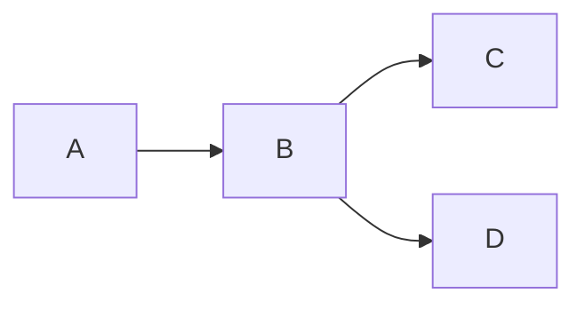
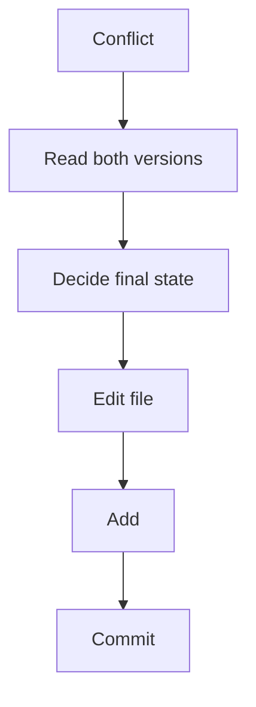

# ⚔️ Merge Conflict Solutions

> “Once you understand conflicts, they stop being scary.”

---

## ✅ Challenge 1: Create Conflict

```bash
git checkout main
echo "Version main" > app.txt
git add app.txt
git commit -m "Initial commit"

git checkout -b feature-a
echo "Version feature" > app.txt
git commit -am "Feature change"

git checkout main
echo "Version main updated" > app.txt
git commit -am "Main change"

git merge feature-a
```

👉 Conflict appears

---

## 🧠 Visual



---

## ✅ Challenge 2: Conflict Markers

```text
<<<<<<< HEAD
Version main updated
=======
Version feature
>>>>>>> feature-a
```

👉 Meaning:

* HEAD → current branch
* feature-a → incoming branch

---

## ✅ Challenge 3: Resolve Manually

Edit file:

```text
Final Version
```

Then:

```bash
git add app.txt
git commit
```

---

## ✅ Challenge 4: Abort Merge

```bash
git merge --abort
```

---

## ✅ Challenge 5: Multiple File Conflicts

Repeat same process for all files:

```bash
git status
# resolve each file
git add .
git commit
```

---

## ✅ Challenge 6: Rebase Conflict

```bash
git checkout feature-a
git rebase main
```

👉 Conflict occurs

---

## ✅ Challenge 7: Continue Rebase

```bash
git add .
git rebase --continue
```

---

## ✅ Challenge 8: Skip Commit

```bash
git rebase --skip
```

---

## ✅ Challenge 9: Compare Versions

```bash
git diff
```

---

## ✅ Challenge 10: Merge Tool

```bash
git mergetool
```

---

## ✅ Challenge 11: Accept Versions

Keep current:

```bash
git checkout --ours app.txt
```

Keep incoming:

```bash
git checkout --theirs app.txt
```

Then:

```bash
git add app.txt
git commit
```

---

## ✅ Challenge 12: Team Conflict Simulation

Same steps as Challenge 1 but with multiple commits.

---

## ✅ Challenge 13: Delete vs Modify Conflict

👉 Resolve by:

* keeping file
* or deleting

```bash
git add file.txt   # keep
# or
git rm file.txt    # delete
git commit
```

---

## ✅ Challenge 14: Rename Conflict

👉 Fix manually:

* choose correct filename
* update content
* commit

---

## ✅ Challenge 15: Prevent Conflicts

```text
✔ Pull frequently
✔ Rebase often
✔ Keep branches small
✔ Communicate with team
```

---

## 🧠 Conflict Resolution Mental Model



---

## ⚡ Pro Tips

```text
Never panic
Read conflict markers carefully
Use git status constantly
Small commits = fewer conflicts
```

---

## 🚀 Next Step

➡️ Move to: `04-Recovery/`

---


---

## 🏁 Final Thought

> “A developer who understands conflicts is a developer teams trust.”
