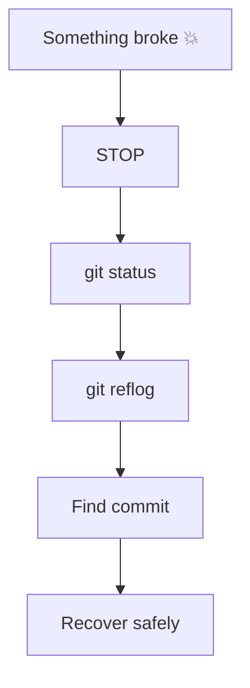

# 🚑 Git Recovery Challenges

> “Nothing is ever truly lost in Git — unless you don’t know how to find it.”

---

## 🧠 Recovery Mindset

---

## ⚡ Challenge 1: Undo Last Commit (Keep Changes)

### 🎯 Goal

Undo last commit but keep files.

### 📌 Task

* Make a commit
* Undo it but keep changes staged

---

## ⚡ Challenge 2: Undo Last Commit (Unstage Changes)

### 🎯 Goal

Undo commit and unstage changes.

---

## ⚡ Challenge 3: Hard Reset (Simulate Data Loss)

### 🎯 Goal

Understand destructive command.

### 📌 Task

* Make 2 commits
* Run hard reset
* Observe loss

---

## ⚡ Challenge 4: Recover Lost Commit via Reflog

### 🎯 Goal

Recover commit after reset

---

## ⚡ Challenge 5: Restore Deleted File (Uncommitted)

### 🎯 Goal

Recover file from working directory

---

## ⚡ Challenge 6: Restore Deleted File (Committed)

### 🎯 Goal

Recover file from history

---

## ⚡ Challenge 7: Recover Deleted Branch

### 🎯 Goal

Restore deleted branch using reflog

---

## ⚡ Challenge 8: Detached HEAD Recovery

### 🎯 Goal

Save work from detached HEAD

---

## ⚡ Challenge 9: Recover Lost Stash

### 🎯 Goal

Retrieve stash accidentally dropped

---

## ⚡ Challenge 10: Undo a Push (Safe Way)

### 🎯 Goal

Undo commit already pushed

---

## ⚡ Challenge 11: Fix Wrong Branch Commit

### 🎯 Goal

Move commit to correct branch

---

## ⚡ Challenge 12: Recover After Force Push

### 🎯 Goal

Restore overwritten history

---

## ⚡ Challenge 13: Restore Old Version of File

### 🎯 Goal

Bring back specific version

---

## ⚡ Challenge 14: Find Lost Commits (Deep)

### 🎯 Goal

Use low-level recovery

---

## ⚡ Challenge 15: Recover After Merge Gone Wrong

### 🎯 Goal

Undo bad merge

---

## ⚡ Challenge 16: Undo Rebase

### 🎯 Goal

Restore pre-rebase state

---

## ⚡ Challenge 17: Recover Deleted Remote Branch

### 🎯 Goal

Restore remote branch

---

## ⚡ Challenge 18: Clean Working Directory Mistake

### 🎯 Goal

Recover after `git clean`

---

## ⚡ Challenge 19: Fix Broken Repo State

### 🎯 Goal

Diagnose and fix unexpected state

---

## ⚡ Challenge 20: Full Disaster Drill

### 🎯 Goal

Simulate:

* reset
* branch delete
* force push

Recover everything.
