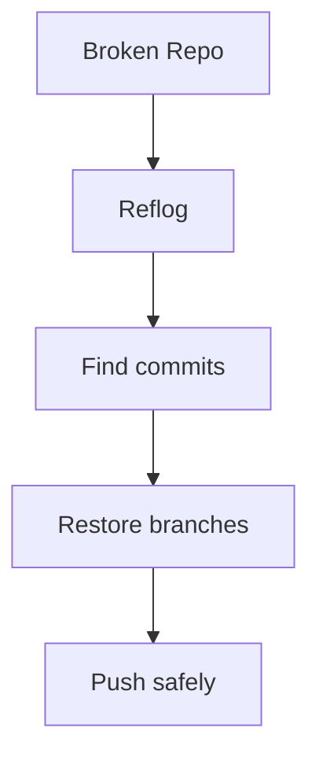

# 🚑 Git Recovery Solutions

> “If you understand reflog, you understand Git recovery.”

---

## ✅ Challenge 1: Undo Commit (Keep Changes)

```bash
git reset --soft HEAD~1
```

---

## ✅ Challenge 2: Undo Commit (Unstage)

```bash
git reset HEAD~1
```

---

## ✅ Challenge 3: Hard Reset

```bash
git reset --hard HEAD~2
```

⚠️ Deletes changes

---

## ✅ Challenge 4: Recover Lost Commit

```bash
git reflog
git reset --hard <commit>
```

---


---

## ✅ Challenge 5: Restore Deleted File

```bash
git restore file.txt
```

---

## ✅ Challenge 6: Restore Committed File

```bash
git checkout HEAD~1 -- file.txt
```

---

## ✅ Challenge 7: Recover Deleted Branch

```bash
git reflog
git checkout -b recovered <commit>
```

---

## ✅ Challenge 8: Detached HEAD Recovery

```bash
git checkout -b safe-branch
```

---

## ✅ Challenge 9: Recover Lost Stash

```bash
git fsck --lost-found
```

---

## ✅ Challenge 10: Undo Push Safely

```bash
git revert <commit>
```

---

## ✅ Challenge 11: Wrong Branch Commit

```bash
git cherry-pick <commit>
```

---

## ✅ Challenge 12: Recover After Force Push

👉 Use teammate or reflog:

```bash
git reflog
git checkout -b recovery <commit>
```

---

## ✅ Challenge 13: Restore Old File Version

```bash
git checkout <commit> -- file.txt
```

---

## ✅ Challenge 14: Deep Recovery

```bash
git fsck --lost-found
```

---

## ✅ Challenge 15: Undo Merge

```bash
git reset --hard HEAD~1
```

or safe:

```bash
git revert -m 1 <merge-commit>
```

---

## ✅ Challenge 16: Undo Rebase

```bash
git reflog
git reset --hard HEAD@{1}
```

---

## ✅ Challenge 17: Recover Remote Branch

```bash
git checkout -b branch <commit>
git push origin branch
```

---

## ✅ Challenge 18: Clean Mistake

👉 Hard to recover — depends on backup

---

## ✅ Challenge 19: Fix Broken Repo

```bash
git status
git log
git reflog
```

---

## ✅ Challenge 20: Full Disaster Recovery



---

## 🧠 Recovery Golden Rules

```text
1. Never panic
2. Use reflog first
3. Create backup branch
4. Avoid force push blindly
```

---

## ⚡ Recovery Toolkit

```bash
git reflog
git log --all
git fsck
git show <commit>
git checkout <commit>
git reset --hard <commit>
```

---

## 🚀 Next Step

➡️ Move to: `05-Master-Level/`

---


---

## 🏁 Final Thought

> “Git doesn’t lose your work — you just haven’t learned how to recover it yet.”
