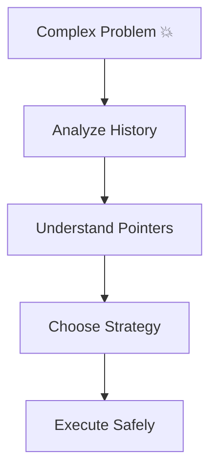

# 🔥 Master-Level Git Challenges

> “If you can solve these, you don’t just use Git — you control it.”

---

## 🧠 Master Mindset

---

## ⚡ Challenge 1: Rewrite Full History Safely

### 🎯 Goal

Rewrite commit history (messages or structure)

### 📌 Task

* Modify last 3 commits
* Change messages and combine commits

---

## ⚡ Challenge 2: Remove Sensitive Data from History

### 🎯 Goal

Permanently remove secrets from repo

### 📌 Task

* Add fake API key
* Remove it from entire history

---

## ⚡ Challenge 3: Split a Large Commit

### 🎯 Goal

Break one commit into multiple logical commits

---

## ⚡ Challenge 4: Reorder Commits

### 🎯 Goal

Change commit order cleanly

---

## ⚡ Challenge 5: Apply Only Part of a Commit

### 🎯 Goal

Extract partial changes

---

## ⚡ Challenge 6: Create Clean Linear History

### 🎯 Goal

Convert messy history into linear

---

## ⚡ Challenge 7: Resolve Complex Multi-Branch Merge

### 🎯 Goal

Merge 3 branches with conflicts

---

## ⚡ Challenge 8: Simulate Real Team Workflow

### 🎯 Goal

Handle:

* multiple features
* updates
* merges

---

## ⚡ Challenge 9: Recover After Complex Rebase Gone Wrong

### 🎯 Goal

Fix broken history

---

## ⚡ Challenge 10: Interactive Rebase Deep Dive

### 🎯 Goal

Use:

* squash
* reword
* drop

---

## ⚡ Challenge 11: Create Patch & Apply It

### 🎯 Goal

Share changes without pushing

---

## ⚡ Challenge 12: Work with Submodules (Intro)

### 🎯 Goal

Add external repo inside repo

---

## ⚡ Challenge 13: Handle Diverged Branches

### 🎯 Goal

Fix local vs remote mismatch

---

## ⚡ Challenge 14: Simulate Large Repo Optimization

### 🎯 Goal

Improve performance

---

## ⚡ Challenge 15: Manual Conflict Resolution Strategy

### 🎯 Goal

Resolve conflict logically (not blindly)

---

## ⚡ Challenge 16: Debug Commit Graph

### 🎯 Goal

Understand complex graph

---

## ⚡ Challenge 17: Rewrite Author History

### 🎯 Goal

Change author/email in commits

---

## ⚡ Challenge 18: Recover Dangling Objects

### 🎯 Goal

Recover orphan commits

---

## ⚡ Challenge 19: Create Custom Git Alias

### 🎯 Goal

Improve productivity

---

## ⚡ Challenge 20: Simulate Production Hotfix

### 🎯 Goal

Fix bug from old commit and deploy

---

## ⚡ Challenge 21: Merge vs Rebase Decision Drill

### 🎯 Goal

Choose correct strategy

---

## ⚡ Challenge 22: Cherry-Pick Multiple Commits

### 🎯 Goal

Move series of commits

---

## ⚡ Challenge 23: Advanced Stash Workflow

### 🎯 Goal

Use stash with branches

---

## ⚡ Challenge 24: Git Internals Exploration

### 🎯 Goal

Inspect objects manually

---

## ⚡ Challenge 25: Full Git Debug Simulation

### 🎯 Goal

Fix:

* lost commits
* broken branch
* wrong merge
