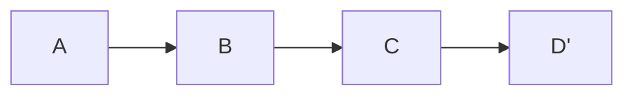
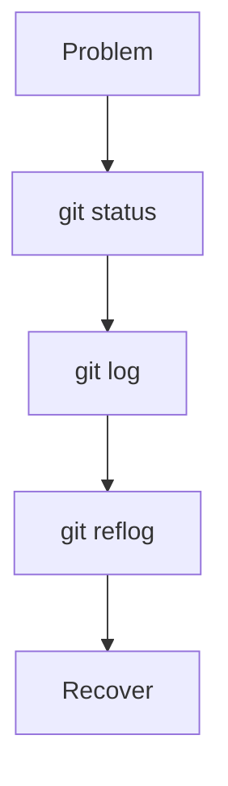

# 🔥 Master-Level Solutions

> “At this level, you are thinking in commits, not commands.”

---

## ✅ Challenge 1: Rewrite History

```bash
git rebase -i HEAD~3
```

Use:

```
pick
reword
squash
```

---

## ✅ Challenge 2: Remove Sensitive Data

```bash
git filter-repo --path file.txt --invert-paths
```

Then:

```bash
git push --force
```

---

## ✅ Challenge 3: Split Commit

```bash
git reset HEAD~1
git add -p
git commit -m "part 1"
git commit -m "part 2"
```

---

## ✅ Challenge 4: Reorder Commits

```bash
git rebase -i HEAD~n
```

Rearrange lines

---

## ✅ Challenge 5: Partial Commit Apply

```bash
git cherry-pick -n <commit>
git reset
git add -p
git commit
```

---

## ✅ Challenge 6: Linear History

```bash
git rebase main
```

---



---

## ✅ Challenge 7: Multi-Branch Merge

```bash
git merge branch1
git merge branch2
git merge branch3
```

Resolve conflicts step-by-step

---

## ✅ Challenge 8: Team Workflow

Use:

* feature branches
* merge or rebase
* pull frequently

---

## ✅ Challenge 9: Recover Rebase

```bash
git reflog
git reset --hard HEAD@{1}
```

---

## ✅ Challenge 10: Interactive Rebase

```bash
git rebase -i HEAD~5
```

---

## ✅ Challenge 11: Patch

```bash
git format-patch -1 <commit>
git apply file.patch
```

---

## ✅ Challenge 12: Submodule

```bash
git submodule add <repo-url>
```

---

## ✅ Challenge 13: Diverged Branch

```bash
git pull --rebase
```

or

```bash
git merge
```

---

## ✅ Challenge 14: Optimize Repo

```bash
git gc
git prune
```

---

## ✅ Challenge 15: Manual Conflict Strategy

👉 Understand both changes → merge logically

---

## ✅ Challenge 16: Debug Graph

```bash
git log --graph --oneline --all
```

---

## ✅ Challenge 17: Rewrite Author

```bash
git commit --amend --author="Name <email>"
```

---

## ✅ Challenge 18: Recover Dangling

```bash
git fsck --lost-found
```

---

## ✅ Challenge 19: Git Alias

```bash
git config --global alias.lg "log --oneline --graph --all"
```

---

## ✅ Challenge 20: Production Hotfix

```bash
git checkout <old-commit>
git checkout -b hotfix
# fix bug
git commit
git checkout main
git merge hotfix
```

---

## ✅ Challenge 21: Merge vs Rebase

👉 Decision:

* shared → merge
* local → rebase

---

## ✅ Challenge 22: Cherry-Pick Multiple

```bash
git cherry-pick A^..B
```

---

## ✅ Challenge 23: Advanced Stash

```bash
git stash branch new-branch
```

---

## ✅ Challenge 24: Inspect Objects

```bash
git cat-file -p <hash>
```

---

## ✅ Challenge 25: Full Debug



---

## 🧠 Master Summary

```text
Rebase = rewrite
Merge = combine
Cherry-pick = copy
Reflog = recovery
Objects = core system
```

---

## 🚀 Next Step

➡️ Move to:

* Real-world labs
* Timed challenges

---


---

## 🏁 Final Thought

> “Mastery is when Git stops surprising you — because you understand it.”
