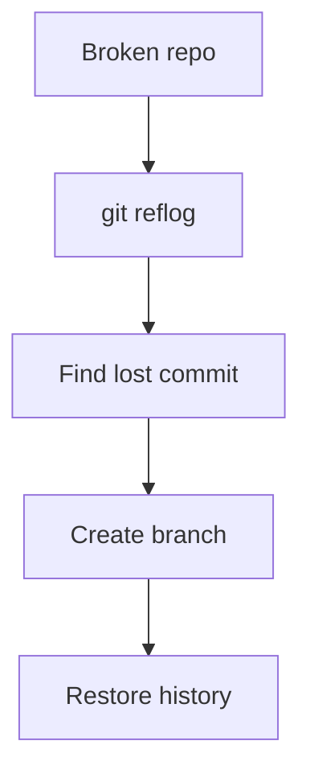

# 💥 Broken Repo Lab (Disaster Recovery Simulation)

> “Your repo is broken. History looks wrong. Nothing makes sense.”

---

## 🎯 Objective

Fix a corrupted Git state involving:

* reset
* deleted branch
* detached HEAD

---

## 🧪 Setup Scenario

```bash
# simulate project
git init
echo "v1" > app.txt
git add .
git commit -m "initial"

echo "v2" >> app.txt
git commit -am "update v2"

git checkout -b feature
echo "feature work" >> app.txt
git commit -am "feature commit"

# break things
git checkout main
git reset --hard HEAD~1
git branch -D feature
```

---

## 💥 Current State


---

## 🎯 Tasks

1. Find lost commit
2. Recover feature branch
3. Restore correct history

---

## 🧠 Solution Strategy



---

## ✅ Commands

```bash
git reflog
git checkout -b recovered <commit>
```

---

## 🏁 Outcome

* Lost commit restored
* Branch recovered
* Repo fixed
