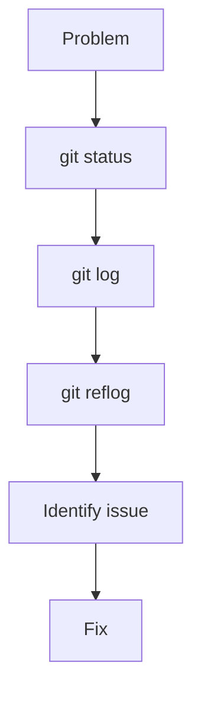
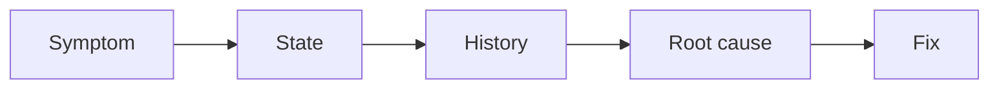
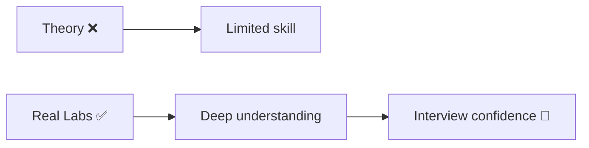
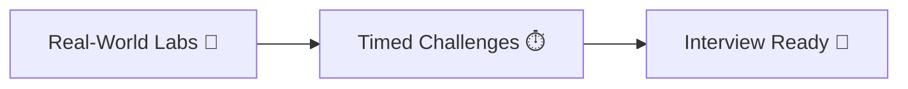

# 🔍 Git Debugging Lab (Think Like a Pro)

> “The repo behaves strangely. You must diagnose before acting.”

---

## 🎯 Objective

Debug unknown repo state using:

* logs
* reflog
* diff

---

## 🧪 Scenario

You see:

* missing commits
* unexpected file state
* branch confusion

---

## 🧠 Debug Flow



---

## 🎯 Tasks

### Task 1: Identify current branch

---

### Task 2: Check history graph

---

### Task 3: Find missing commit

---

### Task 4: Compare file versions

---

### Task 5: Restore correct state

---

## ✅ Commands Toolkit

```bash
git status
git branch
git log --graph --oneline --all
git reflog
git diff
git show <commit>
```

---

## 🧠 Example Fix

```bash
git reflog
git reset --hard <commit>
```

---

## 🔬 Advanced Debug Thinking



---

## 🏁 Outcome

* Problem identified
* Root cause understood
* Repo fixed safely

---

---

# 🧠 Why These Labs Are Powerful



---

# 🚀 Next Step

➡️ Move to: `07-Timed-Challenges/`

---



---

## 🏁 Final Thought

> “Reading Git teaches you commands.
> Debugging Git teaches you mastery.”
