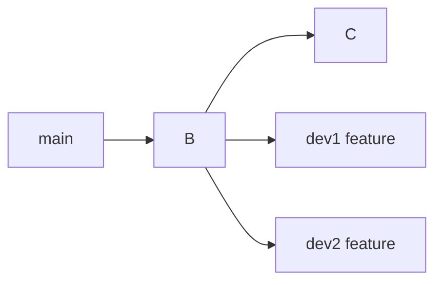
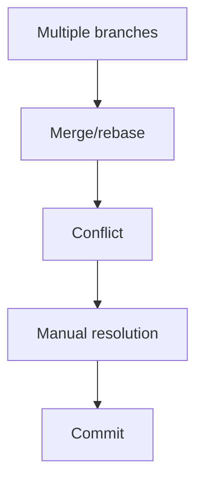

# 👥 Team Collaboration Lab

> “Multiple developers. Conflicts. History issues. Real-world chaos.”

---

## 🎯 Objective

Simulate team workflow with:

* multiple branches
* conflicts
* synchronization

---

## 🧪 Scenario



---

## 🧪 Setup

### Dev 1:

```bash
git checkout -b feature-login
echo "login v1" > login.txt
git commit -am "login feature"
```

---

### Dev 2:

```bash
git checkout -b feature-navbar
echo "navbar v1" > navbar.txt
git commit -am "navbar feature"
```

---

### Create Conflict

Both modify same file:

```bash
echo "conflict" > app.txt
git commit -am "dev1 change"
```

---

## 🎯 Tasks

1. Merge both features
2. Resolve conflicts
3. Keep clean history

---

## 🧠 Strategy



---

## ✅ Commands

```bash
git merge feature-login
git merge feature-navbar
# resolve conflicts
git add .
git commit
```

---

## 🏁 Outcome

* Conflicts resolved
* Features merged
* Team workflow simulated
