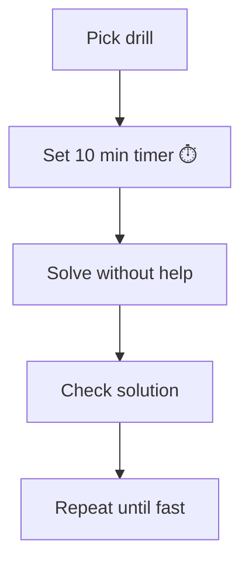
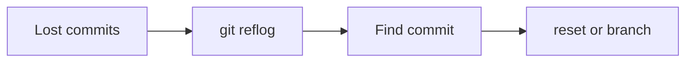
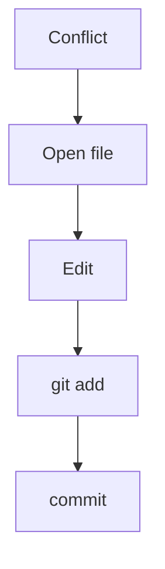
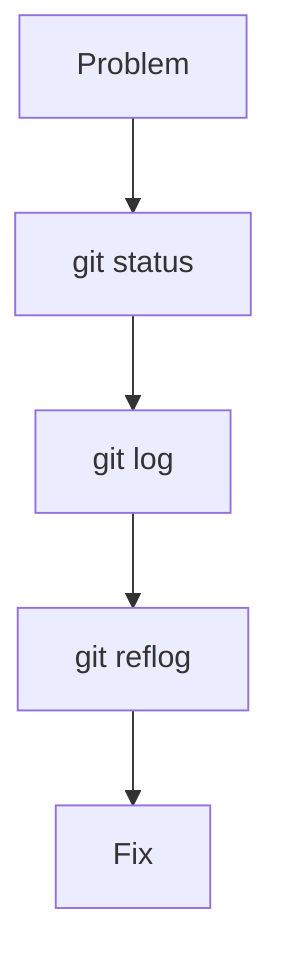
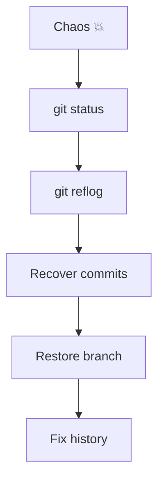
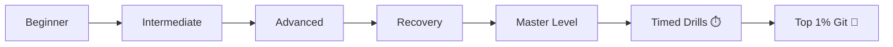

# ⏱️ Git 10-Minute Drills (Speed + Pressure Training)

> “Knowing Git is one thing. Solving under pressure is another.”

---

## 🧠 How to Use These Drills



---

## ⚡ Drill Rules

```text id="tdr1"
✔ No Googling
✔ Use terminal only
✔ Think before typing
✔ Use git status frequently
✔ Focus on speed + accuracy
```

---

# 🔥 Drill 1: Lost Commit Recovery

### 🎯 Scenario

You ran:

```bash id="d1"
git reset --hard HEAD~2
```

Now your last 2 commits are gone.

---

### 🧪 Task

Recover the lost commits.

---

### ⏱️ Target Time

3–5 minutes

---

## 🧠 Expected Flow



---

# 🔥 Drill 2: Wrong Branch Commit

### 🎯 Scenario

You committed on `main` instead of `feature`.

---

### 🧪 Task

Move the commit to a new branch and clean `main`.

---

### ⏱️ Target Time

4–6 minutes

---

# 🔥 Drill 3: Merge Conflict Fix

### 🎯 Scenario

Two branches modified the same file → conflict.

---

### 🧪 Task

Resolve conflict and complete merge.

---

### ⏱️ Target Time

5–7 minutes

---

## 🧠 Conflict Flow



---

# 🔥 Drill 4: Detached HEAD Save

### 🎯 Scenario

You committed in detached HEAD.

---

### 🧪 Task

Save that work safely.

---

### ⏱️ Target Time

2–3 minutes

---

# 🔥 Drill 5: Undo Pushed Commit Safely

### 🎯 Scenario

You pushed a wrong commit to remote.

---

### 🧪 Task

Undo it without breaking team history.

---

### ⏱️ Target Time

4–6 minutes

---

# 🔥 Drill 6: Recover Deleted Branch

### 🎯 Scenario

A branch was deleted accidentally.

---

### 🧪 Task

Restore it.

---

### ⏱️ Target Time

3–5 minutes

---

# 🔥 Drill 7: Clean Commit History

### 🎯 Scenario

You have 5 messy commits.

---

### 🧪 Task

Convert them into 1 clean commit.

---

### ⏱️ Target Time

5–8 minutes

---

# 🔥 Drill 8: Compare Branch Differences

### 🎯 Scenario

You need to know what changed between branches.

---

### 🧪 Task

Find differences in commits and files.

---

### ⏱️ Target Time

2–4 minutes

---

# 🔥 Drill 9: Rebase Conflict Recovery

### 🎯 Scenario

Rebase caused conflict.

---

### 🧪 Task

Resolve and continue rebase.

---

### ⏱️ Target Time

5–7 minutes

---

# 🔥 Drill 10: Emergency Debug

### 🎯 Scenario

Repo looks broken:

* wrong files
* missing commits

---

### 🧪 Task

Diagnose and fix.

---

### ⏱️ Target Time

6–10 minutes

---

## 🧠 Debug Flow



---

# ⚡ Drill 11: Cherry-Pick Specific Fix

### 🎯 Scenario

A bug fix exists in another branch.

---

### 🧪 Task

Apply only that fix.

---

---

# ⚡ Drill 12: Stash Workflow

### 🎯 Scenario

You must switch branches with uncommitted changes.

---

### 🧪 Task

Save and restore work safely.

---

---

# 🧠 Master Drill (Final Boss)

---

## 🔥 Drill 13: Full Disaster Simulation

### 🎯 Scenario

You:

* committed on wrong branch
* ran reset
* deleted branch
* caused conflict

---

### 🧪 Task

Recover everything:

* commits
* branch
* clean history

---

### ⏱️ Target Time

10 minutes

---

## 🧠 Full Recovery Flow



---

# ⚡ Speed Benchmarks

```text id="tdbench"
Beginner → 10 min per task
Intermediate → 5 min
Advanced → 2–3 min
Expert → < 2 min
```

---

# 🧠 Mental Checklist

```text id="tdcheck"
Where am I? → git status
What changed? → git diff
What happened? → git log
What was lost? → git reflog
How to fix? → choose command
```

---

# 🚀 Final Progress Map



---

## 🏁 Final Thought

> “Speed comes from clarity.
> Clarity comes from practice.”

---

## 🎯 Final Advice

👉 Repeat these drills until:

* You don’t hesitate
* You don’t guess
* You **know exactly what to do**
