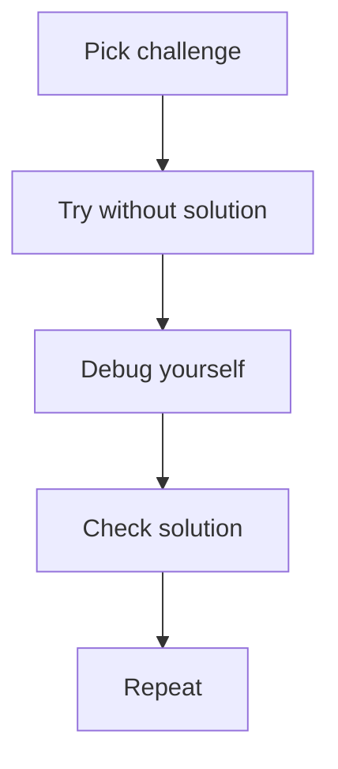
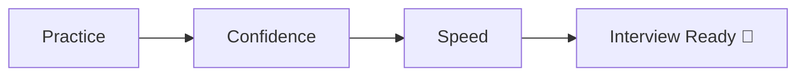

# 🧪 Git Challenges Lab (Hands-On Mastery)

> “You don’t learn Git by reading — you master it by breaking and fixing things.”

---

## 🎯 What This Section Does

* Turn knowledge into **real skill**
* Simulate **interview scenarios**
* Build **debugging confidence**

---

## 🧭 Learning Path


---

## 📚 Modules

---

### 🟢 Beginner

➡️ `01-Beginner/`

* Basic commands
* Simple workflows
* Git fundamentals

---

### 🌿 Branching

➡️ `02-Branching/`

* Create branches
* Switch branches
* Move commits

---

### ⚔️ Merge Conflicts

➡️ `03-Merge-Conflicts/`

* Resolve conflicts
* Understand conflict markers
* Practice real merge issues

---

### 🚑 Recovery

➡️ `04-Recovery/`

* Recover lost commits
* Fix broken repos
* Use reflog

---

### 🔥 Master Level

➡️ `05-Master-Level/`

* Complex workflows
* History rewriting
* Multi-branch scenarios

---

### 🧪 Real-World Labs

➡️ `06-Real-World-Labs/`

* Broken repo debugging
* Team collaboration simulation
* Production-like problems

---

### ⏱️ Timed Challenges

➡️ `07-Timed-Challenges/`

* Solve problems under time pressure
* Interview-style drills

---

## 🧠 How to Use This Section



---

## ⚡ Rules for Maximum Learning

```text
1. Do NOT jump to solutions
2. Break things intentionally
3. Use git status + reflog
4. Think before running commands
```

---

## 🧪 Example Challenge Style

```text
Goal:
Move commit from main → feature

Constraint:
Do not lose history

Hint:
Think about cherry-pick
```

---

## 🚀 Outcome



---

# 🏁 Final Thought

> “Reading Git makes you familiar.
> Breaking Git makes you dangerous (in a good way).”
