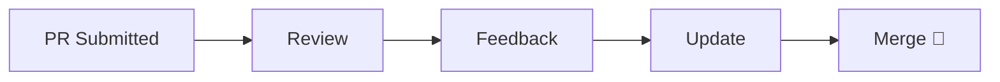

# 🤝 Contributing Guide

> “Great repositories are built by great contributors.”

Thank you for your interest in contributing to **Git & GitHub Mastery** 🚀  
This project aims to provide a **complete, structured, and visual learning system** for Git.

---

## 🧠 Philosophy

```mermaid
flowchart LR
    A[Contributor] --> B[Improve Clarity]
    B --> C[Better Learning]
    C --> D[Better Developers 🚀]
````

We focus on:

* simplicity
* clarity
* real-world usefulness
* structured learning

---

## 🎯 Ways to Contribute

You can contribute by:

* 📝 Improving explanations
* 🐛 Fixing typos or mistakes
* 📊 Adding diagrams (Mermaid / visuals)
* 🧪 Adding challenges or labs
* 🎯 Improving interview questions
* ⚡ Enhancing cheat sheets
* 🧠 Adding real-world scenarios

---

## 🚀 Getting Started

### 1. Fork the Repository

```bash
git clone https://github.com/Vipul99999/git-github-mastery.git
cd git-github-mastery
```

---

### 2. Create a Branch

```bash
git switch -c feature/your-change
```

---

### 3. Make Changes

* follow folder structure
* keep content consistent
* test your changes (readability + clarity)

---

### 4. Commit Changes

```bash
git commit -m "feat: improve merge conflict explanation"
```

---

### 5. Push & Create PR

```bash
git push origin feature/your-change
```

Then open a Pull Request 🚀

---

## 🌿 Branch Naming Convention

```text
feature/add-new-topic
fix/typo-in-readme
docs/update-cheatsheet
refactor/improve-structure
```

---

## 🧾 Commit Message Style

Use clear and meaningful messages:

```text
feat: add advanced rebase explanation
fix: correct typo in recovery guide
docs: improve beginner cheatsheet
```

---

## 🧠 Content Guidelines

When contributing content:

✔ Keep language simple and clear
✔ Prefer examples over theory
✔ Add Mermaid diagrams where useful
✔ Maintain consistent formatting
✔ Keep sections short and structured
✔ Add “Next Step” when helpful

---

## 🎨 Visual Guidelines

* Use **Mermaid diagrams** for flows
* Keep diagrams simple and readable
* Avoid over-complicated visuals

---

## 📁 Structure Rules

👉 Follow existing structure:

* basics → `01-Basics/`
* branching → `02-Branching/`
* advanced → `07-Advanced-Git/`
* recovery → `11-Mistakes-Recovery/`

⚠️ Do not change structure without discussion

---

## ⚠️ What to Avoid

❌ Very large PRs
❌ Unclear explanations
❌ Breaking structure
❌ Overly complex content
❌ Adding external assets (unstable links)
❌ Duplicate topics

---

## 🧪 Quality Checklist

Before submitting PR:

* [ ] Content is clear and beginner-friendly
* [ ] No spelling or grammar issues
* [ ] Follows repository structure
* [ ] Includes examples (if applicable)
* [ ] Adds value (not repetition)

---

## 🔍 Pull Request Review Process



---

## 🧠 Good Contribution =

* clear
* useful
* structured
* consistent
* practical

---

## ❓ Need Help?

If you're unsure:

* open an issue
* ask questions
* suggest improvements

---

## ⭐ Final Note

> “You don’t need to be an expert to contribute —
> you just need to make something clearer for the next learner.”

---

Thank you for contributing ❤️
