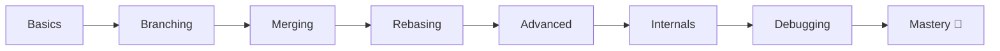
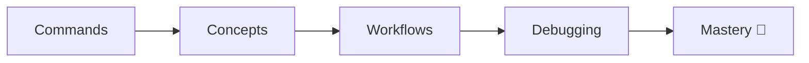

# 🚀 Git & GitHub Mastery (Top 1% Guide)


> 🧠 From Beginner → Top 1% Git Engineer  
> 🔬 Deep internals + real-world debugging  
> 🎯 Interview-ready + hands-on labs  

---

## 🔍 Learn Git & GitHub (Complete Guide)

A complete **Git and GitHub tutorial** covering:

- Git basics for beginners  
- Branching, merging, and rebasing  
- Git internals explained  
- GitHub workflows (PRs, issues, collaboration)  
- Debugging and recovery (reflog, reset, revert)  
- Interview preparation (FAANG-level questions)  

👉 This is a **complete Git learning roadmap** from beginner to advanced.

---

## 🧠 Topics Covered (SEO Keywords)

Git, GitHub, version control, git tutorial, git for beginners, git advanced, git internals, git rebase, git merge, git workflow, github workflow, pull requests, merge conflicts, git debugging, reflog, reset vs revert, git interview questions, git roadmap

---

## 📌 Quick Navigation

- 🚀 [Start Here](./START-HERE.md)
- 🧠 [Mental Models](./00-Mental-Models/)
- 📚 [Full Course](./01-Basics/)
- 🌿 [Branching](./02-Branching/)
- 🔀 [Merging](./03-Merging/)
- 🔄 [Rebasing](./04-Rebasing/)
- 🌍 [GitHub](./05-Remote-GitHub/)
- 👥 [Collaboration](./06-Collaboration/)
- 🔴 [Advanced Git](./07-Advanced-Git/)
- 🔬 [Internals](./10-Git-Internals/)
- 🚑 [Recovery](./11-Mistakes-Recovery/)
- 🎯 [Interview Prep](./12-Interview-Questions/)
- ⚔️ [Challenges](./13-Challenges/)
- 🧪 [Projects](./projects/)
- 🎁 [Bonus](./bonus/)
- 📄 [Cheat Sheets](./cheatsheets/)

---

## 🧠 Learning System

```mermaid
flowchart LR
    A[Concepts] --> B[Visual Learning]
    B --> C[Hands-on Practice]
    C --> D[Debugging]
    D --> E[Mastery 🚀]
````

---

## 🔥 What Makes This Repo Special?

✔ Visual diagrams for deep understanding
✔ Real-world debugging scenarios
✔ Hands-on labs & challenges
✔ Interview-focused preparation
✔ Git internals explained simply

---

## 🧭 Git Mental Model

```mermaid
graph LR
    A[Working Directory] --> B[Staging Area]
    B --> C[Commit]
    C --> D[Branch]
    D --> E[Remote]
```

---

## 📚 Course Structure



---

## 🧭 Learning Roadmap


👉 Full roadmap → [ROADMAP.md](./ROADMAP.md)

---

## ⚡ Quick Start

```bash
git clone https://github.com/YOUR_USERNAME/git-github-mastery.git
cd git-github-mastery
```

👉 Start from → `START-HERE.md`

---

## 🎯 Who This Is For

* 🟢 Beginners → structured learning path
* 🧠 Developers → real-world workflows
* 🎯 Interview prep → FAANG-level questions
* 🔴 Advanced users → Git internals

---

## 🧪 What You’ll Be Able to Do

✔ Fix broken repositories
✔ Recover lost commits
✔ Resolve complex merge conflicts
✔ Work safely in teams
✔ Explain Git in interviews confidently

---

## 📊 Skill Progression



---

## 🤝 Contributing

We welcome contributions!

👉 Read: [CONTRIBUTING.md](./CONTRIBUTING.md)

---

## 📄 License

This project is licensed under the MIT License.

---

## ⭐ Support This Project

If this repo helps you:

* ⭐ Star the repo
* 🍴 Fork it
* 📢 Share with others

---

## 🏁 Final Thought

> “Git is not hard — it’s misunderstood.
> Once you understand it, you control it.”
