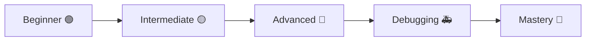
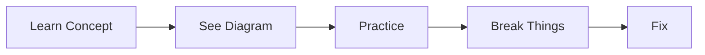
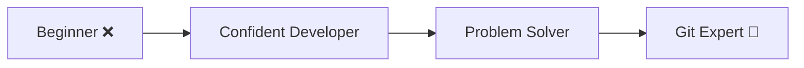

# 🧭 Git & GitHub Mastery Roadmap

> “Follow this path → go from beginner to top 1% Git user.”

---

## 🧠 Complete Learning Journey



---

# 🟢 Stage 1: Beginner (Foundations)

---

## 🎯 Goal

Understand basic Git workflow

---

## 📚 Learn

- Git installation
- `git init`, `git add`, `git commit`
- `git status`, `git log`

👉 Path:

- `START-HERE.md`
- `01-Basics/`

---

## 🧠 Concepts

```text
Repository
Working directory
Staging area
Commit (snapshot)
```

---

## 🧪 Practice

👉 `01-Basics/practice-lab.md`

---

## 🚫 Avoid

- skipping git status
- committing blindly

---

## ✅ Outcome

You can track and save changes confidently

---

---

# 🟡 Stage 2: Branching & Workflow

---

## 🎯 Goal

Work safely using branches

---

## 📚 Learn

- creating branches
- switching branches
- merging

👉 Path:

- `02-Branching/`
- `03-Merging/`

---

## 🧠 Concepts

```text
Branch = pointer
Merge = combine history
```

---

## 🧪 Practice

👉 `02-Branching/practice-lab.md`

---

## ⚠️ Mistakes

- working on main
- ignoring conflicts

---

## ✅ Outcome

You can manage real workflows

---

---

# 🔴 Stage 3: Advanced Git

---

## 🎯 Goal

Understand Git deeply

---

## 📚 Learn

- rebase
- interactive rebase
- cherry-pick
- stash

👉 Path:

- `04-Rebasing/`
- `07-Advanced-Git/`

---

## 🧠 Concepts

```text
DAG (commit graph)
Rebase = rewrite history
```

---

## 🧪 Practice

👉 advanced labs

---

## ⚠️ Mistakes

- rebasing shared branches
- rewriting public history

---

## ✅ Outcome

You control Git behavior

---

---

# 🚑 Stage 4: Debugging & Recovery

---

## 🎯 Goal

Fix any Git problem

---

## 📚 Learn

- reflog
- reset vs revert
- recovery techniques

👉 Path:

- `11-Mistakes-Recovery/`

---

## 🧠 Concepts

```text
HEAD movement
History recovery
Reflog = time machine
```

---

## 🧪 Practice

👉 recovery challenges

---

## ⚠️ Mistakes

- panic
- assuming data is lost

---

## ✅ Outcome

You can recover ANY mistake

---

---

# 🧪 Stage 5: Real-World Practice

---

## 🎯 Goal

Apply Git in real scenarios

---

## 📚 Learn

- collaboration
- PR workflow
- release process

👉 Path:

- `06-Collaboration/`
- `projects/`

---

## 🧪 Practice

👉 real-world labs
👉 team simulations

---

## ✅ Outcome

You can work in teams confidently

---

---

# 🎯 Stage 6: Interview Preparation

---

## 🎯 Goal

Explain Git clearly and solve problems

---

## 📚 Learn

- theory questions
- scenario-based problems
- debugging cases

👉 Path:

- `12-Interview-Questions/`

---

## 🧠 Skills

```text
Explain concepts clearly
Solve problems quickly
Think in Git internals
```

---

## ✅ Outcome

You are interview-ready 🚀

---

---

# ⚡ Weekly Plan

```text
Week 1 → Basics
Week 2 → Branching + Merging
Week 3 → Advanced Git
Week 4 → Debugging + Practice
```

---

---

# 🧠 Learning Strategy



---

---

# ⚡ Golden Rules

```text
✔ Always check git status
✔ Use branches for everything
✔ Keep commits small
✔ Never panic
✔ Use reflog when stuck
```

---

---

# 🚀 Final State



---

---

# 🏁 Final Thought

> “Master Git once — it will save you thousands of hours forever.”
