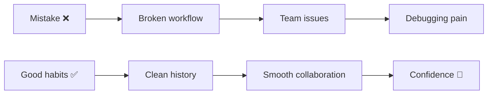
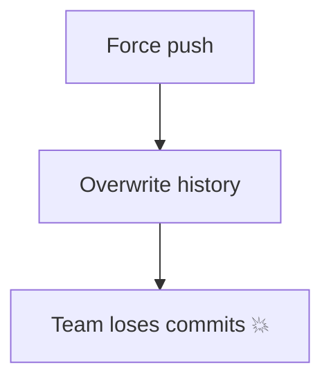
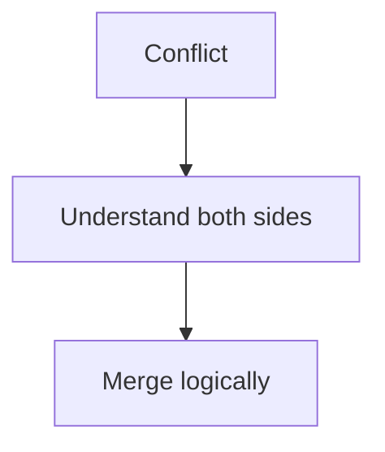

# ❌ Common GitHub Mistakes (And How to Avoid Them)

> “Most Git problems are not technical — they’re behavioral.”

---

## 🧠 Big Picture



---

# ⚠️ 1. Committing Sensitive Data

---

### 🚫 Mistake

* API keys
* passwords
* tokens

---

### 💥 Impact

* security breach
* revoked credentials

---

### ✅ Fix

```bash
git filter-repo
```

---

### 🧠 Rule

```text
Never commit secrets. Ever.
```

---

# ⚠️ 2. Force Push Without Understanding

---

### 🚫 Mistake

```bash
git push --force
```

---

### 💥 Impact



---

### ✅ Fix

```bash
git push --force-with-lease
```

---

### 🧠 Rule

```text
Only force push on your own branches.
```

---

# ⚠️ 3. Working Directly on `main`

---

### 🚫 Mistake

All work on main branch

---

### 💥 Impact

* unstable code
* no isolation

---

### ✅ Fix

```bash
git checkout -b feature-x
```

---

---

# ⚠️ 4. Huge Commits

---

### 🚫 Mistake

One commit = entire project changes

---

### 💥 Impact

* hard to review
* impossible to debug

---

### ✅ Fix

```text
Small, logical commits
```

---

# ⚠️ 5. Bad Commit Messages

---

### 🚫 Mistake

```text
fix
update
done
```

---

### 💥 Impact

* no context
* confusing history

---

### ✅ Fix

```text
Add login validation logic
Fix navbar responsiveness issue
```

---

---

# ⚠️ 6. Not Pulling Before Push

---

### 🚫 Mistake

```bash
git push
```

(without pulling)

---

### 💥 Impact

* conflicts
* rejected push

---

### ✅ Fix

```bash
git pull --rebase
```

---

---

# ⚠️ 7. Ignoring `git status`

---

### 🚫 Mistake

Running commands blindly

---

### 💥 Impact

* confusion
* wrong commits

---

### ✅ Fix

```bash
git status
```

---

### 🧠 Rule

```text
Always know your state
```

---

---

# ⚠️ 8. Deleting Branch Without Checking

---

### 🚫 Mistake

```bash
git branch -D branch
```

---

### 💥 Impact

* lost work

---

### ✅ Fix

```bash
git branch -d branch
```

---

---

# ⚠️ 9. Not Using `.gitignore`

---

### 🚫 Mistake

Committing:

* node_modules
* logs
* build files

---

### 💥 Impact

* huge repo
* slow performance

---

### ✅ Fix

```text
Add proper .gitignore
```

---

---

# ⚠️ 10. Blindly Resolving Conflicts

---

### 🚫 Mistake

Deleting conflict markers without understanding

---

### 💥 Impact

* broken code

---

### ✅ Fix

```text
Read both changes carefully
```

---



---

---

# ⚠️ 11. Rewriting Shared History

---

### 🚫 Mistake

Rebasing or resetting shared branch

---

### 💥 Impact

* team confusion
* broken history

---

### ✅ Fix

```text
Use revert instead
```

---

---

# ⚠️ 12. Not Using Reflog

---

### 🚫 Mistake

Thinking work is lost

---

### 💥 Impact

* panic
* wasted time

---

### ✅ Fix

```bash
git reflog
```

---

---

# ⚡ Golden Rules

```text
✔ Never panic
✔ Always check state
✔ Prefer safe operations
✔ Keep history clean
✔ Think before command
```
