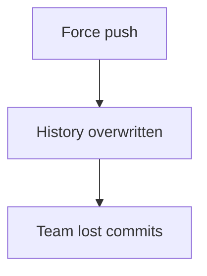
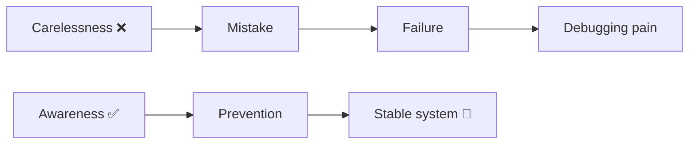

# 💥 Real-World Git Failures (And Lessons)

> “These are not theoretical — these are real mistakes developers made.”

---

# 🔥 Case 1: Force Push Disaster

---

## 🧪 Situation

Developer force-pushed to main.

---

## 💥 What Happened



---

## 🧠 Root Cause

* no understanding of history rewrite

---

## ✅ Fix

* recover via teammate clone
* restore using reflog

---

## 🎯 Lesson

```text
Never force push on shared branches
```

---

---

# 🔥 Case 2: Lost Production Fix

---

## 🧪 Situation

Bug fix commit removed by reset

---

## 💥 Result

Production bug reappeared

---

## 🧠 Root Cause

Used `reset --hard` incorrectly

---

## ✅ Fix

```bash
git reflog
```

---

## 🎯 Lesson

```text
Revert > Reset for shared work
```

---

---

# 🔥 Case 3: Merge Conflict Gone Wrong

---

## 🧪 Situation

Conflict resolved incorrectly

---

## 💥 Result

Broken application

---

## 🧠 Root Cause

Ignored one side of change

---

## ✅ Fix

* re-check changes
* test thoroughly

---

## 🎯 Lesson

```text
Conflicts require thinking, not guessing
```

---

---

# 🔥 Case 4: Secrets Leaked

---

## 🧪 Situation

API key pushed to GitHub

---

## 💥 Result

* key abused
* service blocked

---

## 🧠 Root Cause

No `.gitignore`

---

## ✅ Fix

* remove history
* rotate key

---

## 🎯 Lesson

```text
Security > convenience
```

---

---

# 🔥 Case 5: Massive Commit Chaos

---

## 🧪 Situation

Single commit with huge changes

---

## 💥 Result

* hard debugging
* messy review

---

## 🧠 Root Cause

No commit discipline

---

## 🎯 Lesson

```text
Small commits = easy debugging
```

---

---

# 🔥 Case 6: Broken Deployment

---

## 🧪 Situation

Wrong branch deployed

---

## 💥 Result

Production failure

---

## 🧠 Root Cause

No branch verification

---

## ✅ Fix

```bash
git branch --show-current
```

---

## 🎯 Lesson

```text
Always verify branch before deployment
```

---

---

# 🧠 Failure Pattern



---

---

# ⚡ Master Takeaways

```text
Git rarely fails — humans do
Reflog saves you
Small commits save time
Branches save sanity
Understanding > commands
```

---

---

# 🏁 Final Thought

> “Every Git expert has broken a repo —
> the difference is they learned from it.”
