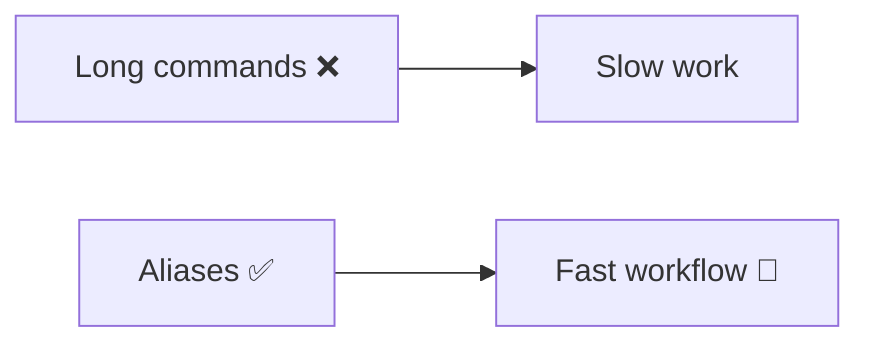

# ⚡ Git Aliases (Supercharge Your Workflow)

> “Aliases turn 10-second commands into 2-second actions.”

---

## 🧠 Why Aliases?



---

# 🚀 Basic Aliases

---

```bash
git config --global alias.st status
git config --global alias.co checkout
git config --global alias.br branch
git config --global alias.cm commit
```

---

### Usage

```bash
git st
git co main
git br
git cm -m "message"
```

---

---

# ⚡ Log Aliases (VERY IMPORTANT)

---

```bash
git config --global alias.lg "log --oneline --graph --all --decorate"
```

---

### Usage

```bash
git lg
```

---

👉 Shows full history visually

---

---

# ⚡ Advanced Aliases

---

```bash
git config --global alias.last "log -1 HEAD"
git config --global alias.unstage "reset HEAD --"
git config --global alias.undo "reset --soft HEAD~1"
```

---

---

# ⚡ Power Aliases

---

```bash
git config --global alias.graph "log --all --decorate --oneline --graph"
git config --global alias.hist "log --pretty=format:'%h %ad | %s%d [%an]' --graph --date=short"
```

---

---

# ⚡ Stash Aliases

---

```bash
git config --global alias.sl "stash list"
git config --global alias.sp "stash pop"
git config --global alias.ss "stash save"
```

---

---

# ⚡ Branch Aliases

---

```bash
git config --global alias.nb "checkout -b"
git config --global alias.del "branch -d"
```

---

---

# ⚡ Safety Aliases

---

```bash
git config --global alias.safe-push "push --force-with-lease"
```

---

---

# 🧠 Example Workflow (With Aliases)

---

```bash
git st
git lg
git nb feature-x
git cm -m "feature added"
git safe-push
```

---

---

# ⚡ Alias Mental Model


---

---

# ⚠️ Tips

```text
Keep aliases simple
Use frequently used commands
Avoid confusing names
```

---

---

# 🏁 Final Thought

> “Productivity is not about doing more —
> it’s about removing friction.”
