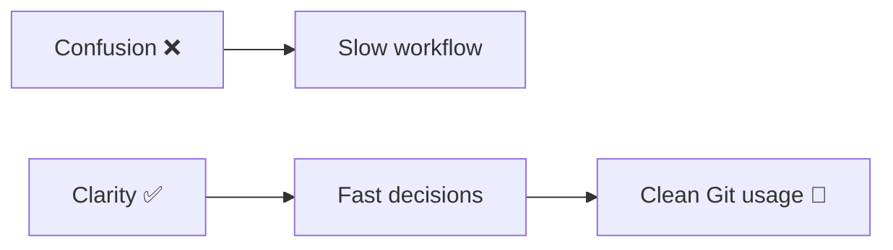
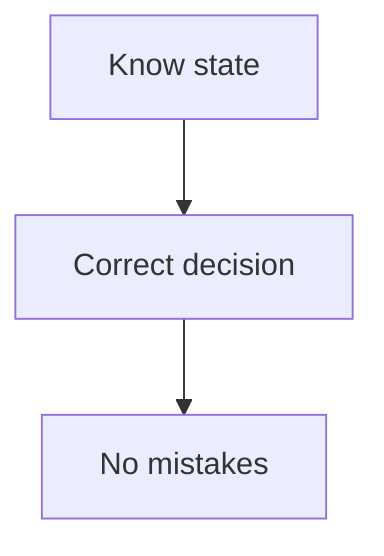
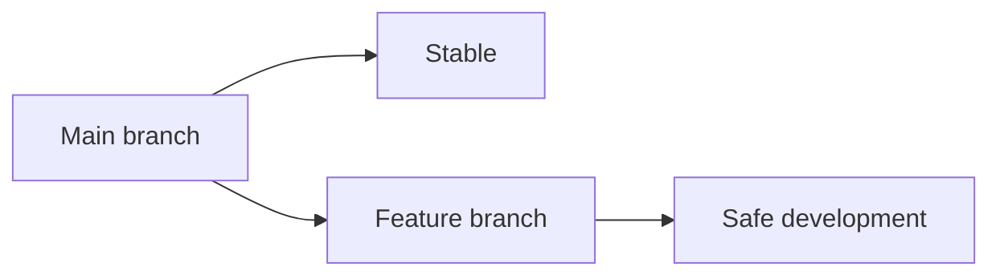
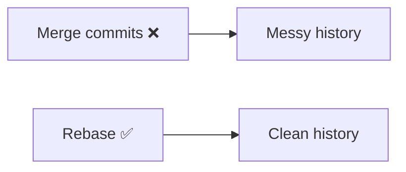
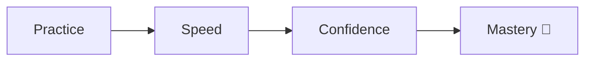

# ⚡ Git Productivity Tips (Work Like a Pro)

> “Fast developers don’t type faster — they think better.”

---

## 🧠 Core Productivity Mindset



---

# 🚀 1. Always Know Your State

---

### ✅ Habit

```bash
git status
```

---

### 🧠 Why



---

### 💡 Rule

```text
Never run a Git command blindly
```

---

# ⚡ 2. Use Small, Frequent Commits

---

### 🚫 Bad

* One big commit

---

### ✅ Good

```text
Fix login bug
Add validation
Update UI
```

---

### 🧠 Benefit

* easy debugging
* clear history

---

---

# ⚡ 3. Use Branches for Everything

---

```bash
git switch -c feature-login
```

---

### 🧠 Why



---

---

# ⚡ 4. Use `git log` Smartly

---

```bash
git log --oneline --graph --all
```

---

### 🧠 Why

* understand history quickly

---

---

# ⚡ 5. Use Reflog for Safety

---

```bash
git reflog
```

---

### 🧠 Why

* recover anything

---

---

# ⚡ 6. Use `--oneline` Everywhere

---

```bash
git log --oneline
```

---

### 🧠 Benefit

* faster reading
* clean output

---

---

# ⚡ 7. Use `git diff` Before Commit

---

```bash
git diff
```

---

### 🧠 Why

* verify changes
* avoid mistakes

---

---

# ⚡ 8. Use `git stash` Smartly

---

```bash
git stash
git stash pop
```

---

### 🧠 Use Case

* switching branches
* temporary save

---

---

# ⚡ 9. Prefer `rebase` for Clean History

---

```bash
git pull --rebase
```

---

### 🧠 Why



---

---

# ⚡ 10. Avoid Force Push (Unless You Know Why)

---

```bash
git push --force-with-lease
```

---

---

# ⚡ 11. Use Aliases

---

```bash
git st
git co
git lg
```

👉 Defined in next file

---

---

# ⚡ 12. Use Tab Completion

---

👉 Press `TAB` for:

* branch names
* file names

---

---

# ⚡ 13. Keep `.gitignore` Clean

---

### 🧠 Avoid

* node_modules
* logs
* build files

---

---

# ⚡ 14. Use Visual Tools (Optional)

---

* VS Code Git panel
* GitLens extension

---

---

# ⚡ 15. Practice Daily

---



---

---

# ⚡ Productivity Summary

```text
Know state → git status
Understand history → git log
Recover anything → git reflog
Work safely → branches
Stay clean → small commits
```
