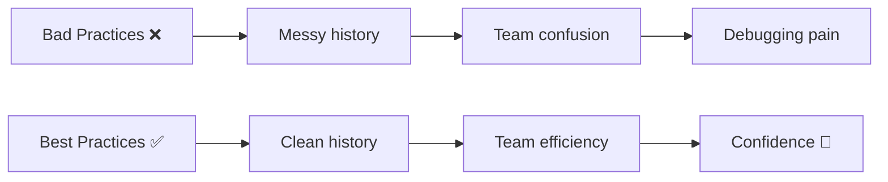
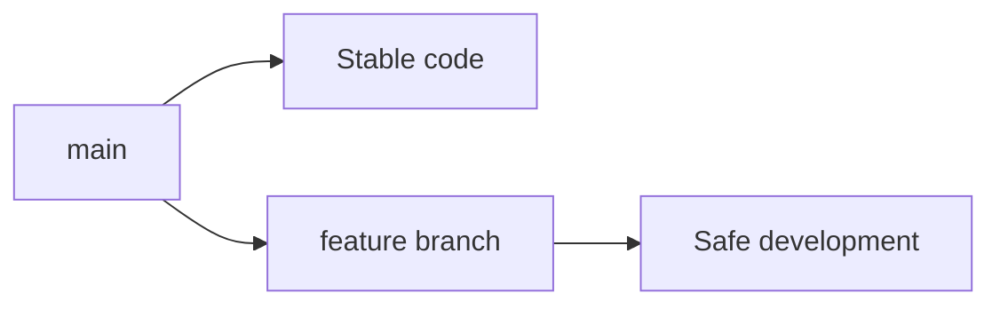
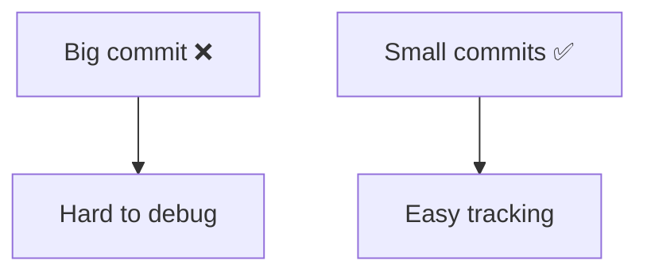
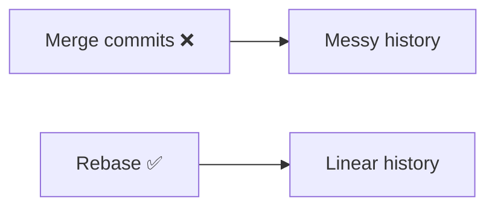
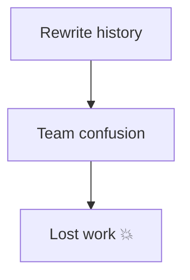
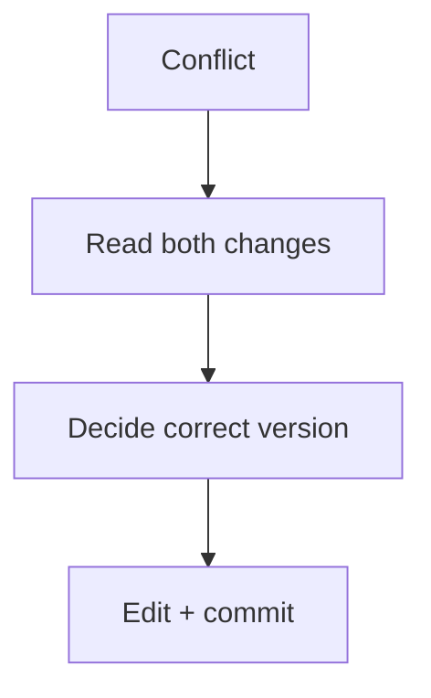
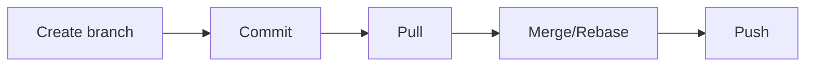
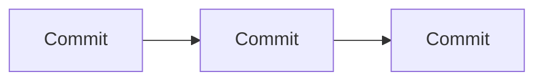
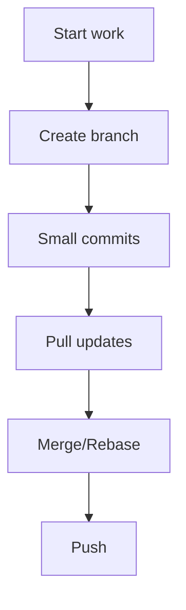

# 🧠 Git Best Practices (Professional Playbook)

> “Good developers use Git. Great developers use Git correctly.”

---

## 🧭 Big Picture



---

# ⚡ 1. Use Feature Branch Workflow

---

### ✅ Always create a branch

```bash id="3lwhhf"
git switch -c feature-login
```

---

### 🧠 Why



---

### 🎯 Rule

```text id="bp1r"
Never work directly on main
```

---

# ⚡ 2. Write Meaningful Commit Messages

---

### 🚫 Bad

```text id="bp2b"
fix
update
done
```

---

### ✅ Good

```text id="bp2g"
Fix login validation bug
Add navbar responsiveness
Refactor authentication logic
```

---

### 🧠 Structure

```text id="bp2s"
<type>: <what changed>
```

---

---

# ⚡ 3. Make Small, Atomic Commits

---

### 🧠 Concept

Each commit = one logical change

---



---

---

# ⚡ 4. Pull Before Push

---

```bash id="bp4c"
git pull --rebase
```

---

### 🧠 Why

* avoid conflicts
* keep history clean

---

---

# ⚡ 5. Prefer Rebase for Local Work

---

```bash id="bp5c"
git rebase main
```

---

### 🧠 Why



---

### 🎯 Rule

```text id="bp5r"
Rebase locally, merge in shared branches
```

---

---

# ⚡ 6. Never Rewrite Shared History

---

### 🚫 Dangerous

```bash id="bp6d"
git reset --hard
git push --force
```

---

### 🧠 Why



---

### ✅ Alternative

```bash id="bp6s"
git revert <commit>
```

---

---

# ⚡ 7. Use `.gitignore` Properly

---

### 🧠 Avoid committing:

```text id="bp7a"
node_modules
.env
logs
build files
```

---

### 🎯 Benefit

* smaller repo
* faster operations

---

---

# ⚡ 8. Always Check State Before Actions

---

```bash id="bp8c"
git status
git log --oneline
```

---

### 🧠 Rule

```text id="bp8r"
Understand state → then act
```

---

---

# ⚡ 9. Resolve Conflicts Carefully

---



---

### 🎯 Rule

```text id="bp9r"
Never blindly delete conflict markers
```

---

---

# ⚡ 10. Use Reflog as Safety Net

---

```bash id="bp10c"
git reflog
```

---

### 🧠 Why

* recover anything
* undo mistakes

---

---

# ⚡ 11. Keep Branches Short-Lived

---

### 🧠 Problem

Long branches → more conflicts

---

### ✅ Fix

```text id="bp11f"
Merge frequently
```

---

---

# ⚡ 12. Review Before Merge

---

### 🔍 Check:

```bash id="bp12c"
git diff main..feature
git log main..feature
```

---

---

# ⚡ 13. Use Tags for Releases

---

```bash id="bp13c"
git tag v1.0
git push origin v1.0
```

---

---

# ⚡ 14. Protect Main Branch

---

### 🧠 Use:

* PR reviews
* branch protection rules

---

---

# ⚡ 15. Backup Before Risky Operations

---

```bash id="bp15c"
git branch backup-branch
```

---

### 🧠 Rule

```text id="bp15r"
Before risky command → create backup
```

---

---

# ⚡ 16. Use Consistent Workflow

---

### Example:



---

---

# ⚡ 17. Document Important Changes

---

### 🧠 Use:

* README
* commit messages

---

---

# ⚡ 18. Avoid Large Binary Files

---

### 🧠 Problem

* slow repo
* big size

---

### ✅ Use

* Git LFS

---

---

# ⚡ 19. Use Aliases for Speed

---

👉 See:
➡️ `03-Productivity/git-aliases.md`

---

---

# ⚡ 20. Think in Terms of History

---

### 🧠 Core Idea



---

### 🎯 Rule

```text id="bp20r"
Git = history, not files
```

---

---

# 🧠 Golden Workflow



---

---

# ⚡ Top 10 Rules (Quick Recall)

```text id="bpquick"
1. Never work on main
2. Write meaningful commits
3. Keep commits small
4. Pull before push
5. Rebase locally
6. Avoid force push
7. Use .gitignore
8. Check status often
9. Resolve conflicts carefully
10. Use reflog when stuck
```

---

---

# 🏁 Final Thought

> “Git best practices are not rules —
> they are habits that save you from pain.”

---

---

# 🚀 Next 


➡️ `05-Roadmap/roadmap-to-git-mastery.md`
