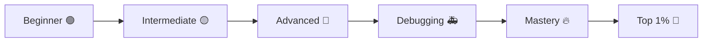
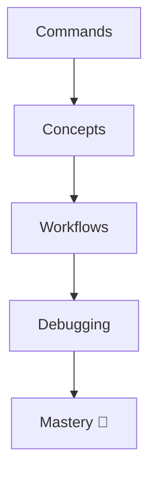
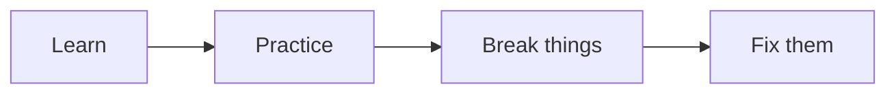
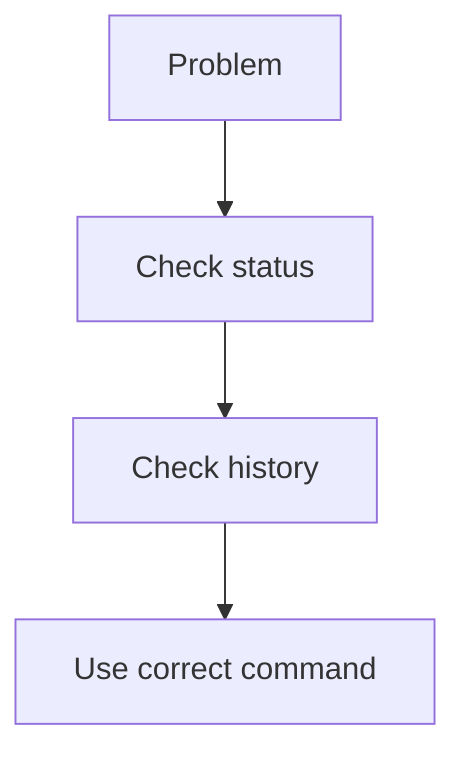
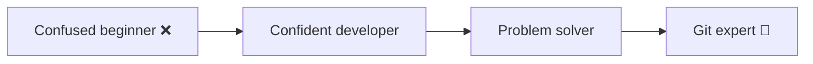

# 🚀 Git Mastery Roadmap (Beginner → Top 1%)

> “You don’t master Git by learning commands — you master it by understanding systems.”

---

## 🧠 Big Picture Journey



---

# 🟢 Stage 1: Beginner (Foundations)

---

## 🎯 Goal

Understand basic Git workflow

---

## 📚 Learn

```text id="rm2"
git init
git add
git commit
git status
git log
```

---

## 🧠 Concepts

* repository
* working directory
* staging area
* commit

---

## 🧪 Practice

👉 `13-Challenges/01-Beginner/`

---

## 🚫 Mistakes to Avoid

* committing everything blindly
* skipping git status

---

## ✅ Outcome

```text id="rm3"
You can track and save changes confidently
```

---

---

# 🟡 Stage 2: Intermediate (Real Workflow)

---

## 🎯 Goal

Work with branches and teams

---

## 📚 Learn

```text id="rm4"
branching
merge
rebase
stash
remote (push/pull)
```

---

## 🧠 Concepts

* branch = pointer
* merge vs rebase
* remote workflow

---

## 🧪 Practice

👉 `13-Challenges/02-Branching/`
👉 `03-Merge-Conflicts/`

---

## 🚫 Mistakes to Avoid

* working on main
* ignoring conflicts

---

## ✅ Outcome

```text id="rm5"
You can collaborate and manage workflows
```

---

---

# 🔴 Stage 3: Advanced (Deep Understanding)

---

## 🎯 Goal

Understand Git internals + history

---

## 📚 Learn

```text id="rm6"
rebase internals
cherry-pick
interactive rebase
git objects
commit graph
```

---

## 🧠 Concepts

* DAG (commit graph)
* SHA-1
* blobs / trees / commits

---

## 🧪 Practice

👉 `03-Advanced/`
👉 `05-Master-Level/`

---

## 🚫 Mistakes to Avoid

* blind rebasing
* rewriting shared history

---

## ✅ Outcome

```text id="rm7"
You understand how Git works internally
```

---

---

# 🚑 Stage 4: Debugging & Recovery

---

## 🎯 Goal

Fix anything in Git

---

## 📚 Learn

```text id="rm8"
reflog
reset vs revert
recover commits
fix broken repos
```

---

## 🧠 Concepts

* HEAD movement
* history recovery
* object persistence

---

## 🧪 Practice

👉 `04-Recovery/`
👉 `06-Real-World-Labs/`

---

## 🚫 Mistakes to Avoid

* panic
* assuming data is lost

---

## ✅ Outcome

```text id="rm9"
You can recover from any Git disaster
```

---

---

# 🔥 Stage 5: Master Level

---

## 🎯 Goal

Control Git fully

---

## 📚 Learn

```text id="rm10"
history rewriting
advanced workflows
team strategies
optimization
```

---

## 🧪 Practice

👉 `05-Master-Level/`
👉 `07-Timed-Challenges/`

---

## 🧠 Skills

* fast debugging
* decision making
* clean history design

---

## ✅ Outcome

```text id="rm11"
You use Git like a system, not a tool
```

---

---

# 🚀 Stage 6: Top 1% Engineer

---

## 🎯 Goal

Think like an expert

---

## 🧠 Skills

```text id="rm12"
Explain Git clearly
Solve problems under pressure
Guide teams
Avoid mistakes proactively
```

---

## 🧪 Practice

* timed drills
* scenario questions
* real-world labs

---

## 🎯 Outcome

```text id="rm13"
You are interview-ready + production-ready
```

---

---

# ⚡ Skill Progression



---

---

# 🧠 Daily Practice Plan

---

## ⏱️ 30-Min Routine

```text id="rm15"
10 min → learn concept
10 min → practice challenge
10 min → debug/review
```

---

---

# ⚡ Weekly Plan



---

---

# 🧭 Decision Thinking (Important)

---



---

---

# ⚡ Golden Rules

```text id="rm18"
Git = history, not files
Reflog = safety net
Small commits = clarity
Branches = safety
Understanding > commands
```

---

---

# 🏁 Final Motivation

> “Most developers *use* Git.
> Very few truly *understand* it.
> That difference is your edge.”

---

---

# 🚀 Your Final State



---

---

## 🎯 Final Advice

👉 Follow this roadmap step by step
👉 Don’t skip challenges
👉 Break things intentionally
👉 Fix them

---

## 🔥 You Now Have

* 📚 Learning system
* 🧪 Practice labs
* 🎯 Interview prep
* 🚀 Mastery roadmap

---

# 🏁 End Note

> “Master Git once — it will save you thousands of hours forever.”
