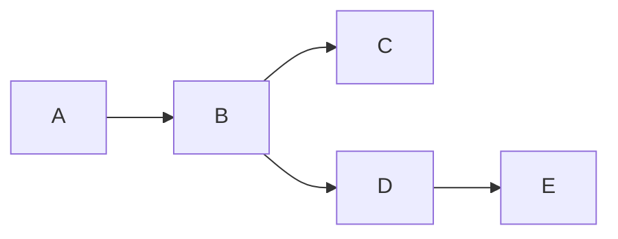
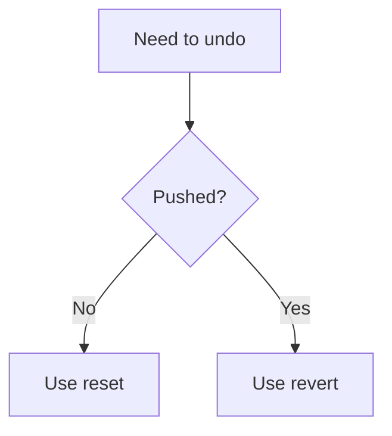
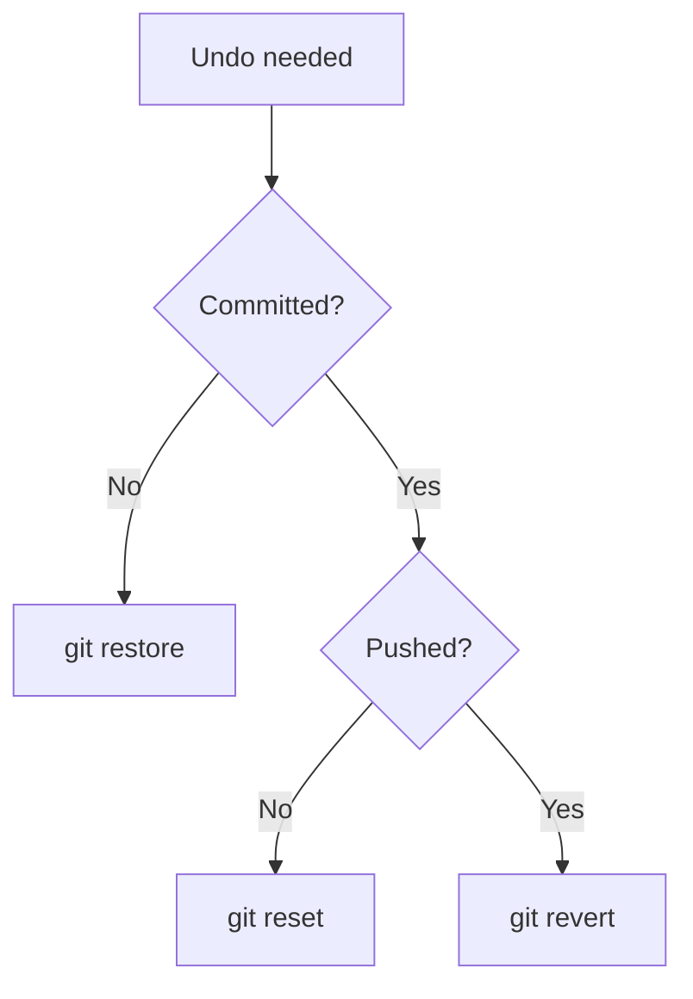
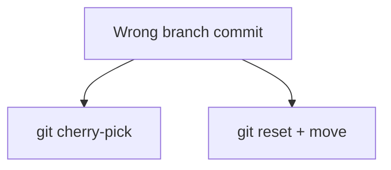
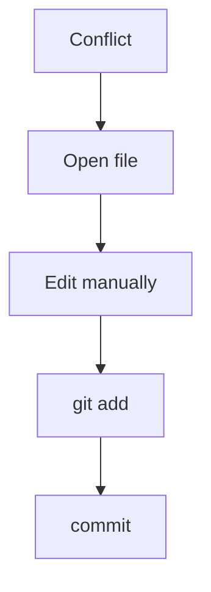
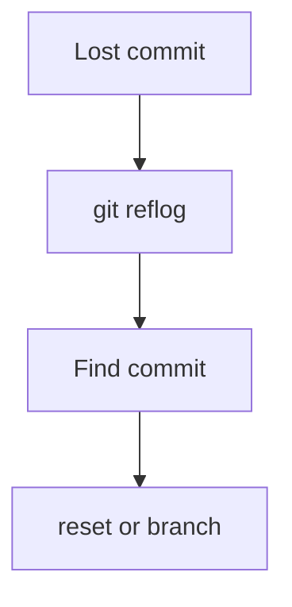
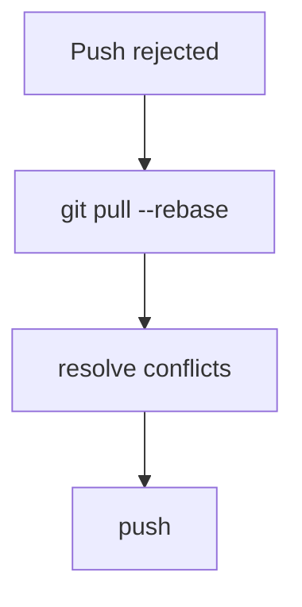

# 🧠 Git Cheat Sheet (Printable • Quick Reference)

> ⚡ “One page to remember everything that matters in Git”

---

# 🧭 1. Git Mental Model


```text
edit → add → commit → push
```

---

# ⚙️ 2. Core Commands

## 📦 Basic

```bash
git init
git clone <url>
git status
git add .
git commit -m "message"
git log --oneline
```

---

## 🌿 Branching

```bash
git branch
git switch -c feature
git switch main
git merge feature
git branch -d feature
```

---

## 🌍 Remote

```bash
git remote -v
git push
git pull --rebase
git fetch
```

---

---

# 🔀 3. Merge vs Rebase

```text
Merge  = combine histories (safe)
Rebase = rewrite history (clean)
```



---

---

# 🔄 4. Reset vs Revert

```text
Reset  = move pointer (danger)
Revert = new commit (safe)
```

---

---

# ⚔️ 5. Conflict Resolution

```text
<<<<<<< HEAD
=======
>>>>>>> branch
```

```text
Steps:
1. Read both versions
2. Edit final code
3. git add
4. git commit
```

---

---

# 🚑 6. Recovery Commands

```bash
git reflog
git reset --hard <commit>
git checkout <commit>
git restore file.txt
git cherry-pick <commit>
```

---

---

# 🧪 7. Undo Cheats

```text
Undo commit (keep changes) → git reset --soft HEAD~1
Undo commit (unstage) → git reset HEAD~1
Safe undo → git revert <commit>
```

---

---

# ⚡ 8. Debug Toolkit

```bash
git status
git log --oneline --graph --all
git reflog
git diff
git show <commit>
```

---

---

# ⚠️ 9. Dangerous Commands

```bash
git reset --hard
git push --force
git clean -fd
```

---

---

# 🧠 10. Internals (Quick)

```text
Blob   = file
Tree   = folder
Commit = snapshot
SHA    = unique ID
```

---

---

# 🧭 11. Decision Guide



---

---

# ⚡ 12. 10 Commands to Remember

```text
git status
git add
git commit
git log
git branch
git switch
git merge
git pull
git push
git reflog
```

---

---

# 🧠 13. Golden Rules

```text
✔ Always check git status
✔ Use branches for all work
✔ Keep commits small
✔ Never rewrite shared history
✔ Use reflog when stuck
```

---

## 🧭 Git System Overview


---

## ⚡ Core Flow

```text id="pc2"
edit → add → commit → push
```

---

## 🌿 Branch Model


---

## 🔀 Merge vs Rebase

```text id="pc4"
Merge = safe history
Rebase = clean history
```

---

## 🔄 Reset vs Revert

```text id="pc5"
Reset = rewrite
Revert = safe undo
```

---

## 🚑 Recovery Power

```text id="pc6"
reflog = time machine
```

---

## ⚠️ Danger Zone

```text id="pc7"
reset --hard
push --force
clean -fd
```

---

## 🧠 Golden Model


---

## 🏁 Final Line

> “Git = commits + pointers + history”

---

# 🧭 Git Decision Tree (Which Command to Use)

> “When confused → follow this”

---

## 🔄 Undo Changes



---

## 🌿 Branch Issues



---

## ⚔️ Conflict Handling



---

## 🚑 Lost Work



---

## 🌍 Remote Issues



---

## 🧠 Core Rule

```text id="dt6"
If unsure → use reflog
```

---

## 🧠 Core Concepts

```text id="iq1"
Git = distributed version control
Commit = snapshot
Branch = pointer
HEAD = current pointer
```

---

## 🔀 Key Differences

```text id="iq2"
Merge = combine history
Rebase = rewrite history

Reset = dangerous
Revert = safe

Fetch = download
Pull = fetch + merge
```

---

## ⚔️ Conflict

```text id="iq3"
Occurs when Git can’t auto merge
Fix manually → add → commit
```

---

## 🚑 Recovery

```text id="iq4"
git reflog = recover anything
```

---

## ⚡ Common Fixes

```text id="iq5"
Wrong branch → cherry-pick
Lost commit → reflog
Detached HEAD → create branch
```

---

## 🧠 Internals

```text id="iq6"
Blob = file
Tree = folder
Commit = snapshot
SHA = ID
```

---

## ⚡ Golden Answers

```text id="iq7"
Branch = pointer to commit
Git = DAG structure
Rebase rewrites commit IDs
```

---

## 🧭 Mental Model

